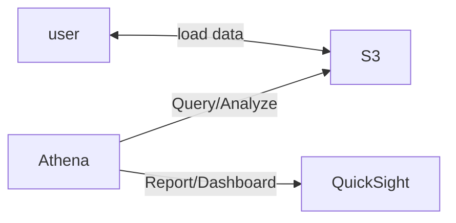

- [How do I analyze my Amazon S3 server access logs using Athena?](https://aws.amazon.com/premiumsupport/knowledge-center/analyze-logs-athena/?nc1=h_ls)

# Athena

- use SQL query on S3, 用來做分析
    - file 可以是 CSV, JSON, ORC, Avro, Parquet(built on Presto)
    - 後面可以接 **Amazon QuickSight** 來做報表
- Use Case:
    - BI / analytics / reporting, analyze & query VPC Flow Logs, ELB Logs / CloudTrail trails, serverless SQL analyze S3, ...
- Cost
    - `$5/TB second`
    - 因為 by scan 量收費, 若 data 有做 Compress 或 columnar 方式儲存, 可省下 $$
    - per query / per TB of data scanned- 可下 SQL 對 S3 查詢做分析
- 支援 csv, json, ORC, Avor, Parquet(built on Presto)

---

---

---
