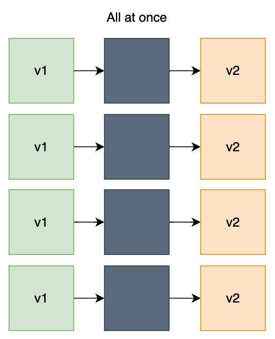
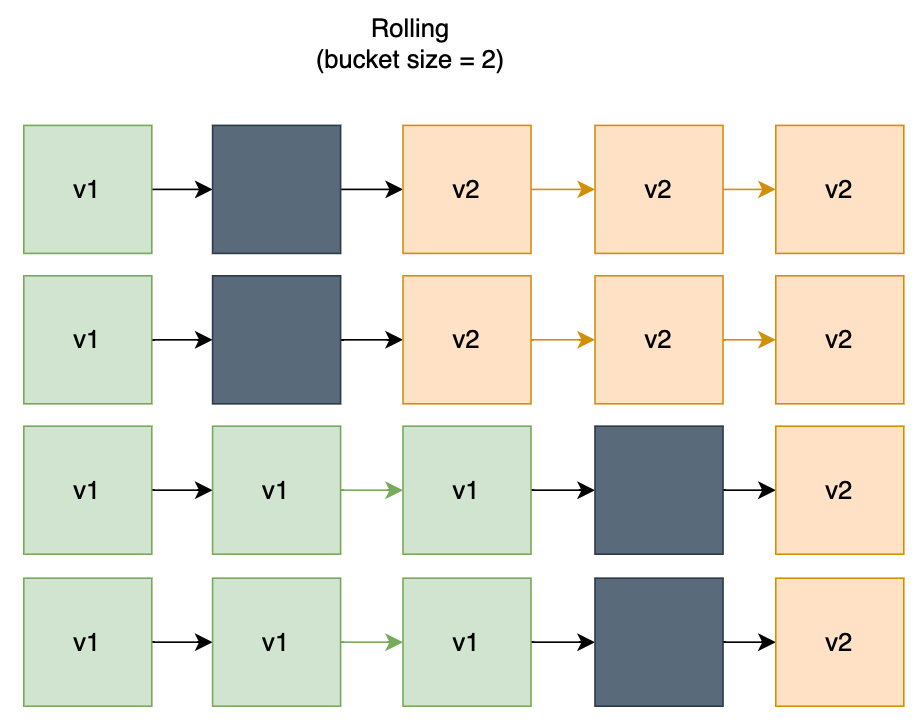
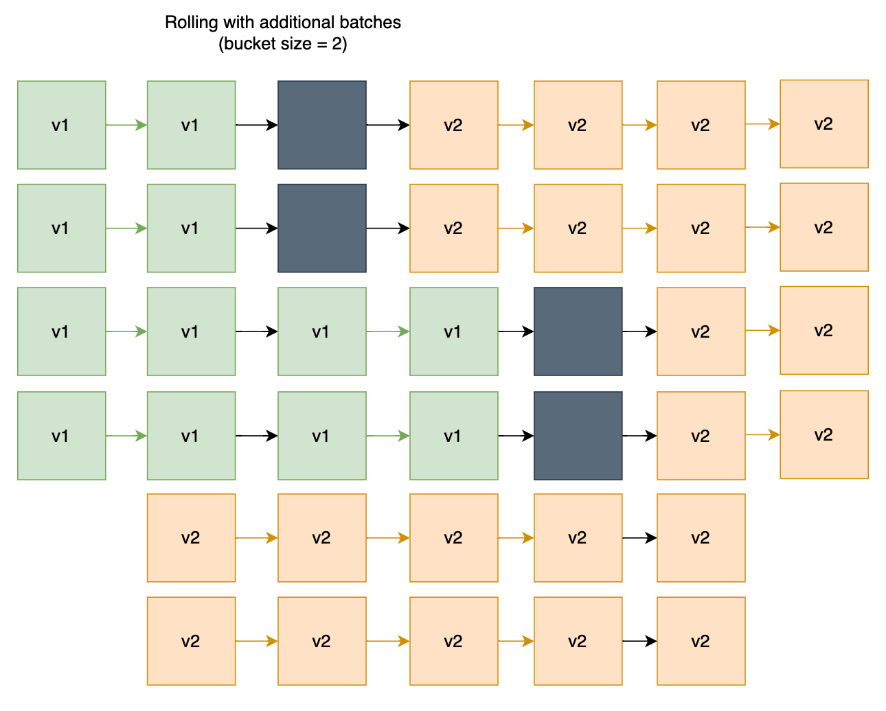

* [What is AWS Elastic Beanstalk](https://docs.aws.amazon.com/elasticbeanstalk/latest/dg/Welcome.html)
* 可用 program 的方式管理架構
* 適用於純 programmer 的團隊
    - beanstalk 自動處理 scaling, balancing, monitoring 等
* 操作方式:
    - Web Console
    - AWS CLI
    - eb (針對 Elastic Beanstalk 設計的高階 CLI)
* Charge
    - 服務不收費
    - 不過會針對 beanstalk 背後的 aws resources 收費
* 幾乎所有 Web APP 架構都會用到 ELB && ASG, 因此這兩者已經直接納入到 Beanstalk
    - Beanstalk 的 APP 一旦建立以後, 無法再修改它的 ELB
        - 因此若有此需求, 需要重建
* Beanstalk 可將節點分成:
    - Web Server Tier, 用來放快速回應的 request
    - Worker Tier, 處理耗時請求
        - 使用 [SQS](./cert-SAA_C02.md#sqs-sns-kinesis-activemq)
        - 裡頭放置 `cron.yaml` 來讓節點去 poll jobs
    - NOTE: 下圖的 ALB: Application Load Balancer
    

```mermaid
    flowchart LR

    subgraph web["Web Tier = ELB + EC2"]
        ALB --> asg1["ASG"]
    end

    subgraph worker["Worker Tier = SQS + EC2"]
        SQS --> asg2["ASG"]
    end

    asg1 -- PUT --> SQS
    Client -- request --> ALB
    ```

* Beanstalk 有他專屬的 CLI, 有需要再找 `eb cli` (更為簡易使用)
* 對於 Beanstalk 的環境變數 && 依賴服務, 可放在專案目錄下的:
    - `/.ebextensions/*.config`, 可定義環境變數 && 依賴的 AWS Services
        - 但需要非常留意!!! 如果裡面有放 DB, 那如果 Beanstalk APP 移除的話, 相關資源也會消失
            - Beanstalk Decouple RDS 的議題, 底下為 migration 建議方式
                - [decouple RDS from Beanstalk](https://aws.amazon.com/premiumsupport/knowledge-center/decouple-rds-from-beanstalk/)
                - 先到 RDS 建立 snapshot (保險起見)
                - RDS console > protect the RDS database from deletion
                - 建立新的 Beanstalk Environment (without RDS)
                - CNAME swap
                - Terminate OLD environment
                    - RDS 會因為剛剛上了保護機制, 因而無法移除
                    - 後續移除動作也會跟著失敗
                - 後續手動到 CloudFormation 移除相關 stack (處於 `DELETE_FAILED state` 的這些資源)
                    - Beanstalk 背後是 CloudFormation
* Beanstalk Lifecycle Policy
    - Beanstalk 最多只能有 1000 APP Versions
        - 可善用 *lifecycle policy* 來清理, 或保存到 S3
* Beanstalk in Docker
    - 需要定義 `Dockerfile` && `Dockerrun.aws.json`
        - 後者, 告知 Image 位置 && Volume && Port && Logging && ...
    - 建立 APP Environment 的 Platform 的選則:
        - Docker running on ... (Single Docker Container)
            - 不會使用到 ECS
        - Multi-Container Docker
            - `Dockerrun.aws.json` 裡頭定義 **ECS task definition**
            - 會自動建立相關資源:
                - ECS Cluster
                - EC2 instances, 可用作 ECS Cluster
                - Load Balancer (in HA mode)
                - Task definition && execution
* Beanstalk with HTTPS
    - via ELB console 上傳證書
    - via Beanstalk 的 `/.ebextensions/securelistener-alb.config` 給證書
    - via [ACM](https://aws.amazon.com/certificate-manager/?nc1=h_ls) 託管證書
    - via ALB 的 http 301 https
    - via 程式端的 redirect, [https-redirect](https://github.com/awsdocs/elastic-beanstalk-samples/tree/main/configuration-files/aws-provided/security-configuration/https-redirect)
* Beanstalk 進階問題
    - 如果需要 Beanstalk 不支援的 Language 且 不使用 Docker
        - 使用 `Platform.yaml` 來定義 AMI, 建立 Custom Image
    - 如果需要特殊的 Platform (OS, additional Software, Scripts to run)
        - 使用 **Packer software** 來建立 entirely new Beanstalk Platform
# Beanstalk 的更新

## All at once

* 一次更新所有 instances 到 New Version
* 最快速, 但會有 downtime



## Rolling

* 針對現有 instances, 逐批(bucket) 更新 instances
* 更新期間的可用規模, 會略小於平常的時候 (因為隨時都有機器在更新)
* 更新流程示意圖如下



## Rolling with additional batches

* (與 Rolling 差不多)
* 現有 instances 先不動(而非 Old instances 直接更新)
* 建新一批(bucket) instances 跑 New Version
* 之後再陸續更新 現有 instances 到 New Version
* 更新期間的可用規模, 與平常規模一樣



## Immutable

* zero downtime
* high cost, double capacity
    - 可快速 rollback(僅需關閉 new ASG)
* 建一批 (new temp ASG) 跑 New Version
* 完成後 migrate 到 Old ASG
* 若沒問題, Terminate Old Version instances
* 若有問題, Terminate New Version instances


## Blue/Green (非 Beanstalk 直接議題, 但可實作)

* 建立多個 Environment
* 藉由 DNS 改變解析到不同版本的環境
    - 此為 `Beanstalk swap URLs`
    - 就算 New Version 有問題, Rollback 非常快
        - 改 DNS CNAME 即可 (Beanstalk 裡頭直接切換)
* New Version 剛部署完成時, 藉由 DNS 將少量流量導入來測試

## Traffic Splitting

## Canary Testing 金絲雀部署
