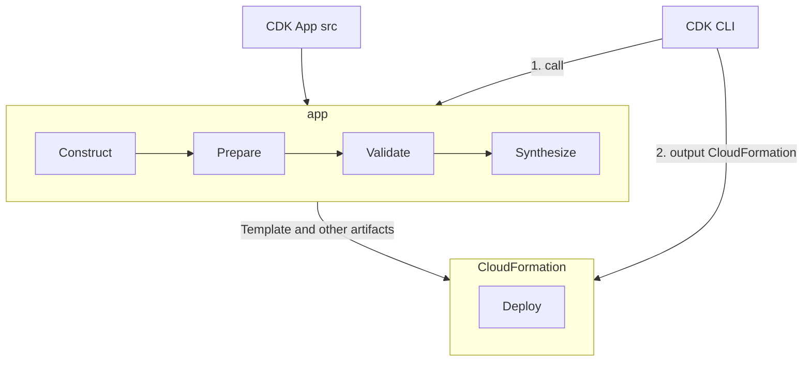
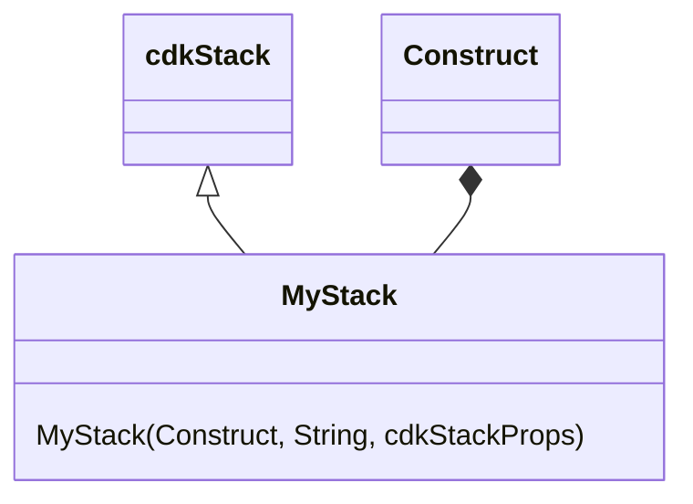

# [Cloud Development Kit, CDK](https://docs.aws.amazon.com/cdk/v2/guide/home.html)

- [cdktf](https://developer.hashicorp.com/terraform/cdktf)
- [cdk8s](https://cdk8s.io/)
- [Former2](https://former2.com/#section-outputs-cdkv2)
- [Youtube - CDK](https://www.youtube.com/watch?v=uFZjj9QnvQs&list=PLD6e3vg1Inj9qvHFkvHUJXWBuTFKcI9J_)
- [cdk 筆記](https://www.ernestchiang.com/zh/notes/aws/cdk/)

# CDK 名詞 & 主要元件

- Construct
- Synthesis
    - 運行 `cdk synth`, 程式會去巡覽所有的 Constructs, 並生成的 CFN Templates
    - 東西會丟到 `cdk.out` Dir 裡頭 (`cdk deploy` 也會做同樣動作)
- Asset
    - Assets are files bundled into CDK Apps
    - Assets 被視為是 cdk App 所需要操作的任何 artifacts
    - cdk 會針對這些 artifacts, 然後藉由 bootstrap 來將他們生成 CloudFormation
- Bootstrap
    - 將 artifacts(也就是 assets) 生成 CloudFormation
    - 運行 `cdk bootstrap`, 會部署一個 **CDKToolkit** CloudFormation Stack
        - AWS Console 的 CloudFormation 會出現 **CDKToolkit** 這個 Stack
        - 並建置對應的 AWS S3 Bucket, 來儲存這些 Assets
    - `cdk bootstrap` 的當下, 需要 Admin Role, 後續則不需要
- Deploy
    - 運行 `cdk deploy`, CDK App 首先初始化成 App Tree
        - 觸發一系列的 Constructs 的各種 `prepare`, `validate`, `synthesize` 方法
    - Deployment **artifacts** 上傳到 **CDKToolkit**
        - 然後就開始部署 CloudFormation deployment

------

------

# CDK 底層概念結構

- cdk App 由 1~N 個 Stakcs 構成
- Stack 由 1~N 個 Constructs 構成
- 每個 Construct 又可包含多個 **concrete AWS Resources**
    - ex: S3 Bucket, Dynamodb Table, Lambda Function
- Construct 具有下列 3 種 fundamental flavors:
    - L1
        - 直接 mapping CloudFormation Resource, 命名都是 `Cfn` 開頭
        - L1 resources 都放在 `aws-cdk-lib`
    - L2
        - 此為 Curated, 由 AWS CDK team 維護安排
        - L2 封裝了 L1, 提供了 best-practice 的預設
    - L3
        - 此為 Patterns, 做了更加應用層方面的包裝
- AWS CDK 的部署單元為 stack

# CDK best-practice

cdk 的最佳實務, 分成 4 個面向

## cdk - Organization best practice

- 團隊訓練, 擬訂執行標準及政策
- 使用 Control Tower 設定 Organization
- 搭配 CDK Pipelines 做 CI/CD

## cdk - Coding best practice

- 配合 AWSWell-Architected
- 每個 App 都從 single package in single repository 作開始
- infra 及 runtime code 放在相同的 package 裡頭
    - 像是 Lambda Function, Docker images

## cdk - Construct best practice

## cdk - Application best practice
