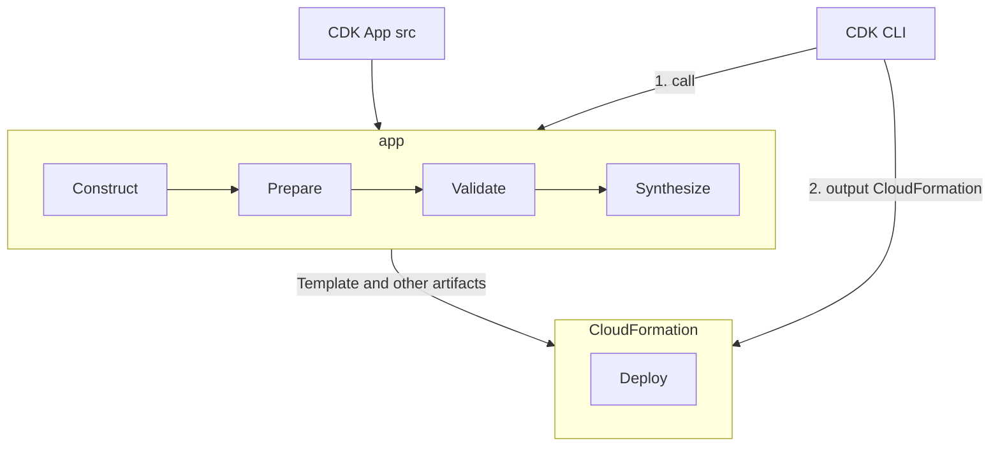
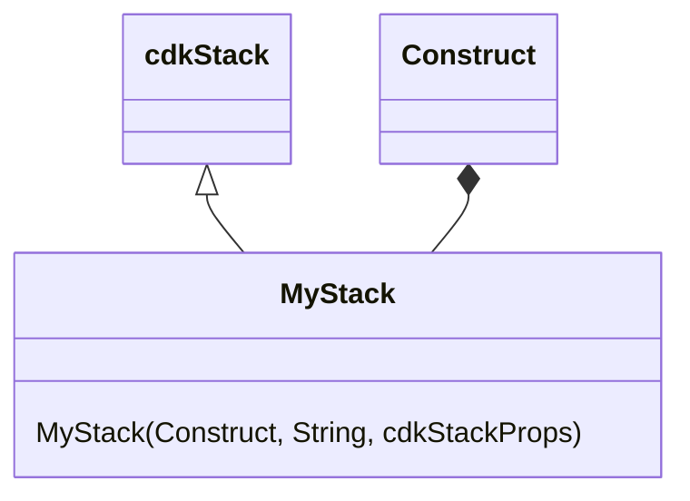

# Cloud Development Kit, CDK

- [What is the AWS CDK?](https://docs.aws.amazon.com/cdk/v2/guide/home.html)
    - WARNING: CDK v1 將於 2023/06 起不再維護, 因此建議改用 CDK v2
- CDK 也有支援 :
    - [Terraform](https://developer.hashicorp.com/terraform/cdktf)
    - [K8s](https://cdk8s.io/)
- [Former2](https://former2.com/#section-outputs-cdkv2)

# CDK 名詞 & 主要元件

- Construct
- Synthesis
    - 運行 `cdk synth`, 程式會去巡覽所有的 Constructs, 並生成的 CFN Templates
    - 東西會丟到 `cdk.out` Dir 裡頭 (`cdk deploy` 也會做同樣動作)
- Asset
    - Assets are files bundled into CDK Apps
    - Assets 被視為是 cdk App 所需要操作的任何 artifacts
    - cdk 會針對這些 artifacts, 然後藉由 bootstrap 來將他們生成 CloudFormation
- Bootstrap
    - 將 artifacts(也就是 assets) 生成 CloudFormation
    - 運行 `cdk bootstrap`, 會部署一個 **CDKToolkit** CloudFormation Stack
        - AWS Console 的 CloudFormation 會出現 **CDKToolkit** 這個 Stack
        - 並建置對應的 AWS S3 Bucket, 來儲存這些 Assets
    - `cdk bootstrap` 的當下, 需要 Admin Role, 後續則不需要
- Deploy
    - 運行 `cdk deploy`, CDK App 首先初始化成 App Tree
        - 觸發一系列的 Constructs 的各種 `prepare`, `validate`, `synthesize` 方法
    - Deployment **artifacts** 上傳到 **CDKToolkit**
        - 然後就開始部署 CloudFormation deployment

------

------

# CDK 底層概念結構

- cdk App 由 1~N 個 Stakcs 構成
- Stack 由 1~N 個 Constructs 構成
- 每個 Construct 又可包含多個 **concrete AWS Resources**
    - ex: S3 Bucket, Dynamodb Table, Lambda Function
- Construct 具有下列 3 種 fundamental flavors:
    - L1, AWS CloudFormation-only
        - 由 AWS CloudFormation 自動產生
        - 命名方式都以 `Cfn` 開頭, ex: CfnBucket 表示 L1 construct 的 S3 bucket
        - L1 resources 都放在 `aws-cdk-lib`
    - L2, Curated
        - 由 AWS CDK team 維護安排
        - L2 封裝了 L1, 提供必要預設
    - L3, Patterns
- AWS CDK 的 `unit of deployment` 為 `stack`
- cdk 操作的 App, Stack, Construct, Resource 概念結構如下:
  - app > stack > construct > resource
  - app 內可含多個 stacks, stack 可含多個 constructs, construct 可含多個 resources

