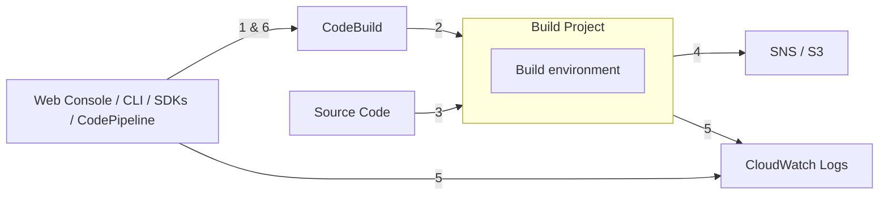

- [What is AWS CodeBuild?](https://docs.aws.amazon.com/codebuild/latest/userguide/welcome.html)
- CodeBuild compiles your source code, runs unit tests, and produces artifacts that are ready to deploy
    - 總之, 就是從 src code 跑 test, 產 artifacts
    - 會把 build environments(programming language, dependencies) 整個包好
- Serverless, Scalable, HA
- 可在 Cloud 做 Build Code
    - compile, test, 產生 package
- Charge: 只對 Build Time 收 $$
- 需要建立 root file : `buildspec.yml` (等同於 `Dockerfile`)
- local dev 測試使用, 需安裝 *CodeBuild Agent*
    - [Run builds locally with the AWS CodeBuild agent](https://docs.aws.amazon.com/codebuild/latest/userguide/use-codebuild-agent.html)
- CodeBuild 的環境變數, [Environment variables in build environments](https://docs.aws.amazon.com/codebuild/latest/userguide/build-env-ref-env-vars.html)
- CodeBuild Container
    - 因安全性因素(ex: 未必很清楚 Image 究竟幹了些啥), Container 跑在 VPC 外部
    - 但如果要做整合測試 或需要授權訪問 AWS Resources, 則可做底下配置, 便可讓 *CodeBuild Container* 跑在 VPC 裡頭:
        - VPC ID
        - Subnet IDs
        - Security Group IDs




# CodeBuild locally

```bash
# Run builds locally with the AWS CodeBuild agent
#   https://docs.aws.amazon.com/codebuild/latest/userguide/use-codebuild-agent.html

$# docker pull public.ecr.aws/codebuild/amazonlinux2-x86_64-standard:3.0  # 13GB...
$# docker pull public.ecr.aws/codebuild/amazonlinux2-x86_64-standard:4.0  #  8GB...

$# wget https://raw.githubusercontent.com/aws/aws-codebuild-docker-images/master/local_builds/codebuild_build.sh && mv codebuild_build.sh ~/bin
$# chmod +x ~/bin/codebuild_build.sh
$# codebuild_build.sh \
    -i public.ecr.aws/codebuild/amazonlinux2-x86_64-standard:4.0 \
    -a public
# -i : image_name
# -a : artifact_output_directory
```
