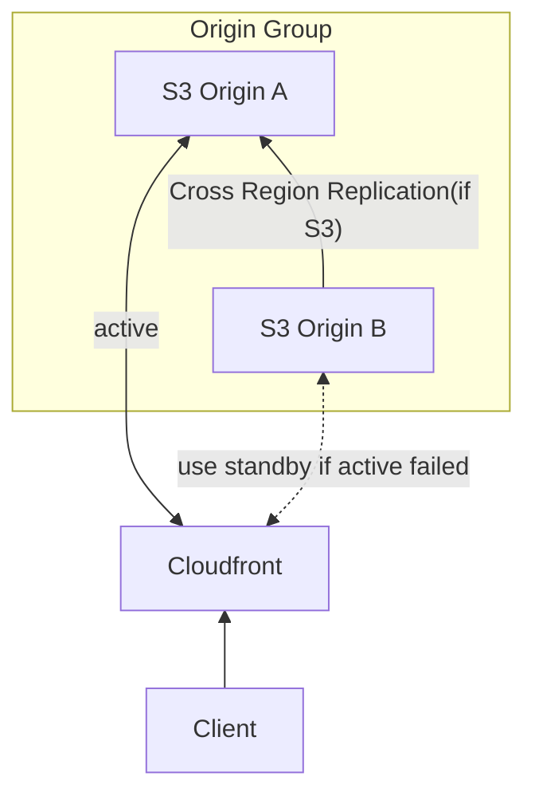
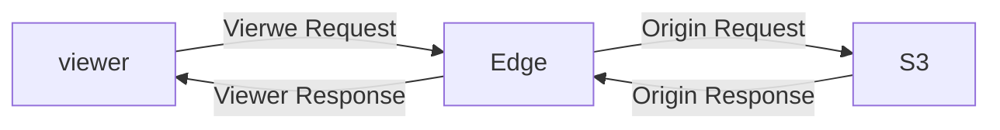

# [CloudFront](https://docs.aws.amazon.com/AmazonCloudFront/latest/DeveloperGuide/Introduction.html)

- [深入討論為何 ACM 只能在 us-east-1](https://ithelp.ithome.com.tw/articles/10242264)
- 有超過 200+ 個 Edge Locations
    - file cached for TTL
- Security 安全性方面, 結合了:
    - DDoS protection
    - Shield
    - Web Application Firewall
- CloudFront 的 Origins 種類:
    - S3 bucket
        - Using a standard Amazon S3 bucket
        - Using Amazon S3 Object Lambda
        - Using an Amazon S3 bucket that's configured as a website endpoint
        - Adding CloudFront to an existing Amazon S3 bucket
        - Moving an Amazon S3 bucket to different AWS Region
    - MediaStore container / MediaPackage channel
    - ALB
    - Lambda function Url
    - EC2
    - CloudFront origin groups
- CloudFront Origin:
    - 回源到 S3 的驗證機制 (用來給 CloudFront access S3 的 IAM Role):
        - OAC, Origin Access Control
            - 相較於 OAI 的額外優點:
                - 支援 all Region S3 buckets
                - 支援 SSE-KMS
                - 支援 Dynamic request(PUT, DELETE) to S3
        - OAI, Origin Access Identity (legacy)
            - Enhanced security with CloudFront OAI
    - Custom Origin(HTTP)
        - ALB && EC2 instance
            - 必須要是 public && SG 要允許 AWS CloudFront IPs 來訪問
                - https://d7uri8nf7uskq.cloudfront.net/tools/list-cloudfront-ips
        - S3 Website (必須確保 S3 Bucket 為 static S3 Website)
        - any HTTP backend
- CloudFront 也可用來作為上傳 file 到 S3, 作為 Ingress 使用
- CDN 也可設定 黑白名單 來做訪問許可
    - country 則使用 3rd Geo-IP database
- paid shared content(付費共享內容)
    - 藉由 **CloudFront Signed URL / Signed Cookies**
        - Signed URL, 假如只有單純幾個檔案, 可使用此方式 (URL 內含 creds)
        - Signed Cookies, 假如有超多檔案建議用此方式
    - 可設定 URL 在特定時間後到期 OR 設定哪些 IP 可以訪問 等等 (for premium user)
    - 這個和 [S3 Pre-Signed URL](./S3.md#s3-pre-signed-urls) 很容易搞混
        - 可用來 filter by IP, path, date, expiration
            - 相較於 S3 Pre-Signed URL, 只能用來限定特定 URL 有效期限
    ```mermaid
    flowchart TB

    cdn["CloudFront \n Edge location"];

    Client -- "1.Authentication \n Authorization" --> App;
    App -- "2.SDK gen Signed URL/cookie" --> cdn;
    cdn <-- "3.OAI" --> S3;
    cdn -- "4.取得 Signed URL/cookie" --> App;
    App -- "5.return URL" --> Client;
    Client -- "6.訪問 Signed URL/cookie 爽看片" --> cdn;
    ```
- CloudFront Signed URL 
    - private key 用來給 APP/EC2, sign URLs
    - public key 用來給 CloudFront verify URLs
    - 有 2 種方式:
        - (建議) 使用 CloudFront > Trusted Key Group
        - (OLD) 使用 root Account 簽發的 CloudFront Key Pair
- Charge 收費方式
    - CloudFront 收費依照 流出流量 計費, 每個 Region 計費都不同
    - 此外也可有 3 種(不知道將來會不會變) Price Classes
        - Price Class All - 所有 Regions 都做 CDN
        - Price Class 200 - 排除掉最貴的 Region
        - Price Class 100 - 只對最便宜的 Region 啟用
    - [Cloudfront](https://aws.amazon.com/cloudfront/pricing/?nc1=h_ls) 詳細計費說明
- CloudFront - Multiple Origin
    - CloudFront 可配置 *Cache Behaviors*, 來針對不同的 URL location, 配置不同的 Origin
        - ex: `/api/*` 丟到 ALB ; 其餘 `/*` 丟到 S3
- CloudFront - Origin Groups
    - 用來因應 HA && failover
    - 1 Primary && 1 Secondary origin (稱之為一組 Origin Group)
    - CloudFront 後面可以有 active-standby 的後端 Resource
    - S3 + CloudFront - Regional HA
- CloudFront - Field Level Encryption
    - Client -> Edge -> CloudFront -> ALB -> WebServer
    - 如果架構如上, 全部使用 https, *Field Level Encryption* 主要功能是, 能針對 Request 裡頭特定欄位
    - Edge Location 使用 public key 加密特定欄位, 最後由 APP 上頭的 private key 解密
- 清除緩存, purge cache, CloudFront Invalidation
- logs
    - 可以啟用並記錄所有向 CloudFront 發出的 Request, 此稱為 Standard logs / Access logs
    - https://docs.aws.amazon.com/AmazonCloudFront/latest/DeveloperGuide/AccessLogs.html

------

關於 Origin Group



------


# details

- [Requiring HTTPS for communication between CloudFront and your Amazon S3 origin](https://docs.aws.amazon.com/AmazonCloudFront/latest/DeveloperGuide/using-https-cloudfront-to-s3-origin.html)
    > CloudFront doesn't redirect DELETE, OPTIONS, PATCH, POST, or PUT requests from HTTP to HTTPS
    - CloudFront 對於上述方法並不會對 http -> https 發送回源請求, 取而代之的是回覆 403


# 回源 - [Controlling origin requests](https://docs.aws.amazon.com/AmazonCloudFront/latest/DeveloperGuide/controlling-origin-requests.html)



- 如果來自 **Viewer Request** 發生了 `cache miss`, 則此 Request 會被送往 origin
    - 此 Request 僅包含了:
        - 不含 Query String 的 URL Path (ex: *https://example.com/users/tony&age=36*, 則為 */users/tony*)
        - Request Body
        - 以及底下幾個 Request Headers:
            - Host
            - User-Agent
            - X-Amz-Cf-Id
    - 如果打算修改 Origin 收到的 Viewer Request, 則要修改 `Original Request Policy, ORP`
- `ORP` 與 `CP, Cache Policy` 分開管控
    - 如果 cache behavior 無 ORP, 則 Original Request 只會包含 cache policy 之中涵蓋的所有 key values ONLY
    - 為了使用 ORP, cache behavior 需有 cache policy
    - cache behavior 無法單純只用 ORP, 需連同 cache policy 一起使用才行
- 而對於 ORP, 可針對下述做 origin request, 變更回源請求能接收到的資訊多寡:
    - URL querystring
    - HTTP Headers
    - cookies
- CloudFront 的 Cache Control
    - 如果發現 CloudFront 的 `Cache Hit Ration` 過低/不理想, 則參考這篇:
        - https://docs.aws.amazon.com/AmazonCloudFront/latest/DeveloperGuide/cache-hit-ratio.html
- CloudFront 背後的 ABL 的 sticky session 問題
    - 如果 ALB 背後的 Instance 希望能夠做 sticky session
        - (假設 ALB 使用 cookie 來判斷黏著), 則需要在 CloudFront 配置 forward / whitelist `AWSALB`
