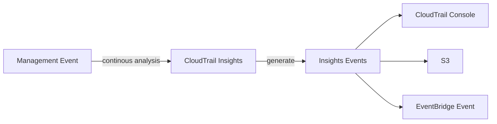
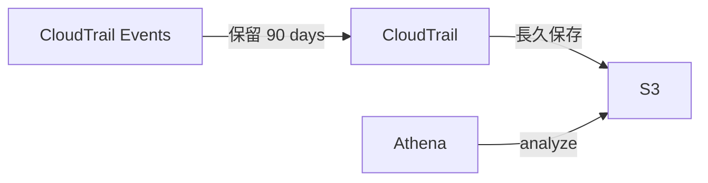

# AWS CloudTrail

- CloudTrail 目的:
  - CloudTrail is a way to get governance, compliance and audit for your AWS Account.
  - 用來記錄所有 AWS Services 的 CRUD
  - governance / compliance / operational auditing / risk auditing of AWS account
- CloudTrail 服務特色 & 重點須知:
  - 非即時 (near-real time)
    - 若從 **Event History** 來查看, 可能要等 15 mins 才會有資料
      - CloudTrail Event History 只會保留 90 days 的資料
      - 若要長期追蹤, 可將 log 保存到 CloudWatch Logs 或 S3
  - 可以搭配 **CloudTrail Insights** 來分析 **Management Events**
  - CloudTrail log file integrity
    - 可用來檢測 CloudTrail logs 是否有被人為竄改(已經不完整了)
- CloudTrail 使用範例:
  - 對日常維運建立操作的 baseline, 搭配告警, 用盡可能及時的方式來做通知
  - 哪個小白把 AWS Resources 砍了
  - 可查看誰把 EC2 關了

## CloudTrail Events

- `Management Events`
  - 預設啟用
  - 針對 AWS Resources 的增刪改, 都會被記錄
    - ex: EC2 的 Start, Stop ; Create IAM Role, ...
  - Events 區分為:
    - Read Events
    - Write Events (需要留意這個是否也被搞破壞, 就無法追查了)
- `Data Events`
  - 預設不啟用 (因為資料量龐大)
  - 針對 AWS Account 裡頭資源的調用
    - Event Source 目前僅能為:
      - S3
      - Lambda
    - ex: call Lambda, put S3 Object, read S3 Object, ...
  - Events 一樣區分為:
    - Read Events
    - Write Events
- `CloudTrail Insights Events`
  - Charge: 要課金 (預設不啟用)
  - 紀錄 AWS Account 裡頭 「非常規活動」
    - ex: 資源配置不正確, 資源使用達到 limits, user behavior, ...
  - Events 僅針對 _Write Events_ 做紀錄

---

---

- 上圖流程, 事件發生, 直到 CloudTrail Web Console 看得到資料, 基本上 > 10 mins

---
