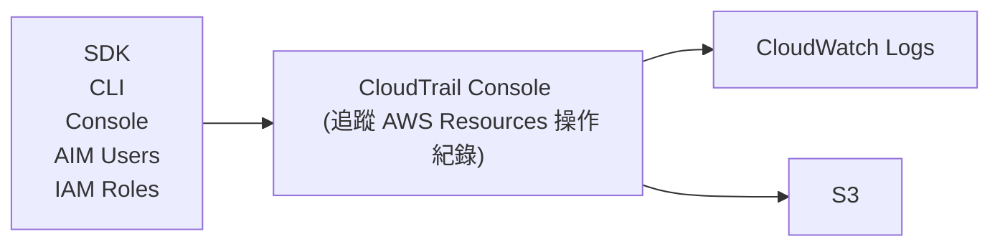
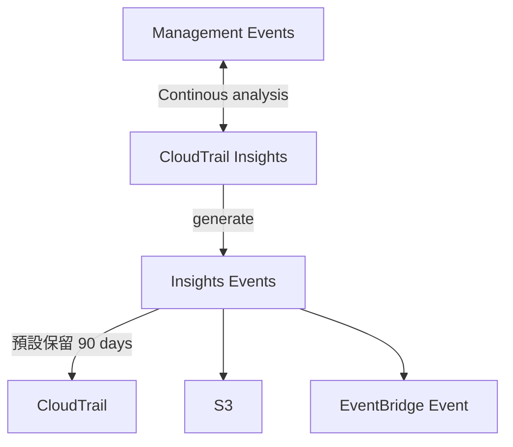

# AWS CloudTrail

- 白話文用途: 從 log 裡頭找到異常行為
    - 達到某種 limit / Resource 配置不正確 / 違反 AWS IAM action, ...
    - 非即時 (near-real time)
- 官方說明: CloudTrail is a way to get governance, compliance and audit for your AWS Account.
    - governance / compliance / operational auditing / risk auditing of AWS account
- 可對日常維運建立 baseline
    - *Management Events* 會被 CloudTrail Insights 分析
    - 追蹤操作記錄, ex:
        - trace API call
            - 紀錄 SDK/CLI/Console/Users/Roles 的操作
        - Audit changes to AWS Resources by users
            - 哪個小白把 AWS Resources 砍了
            - 可查看誰把 EC2 關了
- 如果要讓 CloudTrail 可以追蹤 Event History, 可能要花上 15 分鐘才會有資料
- 可取得 AWS Events & API call 的 history & log
    - 因此可將 log -> CloudWatch Logs 或 S3
    - AWS CloudTrail can be used to audit AWS API calls
- CloudTrail log file integrity
    - 可用來檢測 CloudTrail logs 是否有被人為竄改(已經不完整了)

## CloudTrail Events

- 預設保留 90 days
- `Management Events`
    - 預設啟用
    - 針對 AWS Resources 的增刪改, 都會被記錄
        - ex: EC2 的 Start, Stop ; Create IAM Role, ...
    - Events 區分為:
        - Read Events
        - Write Events (需要留意這個是否也被搞破壞, 就無法追查了)
- `Data Events`
    - 預設不啟用 (因為資料量龐大)
    - 針對 AWS Account 裡頭資源的調用
        - Event Source 目前僅能為:
            - S3
            - Lambda
        - ex: call Lambda, put S3 Object, read S3 Object, ...
    - Events 一樣區分為:
        - Read Events
        - Write Events
- `CloudTrail Insights Events`
    - Charge: 要課金 (預設不啟用)
    - 紀錄 AWS Account 裡頭 「非常規活動」
        - ex: 資源配置不正確, 資源使用達到 limits, user behavior, ...
    - Events 僅針對 *Write Events* 做紀錄

------

------

------

-----

- 上圖流程, 事件發生, 直到 CloudWatch Web Console 看得到資料, 可能 > 10 mins

---