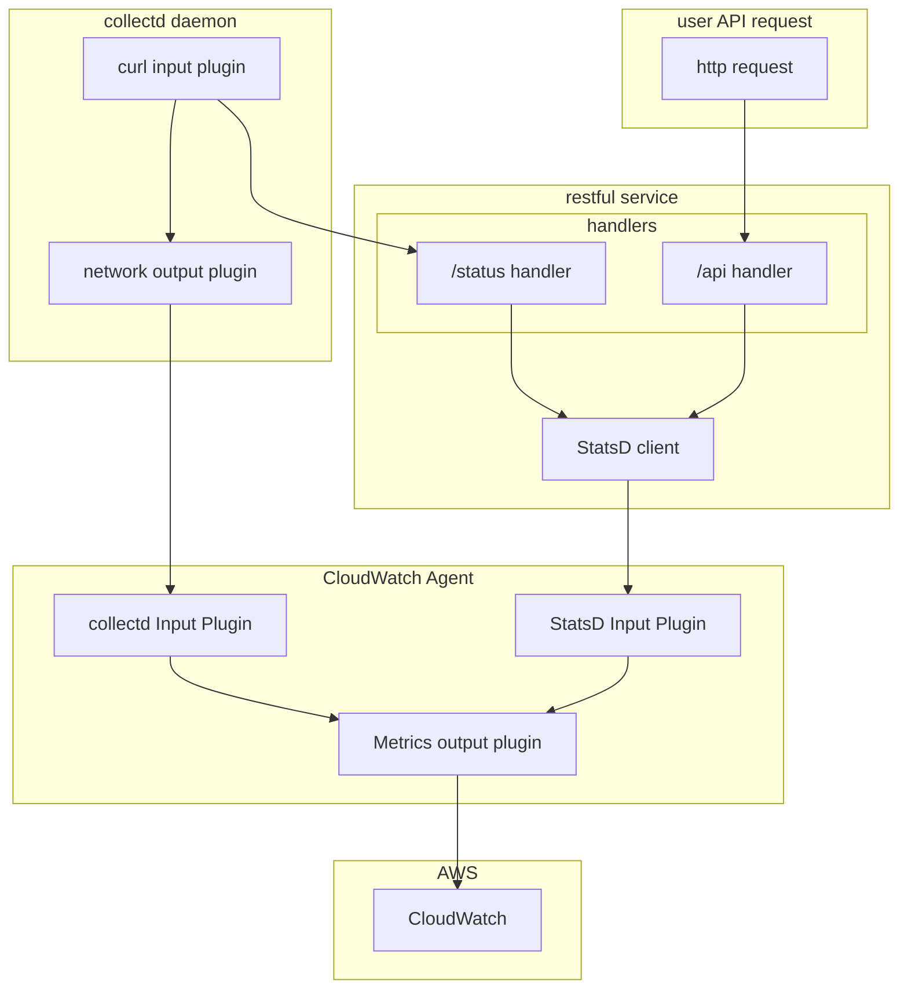

```mermaid
flowchart TB;

curl["curl input plugin"]
network["network output plugin"]
subgraph collectdd["collectd daemon"]
  direction TB
  curl --> network
end

subgraph request["user API request"]
  http["http request"]
end

status["/status handler"]
api["/api handler"]
subgraph restful["restful service"]

  statsdc["StatsD client"]

  subgraph handlers
    curl --> status
    http --> api
  end
  status --> statsdc
  api --> statsdc
end

collectd["collectd Input Plugin"]
statsd["StatsD Input Plugin"]
metrics["Metrics output plugin"]
subgraph agent["CloudWatch Agent"]
  network --> collectd
  statsdc --> statsd

  collectd --> metrics
  statsd --> metrics
end

subgraph AWS
  metrics --> CloudWatch
end
```