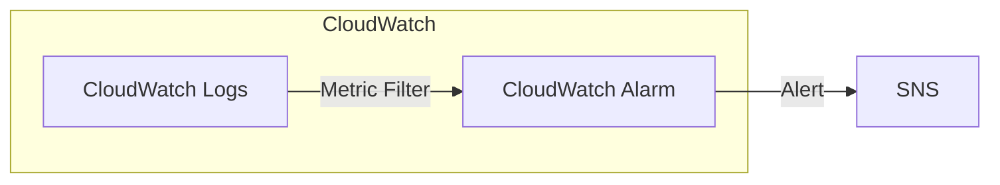

# [AWS CloudWatch](https://docs.aws.amazon.com/AmazonCloudWatch/latest/monitoring/WhatIsCloudWatch.html)

- 用來 `collect / monitor / analyze` AWS Services
    - collect 到的這些數據, 稱之為 metrics
    - CloudWatch 其實就是個 metrics repository
- CloudWatch 會以 time series 的方式, 將這些 metrics 伴隨他的 timestamp 做儲存
    - user 也可自行發布 `aggregated set of data point`, 即 `statistic set` 到 CloudWatch


## CloudWatch 重要名詞定義

### Metrics

- 每隔一段時間發佈到 CloudWatch 的一組 data point
- metric 只保存在他們所在的 Region, 無法自行刪除
    - 15 個月後會消失


### Namespaces

- Metrics 的 Container, 用來隔離不同的 Metrics
    - ex: EC2 使用 `AWS/EC2` 這個 namespace


### Dimensions

- Metric 裡的 Name-Value pair
- 每個 Metric 最多能有 10 個 Dimensions
- 好像可以理解成 OOP 裡頭的 class, attribute name, attribute value 的概念, ex:
    - Instance.id
    - Environment.name
- 每一筆 Metric 都有它的蒐集頻率(StorageResolution API parameter)
    - Standard resolution : 60 secs
    - High resoultion     : 1 sec
        - 很貴
        - 使用 [collected plugin](https://github.com/awslabs/collectd-cloudwatch) 來搜集 metrics
        - 儲存後, 查看 metrics 時, 可再自行選擇資料頻率 1/5/10/30/60 甚至更長的資料頻率
- WARNING: 很容易把 `EC2 detailed monitoring` 和 `CloudWatch Alarm high resolution metrics` 搞混!!
    - EC2 detailed monitoring
        - Enabled  : 每 1 min 發送 metrics 到 CloudWatch (需課金)
            - 如果是底下的操作, 預設是 Detailed Monitoring:
                - 使用 AWS CLI 建立 Launch Configuration
                - 使用 SDK 建立 Launch Configuration (New)
        - Disabled : 每 5 min 發送 metrics 到 CloudWatch
            - 如果是底下的操作, 預設是 Basic Monitoring:
                - 使用 Launch Template (Old)
                - 使用 AWS Management Console 建立 Launch Configuration
    - High Resolution Metrics (需要課金, 而且很貴)
        - APPs 可以每 1 sec 發送 metrics 到 CloudWatch
            -  另一方面, 可以設定 CloudWatch Alarm 在不同的頻率(ex: 每 1/5/10/30/60 secs) 作為評估
    - RDS 的 Enhanced monitoring
        - 
- 如果自行搜集 custom metric 時, 都會去尻 `PutMetricData API`(收費~), 假設又使用 High Resolution, 小心錢包哭哭
    - `aws cloudwatch put-metric-daata --namespace "xxx" --metric-data file://example-metric.json`


### Statistics 

- 不解釋


### Percentiles 

- 不解釋


### Alarms

- 針對一段時間特定 Metric 達到某個 threshold 的狀態, 所做的 actions


# CloudWatch Dashboards

- 可用來快速彙整 key metrics && alarms
- 可 cross AWS accounts && cross Region (global)
- Charge: 3 dashboards(up to 50 metrics) for FREE
    - 超過部分, $3/dashboard/month
- Dashboard 該怎麼建立... 現階段先 PASS
- **CloudWatch ServiceLens** 可用來將下列的各種資訊整合到同一個地方, 用來增加對於 App 的 observability:
    - traces
    - metrics
    - logs
    - alarms
    - other resource health information

# CloudWatch Metrics

- [CloudWatch Metcrics workshop](https://catalog.us-east-1.prod.workshops.aws/workshops/a8e9c6a6-0ba9-48a7-a90d-378a440ab8ba/en-US/200-cloudwatch/210-cloudwatch-metrics)
- 預設 EC2 每 5 分鐘 會有對應 metrics
    - 可花錢... 每分鐘都有 metrics
    - EC2 Memory Usage 並沒在預設的 metrics 裡頭, 想要這個的話需要 custom
- UNKNOWN Accepts metric data points two weeks in the past and two hours in the future
    - (make sure to configure your EC2 instance time correctly)
- 可使用 [put-metric-data](https://awscli.amazonaws.com/v2/documentation/api/latest/reference/cloudwatch/put-metric-data.html) API 來增加 custom metric
- 可以針對 metric 超過門檻, 配置對應的 [alarm actions](https://docs.aws.amazon.com/AmazonCloudWatch/latest/monitoring/cloudwatch_concepts.html#CloudWatchAlarms)
- EC2 預設每 5 mins 會有一筆 metric -> CloudWatch Metric, 如果需要更頻繁的資料, 可啟用 *EC2 Detailed monitoring*(每 1 min 一筆)
    - 很容易與 CloudWatch Metric high resolution && CloudWatch Alarm high resolution 搞混!!
- `Search Expression` 為其中一種 `Math Expression`


## CloudWatch configuration

- 安裝完 CloudWatch 以後, 啟動時需要給一份 JSON, 裡頭包含 3 個部分:
    - agent   : agent configuration
    - metrics : custom metrics
    - logs    : additional log files


# CloudWatch Events

- 老東西, 現在已改為 [EventBridge](#aws-eventbridge-前身為-cloudwatch-events)


# CloudWatch Alarms

- [CloudWatch Alarms workshop](https://catalog.us-east-1.prod.workshops.aws/workshops/a8e9c6a6-0ba9-48a7-a90d-378a440ab8ba/en-US/200-cloudwatch/230-cloudwatch-alarms/231-cloudwatch-alarms)
- 用來 trigger notification
    - 標的為 CloudWatch Metrics, CloudWatch Logs
- Alarm State (Alarm Status)
    - OK
    - INSUFFICIENT_DATA
    - ALARM
- 可對於 Alarms 設定 Period, 用來作為 Length of time in seconds to evaluate the metric
    - 白話文就是, 持續觀察 Metric 多久, 然後才觸發 Alarm, 而發 Metric 一達標就觸發
    - ex: 10 / 30 / 60 secs
        - 很容易與 EC2 detailed monitoring && CloudWatch Metric high resolution 搞混!!
- Alarms 有幾個主要的 Targets:
    - EC2     : stop, terminate, reboot, recover
        - Status Check
            - Instance status : check EC2 VM
            - System status   : check 底層硬體
    - EC2 ASG : trigger auto scaling action
    - SNS     : send notification to SNS
- 也可對 CloudWatch Logs 設定 **Metric Filters**




# CloudWatch Insights

- 因為 CloudWatch Logs 都是蒐集到 S3, 但是不方便觀看, 因此借助 CloudWatch Logs Insights, 可有效的:
    - query logs
    - 把 query 加到 *CloudWatch Dashboard*
- Examples:
    1. example - 基本介紹:
        - 第一行, 要列出的欄位
        - 第二行, 排序條件
        - 第三行, 篩選條件
    ```ini
    fields @timestamp, @message
    | sort @timestamp desc
    | filter @message like "Your Wanted Message"
    ```
    2. example - 篩選特定字元:
        - 假設要列出 'GET /login HTTP/2'
        - 第三行, 藉由 parse 加上 '*', 可將之視為變數, 並指定到後面去
    ```ini
    fields @timestamp, @message
    | sort @timestamp desc
    | parse '"GET * HTTP/2' as @location
      ;;; 可取得 location 欄位
    | parse '"GET * */2' as @location, @protocol
      ;;; 可取得 location 及 protocol 兩個欄位
    ```
    3. example - 做統計:
        - 最後一行, 可計算出去尻 login 的次數
    ```ini
    fields @timestamp, @message
    | filter @logStream = "Error Logs"
    | sort @timestamp desc
    | parse '"GET * */2' as @location, @protocol
    | stats count(*) as sum by @location
    ```


# CloudWatch Contributor insights

- 可分析時序資料, 找出像是 top 10 的流量, 用來得知系統中有哪些部分可能是效能瓶頸
