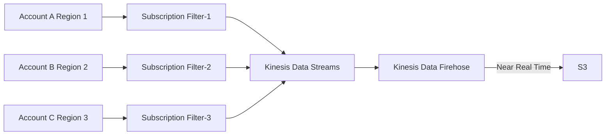

# CloudWatch Logs

- [What is Amazon CloudWatch Logs?](https://docs.aws.amazon.com/AmazonCloudWatch/latest/logs/WhatIsCloudWatchLogs.html)
- [CloudWatch Logs workshop](https://catalog.us-east-1.prod.workshops.aws/workshops/a8e9c6a6-0ba9-48a7-a90d-378a440ab8ba/en-US/200-cloudwatch/220-cloudwatch-logs)
- 預設 CloudWatch Logs 永遠不會到期. 但可調整 *Log Group* 的 *retention policy*
    - CloudWatch Logs 是要收錢的喔!!
- 儲存 AWS Logs 的地方, 可把 log 彙整到 *Log groups*(通常代表一個 Application)
    - Log group 裡頭會有 *Log streams*(instance/log file/container)
    - Logs Insights, 可下查詢語法(有點類似 SQL, 但完全不同), 針對 Log group 做查詢
- *CloudWatch Logs* 可彙整至:
    - Kinesis Data Stream
    - Kinesis Data Firehose
    - AWS Lambda
    - ElasticSearch
    - S3
        - 非即時
            - CloudWatch Logs 藉由 `CreateExportTask` API, 匯出到 S3 (可能要等 12 hrs)
        - 即時
            - 可使用 *Logs Subscriptions*, 如下:
            ```mermaid
            flowchart LR

            cl["CloudWatch Logs"]
            sf["Subscription Filter"]
            kdf["Kinesis Data Firehose"]
                awslf["Lambda \n (managed by AWS)"]
                lf["Lambda (custom)"]
            es["Amazon OpenSearch"]
            kds["Kinesis Data Streams"]

            cl --> sf;
            sf --> awslf;
            awslf -- Real Time --> es;
            kdf -- Near Real Time --> es;
            sf --> kdf;
            kdf -- Near Real Time --> S3;
            sf --> kds;
            kds --> other["KDF, KDA, EC2, Lambda, ..."]
            sf <--> lf;
            ```
- *CloudWatch Logs* Sources:
    - SDK
    -  DEPRECATED `CloudWatch Logs Agent`
        - EC2 安裝此服務, 並取得對 *CloudWatch Logs* 寫入的 *IAM Role*
        - 也可安裝在 on-premise server 來蒐集 log
        - 只能把 log -> *CloudWatch Logs*
    - `CloudWatch Unified Agent`(NEW)
        - 可蒐集額外的 system-level metrics
            - 可蒐集更多細粒度的數據
        - 能把 log && metric -> *CloudWatch Logs*
        - 可使用 **SSM Parameter Store** 來中央化管理參數
    - Elastic Beanstalk
    - ECS
    - Lambda
    - VPC Flow Logs, 送出特定 VPC metadata network traffic
    - API Gateway, 送出打到 API GW 的所有 requests
    - CloudTrail, 可設定 filter 來傳送 log
    - Route53, all DNS query
- Define *Metric Filter* && *Insights*
    - ex: 設定 filter expression, 計算 log file 裡頭 'error' 出現次數 or 取出 log 裡頭特定 IP
    - filter 可用來 trigger **CloudWatch alarms**
- Cross Region 或 Cross Account 的 CloudWatch Logs, 可藉由 Kinesis Data Streams 來彙整 logs




# CLI

```bash
### 建立 CloudWatch Log Group, 名為 /ecs/hello-server101
aws logs create-log-group --log-group-name /ecs/hello-server101


### 

```
