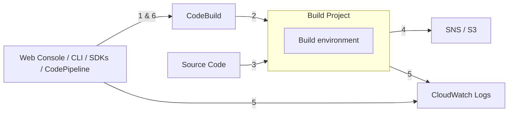

# [AWS CodeBuild](https://docs.aws.amazon.com/codebuild/latest/userguide/welcome.html)

- build artifacts / compile / test / generate packages
- Charge: 只對 Build Time 收 $$
- 預設使用 `/buildspec.yml`
- CodeBuild Container
    - 因安全性因素(ex: 未必很清楚 Image 究竟幹了些啥), Container 跑在 VPC 外部
    - 但如果要做整合測試 或需要授權訪問 AWS Resources, 則可做底下配置, 便可讓 *CodeBuild Container* 跑在 VPC 裡頭:
        - VPC ID
        - Subnet IDs
        - Security Group IDs




# CodeBuild Agent

```bash
# CodeBuild Agent                 - https://docs.aws.amazon.com/codebuild/latest/userguide/use-codebuild-agent.html
# CodeBuild Environment Variables - https://docs.aws.amazon.com/codebuild/latest/userguide/build-env-ref-env-vars.html


### ------------ CoeeBuild Agent 使用的 build environment ------------
docker pull public.ecr.aws/codebuild/amazonlinux2-x86_64-standard:3.0  # 13GB...
docker pull public.ecr.aws/codebuild/amazonlinux2-x86_64-standard:4.0  #  8GB...

# 或參考 https://github.com/aws/aws-codebuild-docker-images 目前已支援的 build environment 自行 build image
git clone https://github.com/aws/aws-codebuild-docker-images.git
cd aws-codebuild-docker-images/ubuntu/standard/7.0
# 不過這包 Dockerfile 不必要的肥大, 使用前先自行修改一下
docker build -t aws/codebuild/standard:7.0 .
# ===================================================================


### ------------ debug CodeBuild locally ------------
wget https://raw.githubusercontent.com/aws/aws-codebuild-docker-images/master/local_builds/codebuild_build.sh
mv codebuild_build.sh ~/bin
chmod +x ~/bin/codebuild_build.sh


codebuild_build.sh \
    -i public.ecr.aws/codebuild/amazonlinux2-x86_64-standard:4.0 \
    -a public
# -i : image_name
# -a : artifact_output_directory
```
