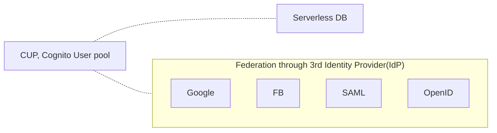
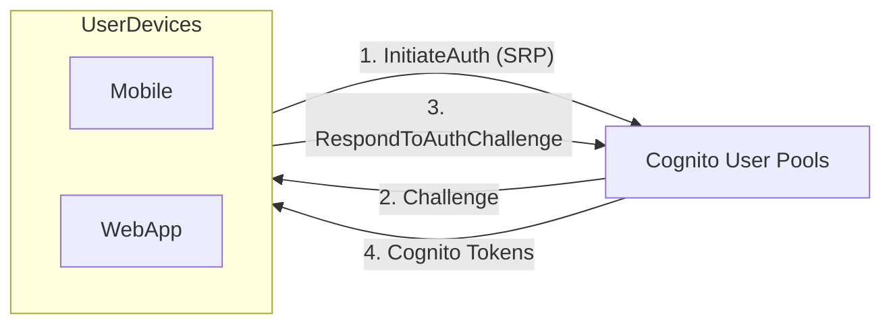
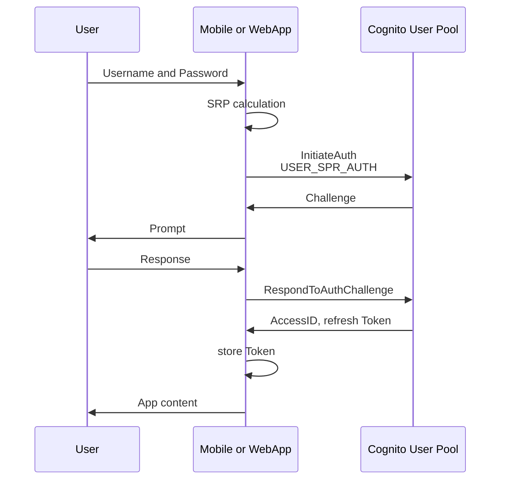
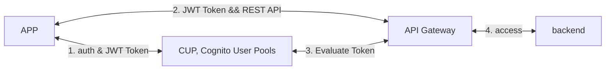
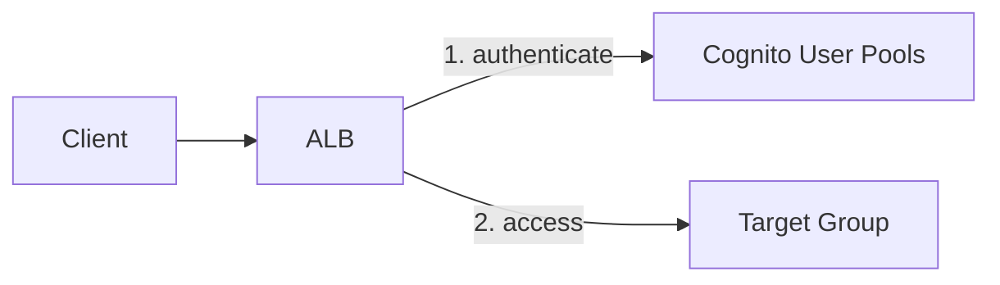
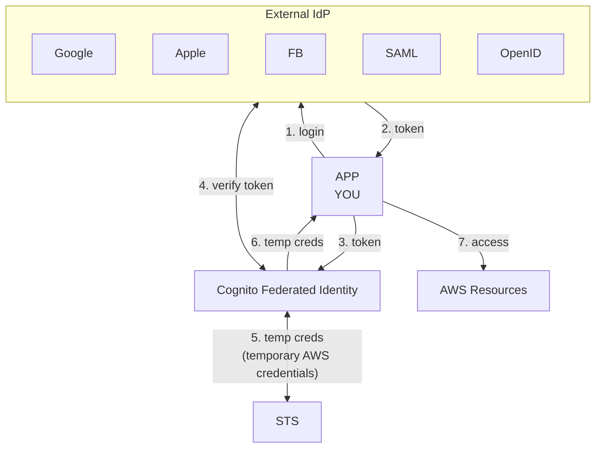

# [Cognito](https://docs.aws.amazon.com/cognito/latest/developerguide/what-is-amazon-cognito.html)

- 用途:
    - 用來給 非 AWS Users identity
    - 用來做 APP / Web 的 認證 / 授權 / 用戶管理
- 主要元件如下(可分別 or 合併 使用)
    - Cognito User Pools, CUP
        - 用來給 APP Users 做 sign-up / sign-in
    - Cognito Identity Pools, CIP
        - 用來授權給 users 取得 **temp creds** 來 access AWS services
- 結合使用 User Pools 及 Identity Pools 的概念示意圖:
    ```mermaid
    flowchart LR
    subgraph AWS
        direction LR
        up["CUP, Cognito User pool"]
        ip["CIP, Cognito Identity pool"]
        rr["AWS Resources"]
    end
    APP <-- 1. authentication && JWT token --> up;
    APP <-- 2. JWT token && creds --> ip;
    APP <-- 3. creds && resources --> rr
    ```


# CUP, Cognito User Pools

- Cognito User Pool 可與其他的 Federation Identity 整合



---

- 較現代化的 **authentication flows** 包含了新的 challenge types(除了密碼驗證以外), AWS Cognito 的 authentication 需要實踐底下 API 的 [Authentication Flow](https://docs.aws.amazon.com/cognito/latest/developerguide/amazon-cognito-user-pools-authentication-flow.html):
    - InitiateAuth
    - RespondToAuthChallenge



上圖的詳細時序如下




- CUP 內建已整合了 API Gateway 以及 ALB






# CIP, Cognito Identity Pools

- Goal: 讓 client 直接訪問 AWS Resources (免 create IAM users)
    - ex: 要讓 FB user, 直接使用 S3
- 使用 **Cognito Identity Pool** 的話, 需要授權這服務使用 `AssumeRoleWithWebIdentity`
    - 如果不使用 Cognito, 而要讓 **external IdP** 訪問 AWS Resources (藉由 OIDC 或 SAML 2.0)的話, 則需要自行實作 `AssumeRoleWithWebIdentity` 這一段
        - 用來與 external IdP 取得 token, 去與 AWS 交換 `temporary security credentials`




# Cognito Sync

- 由 Cognito Service 與 Cognito Clients 構成
- 讓 User 可以跨裝置 同步 User data