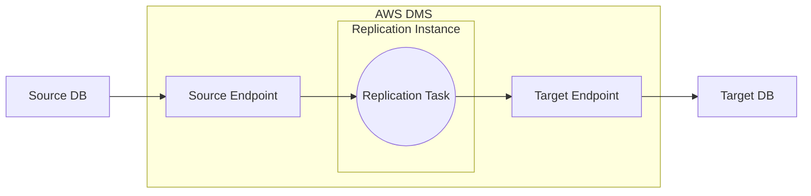
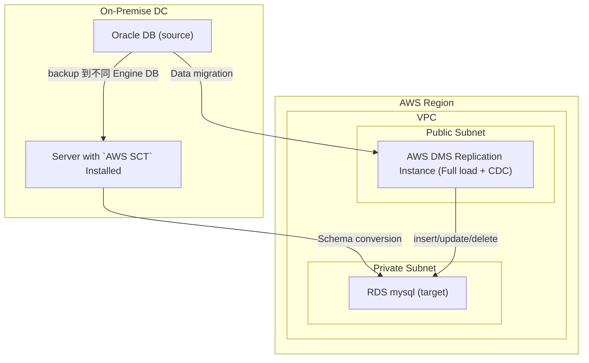

# AWS DMS, Data Migration Service

- 如果 backup source 與 restore target 的 DB engine 不一樣, 參考 `AWS SCT, Schema Conversion Tool`
  - 反過來說, 如果 source 與 target 相同 Engine, 則不需要 SCT
- Continuous Data Replication, CDC
- 可做轉換的 Data Sources:
  - EC2 上頭的 DB
  - RDS
  - S3
  - DocumentDB

---

---

---
