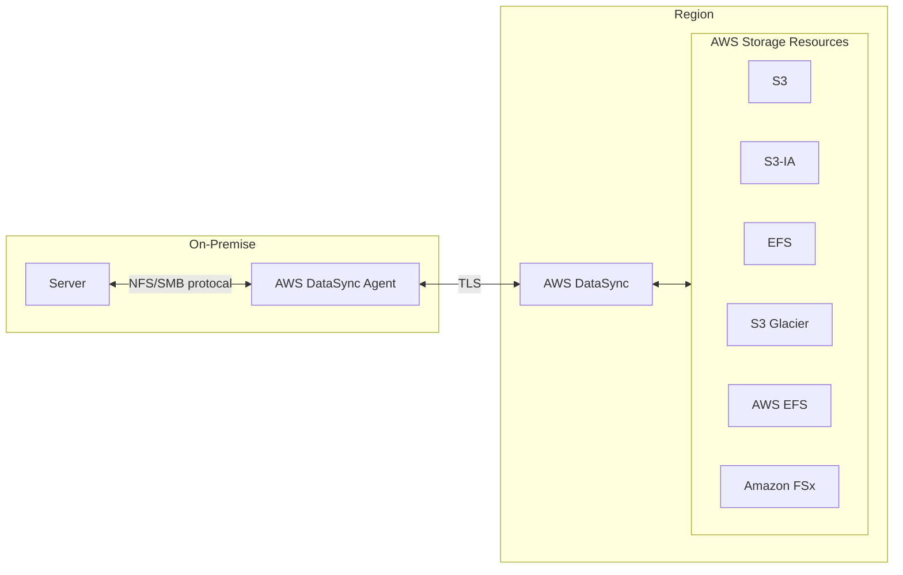
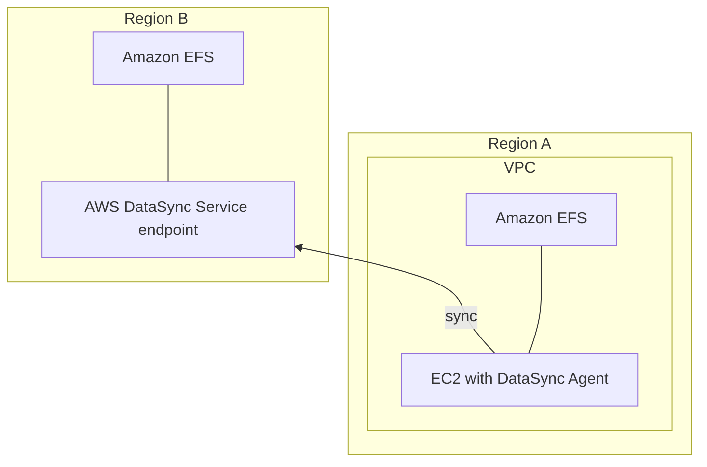
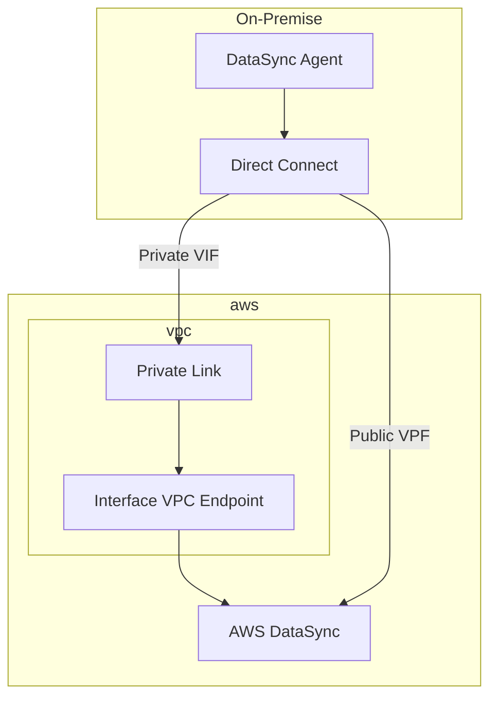

# [AWS DataSync](https://docs.aws.amazon.com/datasync/latest/userguide/what-is-datasync.html)

- simplify && auto && accelerate moving data between storage systems and services
- **DataSync 並非即時同步的服務, 而是定時同步**
- 用來作 AWS 及 non-AWS 的資料同步
    - non-AWS 要做 DataSync 的話, 需要安裝 agent
        - 使用時, 記得限流量, 避免影響其他服務
- 可定期同步到 or 讓資料在服務之間傳輸:
    - NFS
    - SMB
    - HDFS
    - Object storage systems
    - S3
    - EFS
    - Glacier
    - Snowcone
    - AWS FSx
- Sync 時, 可連同 `File permissions` && `metadata` 一起保留下來
- Usage:
    - 大量 data 想從 On-Premise Data -> AWS, 可參考此服務
- Charge:
    - 針對 DataSync 傳輸的流量計費

---

-----------

---

本地與 AWS DataSync 之間的同步方式架構之一

