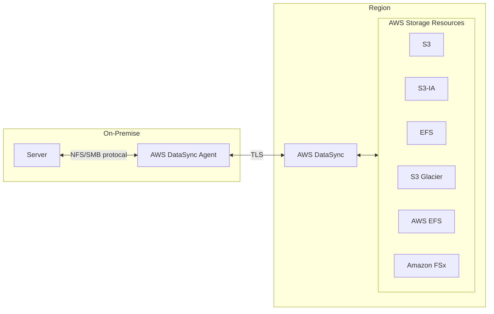
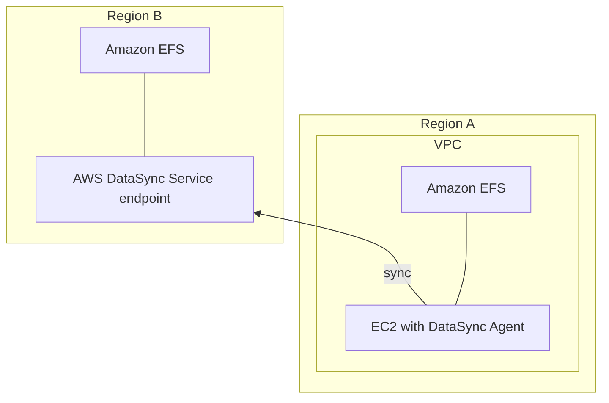

# AWS DataSync

- [What is AWS DataSync?](https://docs.aws.amazon.com/datasync/latest/userguide/what-is-datasync.html)
    - online data transfer service
        - simplify && auto && accelerate moving data between storage systems and services
        - 支援在底下的各種 服務/儲存系統 之間作移動
            - NFS
            - SMB
            - HDFS
            - Object storage systems
            - S3
            - EFS
            - Glacier
            - Snowcone
            - AWS FSx
- 零星功能摘要:
    - 可設定 rate limit
    - 地端需安裝 `AWS DataSync Agent`
    - Sync 時, 可連同 `File permissions` && `metadata` 一起保留下來
- Usage:
    - 大量 data 想從 On-Premise Data -> AWS, 可參考此服務
- Charge:
    - 針對 DataSync 傳輸的流量計費

---

-----------

