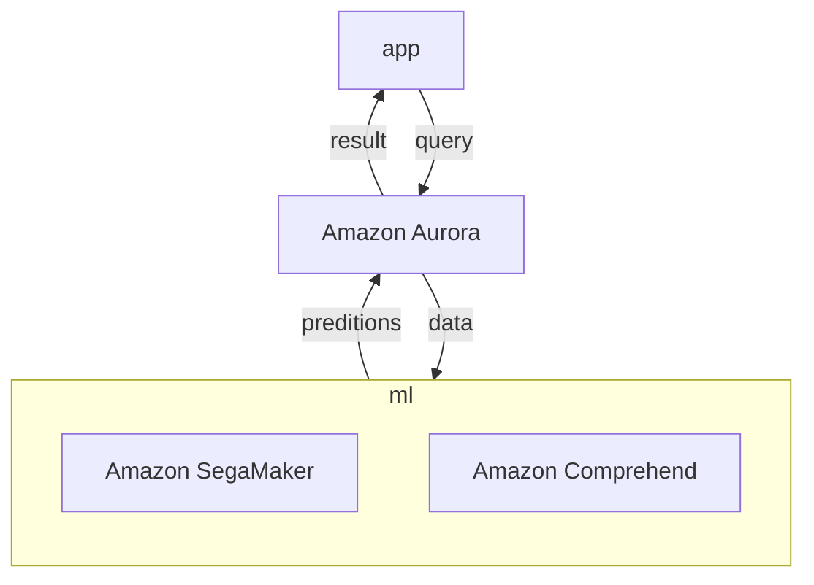
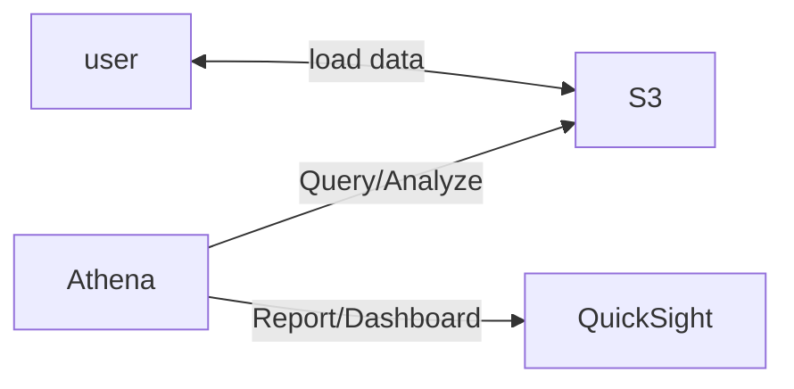
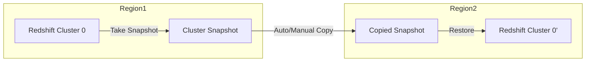
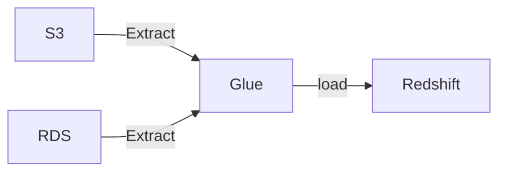
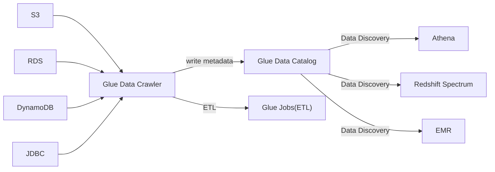
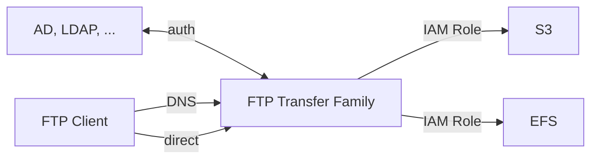

AWS Database && Storage related

# Databases

- DB Types
    - RDBMS(=SQL/OLTP)
        - RDS, Aurora, MySQL, ...
    - NoSQL
        - DynamoDB (~JSON)
        - ElastiCache (key-value pairs)
        - Neptune (graphs)
    - Object Store
        - Glacier
    - Data Warehouse (=SQL Analytics/BI)
        - Redshift (OLAP)
        - Athena
            - Query data on S3
    - Search
        - OpenSearch
    - Graphs
        - Neptune


## RDS, Relational Database Service

- 允許在 RDS 裡頭開 RDB
- RDBMS/OLTP
- 自行準備 EC2 instance && EBS Volume type & size
    - 但無須自行維護機器, OS
    - 因為是需要 Provision EC2, 因此只能做 垂直擴展, 無法水平擴增
    - Storage
        - RDS 具有 storage auto-scaling
            - 可自動偵測 Disk 用量, 並視情況 Scaling EBS
        - use EBS volumes
- 區分成 5 個了解方向:
    - Operations
        - 須自行處理 replicas, ec2 scaling, EBS restore, App Change, ...
    - Security
        - 自行處理 Security Group, KMS, SSL for encryption in transits, IAM Authentication
        - PostgreSQL && MySQL 皆支援 IAM Authentication
    - Reliability
        - 支援 Read-Replica && Multi AZ
    - Performance 依賴於 EC2 && EBS spec
    - Cost
        - based on EC2 && EBS
- Read Replicas
    - RDS Database, 至多可有 5 個 Read Replicas
    - 此為 Async Replication (相較於 Multi-AZ, 使用 Sync Replication)
    - 如果使用的話, Connection String 必須修改
    - Read Replicas 僅需要 Read 權限即可
    - 因 RDS 為 managed service, Same Region && Different AZ, sync Data 不需流量費用
        - 但若跨 Region, 則需要 $$
- Reliability
    - 如果要設定 Multi-AZ 非常簡單, 僅需 Enable 即可. 而且服務可免中斷


### RDS Backups

- Backup (自動)
    - Full      : 每天 
    - Transaction logs : 每 5 分鐘
        - 因此可隨時還原 5 分鐘前資料
    - 預設保留 7 天, 但可增至 35 天
- DB Snapshot (手動觸發)
    - 可自行決定保留多久


### Aurora

- RDS 旗下的其中一款 Engine Type, 地位等同於 RDS MySQL, RDS PostgreSQL, ...
    - AWS 魔改 MySQL/PostgreSQL 以後的 RDBMS
        - CloudNative
    - 可選擇自行 Provision Server 或是 Serverless
    - Operations
        - 可自行選擇是否使用 *Single-master* 或 *Multi-master*
        - 相較於其他 Type, less operations
        - auto scaling storage
        - Auto Scaling
            - 一次 10GB, 最多可擴充達 128 TB
    - Security
        - 同 RDS
        - Encryption at rest by KMS
        - Encryption in-flight uging SSL
        - 可用 IAM token 認證
        - auto backups, snapshots and replicas (皆 encrypted)
    - Reliability
        - AWS 自行幫忙處理好 6 replicas
            - 這 6 個 replication 橫跨了 3 AZ - HA
                - 而他們的背後也是寫入到不同的 Volume(免 user 自管)
            - 具備 Self healing(peer-to-peer replication)
        - auto failover < 30 secs
            - 單一 Cluster 最多可設定 15 Read Replicas (可放在 Auto Scaling)
            - 若超過, 其餘 read replicas 會產生新的 master 來做 write
        - 本身支援 cross replication
        - Global for Disaster Recovery / latency purpose
        - Backtrack: restore data at any point of time without using backups
    - Performance
        - MySQL && Postgresql 效能的 5x && 3x (宣稱)
            - 但是貴了 20%
    - Cost 
        - Pay for use
- Aurora DB Cluster
    - 
    - Load Balancing 發生在 connection level (而非 statement level)
    - *Writer Endpoint* && *Reader Endpoint*
- Deletion
    - 先刪除 Reader Instance
    - 再刪除 Writer Instance
        - 最後刪除 Regional Cluster (又或者, 此會隨著 *Writer Instance* 一同刪除, 不是很確定)
- Auto Scaling for Aurora Replicas
    - 可針對 by CPU 用量 OR by conneciton 數量, 來增加 Read Replicas
    - 增加的 Replicas, 也可產生不同規格的大小
        - 針對 *Aurora DB Cluster* 那張圖, 產生 *Custom Endpoint*(取代掉 *Reader Endpoint*)
- Serverless Aurora
    - Client 連線到 *Proxy Fleet*(而非上述的 *Writer Endpoint* && *Reader Point*)
        - 背後怎麼做 scaling 由 AWS 控制
- Global Aurora
    - 可設定 *Aurora Cross Region Read Replicas*, 但是使用 *Aurora Global Database* 較優
        - 擁有一個 Primary Region(rw)
        - 也可額外設定 5 個 Secondary Region(rr)
            - latency < 1 sec
            - 每個 Secondary Region 有高達 16 Read Replicas
        - 如果原本的 Primary Region 掛了, Promotion 到其他的 Secondary Region < 1 sec
- 整合了 ML




## ElastiCache

- [ElastiCache 機器規格比較表](https://instances.vantage.sh/cache/)
- Managed Redis 或 Memcache
- 需要提供 EC2 instance type
- app 在做 DB query 之前, 會先查詢 ElastiCache, 如果有查到資料, 此稱之為 *Cache hit*
    - 反之沒查到, 則稱為 *Cache miss*. 後續動作為 DB query
        - 可對 DB query result, 寫入到 ElastiCache
- Operations
    - 同 RDS
    - load data -> ElastiCache 有三種 pattern:
        - Lazy Loading
            - 所有 read data 皆 cached
        - Write Through
            - 從 DB 來做 add/update
        - Session Store
            - TTL
- Security
    - 自行處理 KMS, Security Group, IAM
    - 關於 IAM authentication
        - ElastiCache 裡頭, 不支援 *IAM authentication*, 這認證僅支援 API-level Security (delete cache, create cache, ...) 
        - if redis
            - 本身無 IAM 驗證, 但可藉由 RedisAuth 做驗證, "password/token"
            - SSL in-flight
        - if memcached
            - SASL-based authentication
- Reliability
    - Clustering, Multi AZ
- Performance
    - 毫秒級快取
- Cost
    - Pay for usage
- ElastiCache 重要比較
    - ElastiCache - Redis
        - 支援 Multi AZ with Auto-Failover
        - Read Replicas scale reads && HA
        - Data Durability using AOF
        - Backup && restore feature
        - HIPAA Eligible Service
    - ElastiCache - Memcache
        - Multi-node partitioning of data(sharding)
        - 無 HA && 無 persistent && 無 backup && restore
        - Multi-thread architecture
        - pure cache
- 建立時, 可選擇 Cloud 或 On-premise
    - On-premise, 需搭配 **AWS Outpost**


## DynamoDB

同 [CLF-DynamoDB](./cert-CLF_C01.md#dynamodb)

- store documents, key-value
    - 一筆 400 KB
    - 可配置 RCU && WCU
- Operations
    - Serverless -> 無需 operations
    - Auto Scaling
- Security
    - IAM Policy
    - KMS encryption
    - SSL in flight
- Reliability
    - Multi AZ, Backups
- Performance
    - 毫秒等級 latency
    - 若要 caching, 可搭配 DynamoDB Accelerator, DAX
- Cost
    - Pay for usage


## S3

- Operations
    - Serverless, no operations needed
- Security
    - User based
        - IAM policies
    - Resource Based
        - Bucket Policies
        - Object Access Control List
        - Bucket Access Control List
    - ACL
    - Encryption
        - SSE-S3
        - SSE-KMS
        - SSE-C
        - client side encryption
        - SSL in transit
- Reliability
    - 有多種類型可選擇, 但可用性都很多 9 就對了. 支援 Cross-Region Replication, CRR
        - S3 Standard
        - S3 IA
        - S3 One Zone IA
        - Glacier
        - 等等
- Performance
    - single object size limit 5TB
- Cost
    - Pay for storage usage
    - infinite storage


## Athena

- [How do I analyze my Amazon S3 server access logs using Athena?](https://aws.amazon.com/premiumsupport/knowledge-center/analyze-logs-athena/?nc1=h_ls)
    - 其實最難的就只有 UI 不熟 && Create Database && Create Table 而已...
    - 查詢起來還蠻直覺的
    - Case Sensitive!!
- use SQL query on S3, 用來做分析
    - file 可以是 CSV, JSON, ORC, Avro, Parquet(built on Presto)
    - 後面可以接 **Amazon QuickSight** 來做報表
- Use Case: log analytics
- Operations
    - Serverless, no operations needed
- Security
    - IAM + S3 security
- Reliability
    - use Presto Engine, HA
- Performance
    - Query scale based on data size
- Cost
    - per query / per TB of data scanned




## AWS Redshift

- [clf-Redshift](./cert-CLF_C01.md#redshift)
- based on PostgreSQL, use SQL query
    - Columnar Storage (非  row based)
    - Analytics / BI / Data Warehouse
- 為 OLAP, 可用來做 analyze && data warehouse
    - 可達 PB 量級
    - 不適用於 OLTP
    - 整合了 BI tools, ex: **AWS Quicksight** OR **Tableau**
- Redshift Cluster
    - 1 ~ 128 nodes, 每個 node 可達 128 TB
    - Leader Node  : Query planning && aggregating query results
    - Compute Node : Perform queries && return to Leader
- Redshift Spectrum
    - 可直接對 S3 query (免 load)
        - Query -> *Redshift Cluter* 內的 *Leader Node*
        - *Leader Node* 分派給 *Compute Nodes*
        - *Compute Nodes* 再分派給 *Redshift Spectrum*
        - *Redshift Spectrum* 會對 S3 做資料查詢
    - 也就是說, 資料不會進入我們的 Nodes, 會在 *Redshift Spectrum*(AWS Service) 查詢完後回傳結果
- Operations
    - like RDS
- Security
    - 存在於 VPC 之中, using IAM
    - KMS
    - Backup & Restore
    - monitoring
- Reliability
    - 無 Multi AZ
    - 自行對 Cluster 做 cross-region snapshot(point-in-time backup)
        - 可 manual 或 automatically
            - 若 auto, AWS 每隔 8 hrs 或 異動達 5 GB, 會做 snapshot
    - 可藉由配置 auto copy snapshot Cluster 到其他的 Region, 來加強 Disaster Recovery Strategy
- Performance
    - 因 Massively Parallel Query Execution(MPP) Engine, 因而 high-performance
    - 宣稱比其他 10x 於其他 WareHouse
- Cost
    - pay for node provisioned
    - 宣稱僅其他 WareHouse 1/10 Cost
- Redshift Enhanced VPC Routing
    - COPY / UNLOAD COMMAND, 可免藉由 public internet 來 copy data
- 有三種 Load Data -> Redshift 的方式
    - 使用 Kinesis Data Firehose, KDF
        - KDF 由不同 source 蒐集資料, 倒入 Redshift Cluster
        - 藉由 `COPY COMMAND`, S3 -> Redshift
            ```
            copy customer
            from 's3://my_bucket/my_data'
            iam_role 'arn:aws:iam::123456887123:role/MyRedshiftRole'
            ```
        - EC2 Instance, JDBC driver
            - EC2 data -> Redshift Cluster
    - By using `COPY COMMAND`, 可從 S3, DynamoDB, DMS, other DB 來 load data




## AWS Glue

- AWS managed extract, transform and load service(ETL)
    - Data Catalog Service
    - ETL, Serverless
- Serverless
- 家族服務:
    - Glue Data Catalog
        - catalog of databases
        - 可整合 Athena, RedShift, EMR






## AWS Neptune

- [clf-Neptune](./cert-CLF_C01.md#amazon-neptune)
- Graph DB
- Use Case
    - Social Network
    - Wikipedia
- Point-in-time recovery
    - 不斷 backup to S3
- Security
    - KMS encryption + HTTPS
- Reliability
    - HA, multi-az, up to 15 read replicas
- Performance
- Cost: Pay per node provisioned (類似 RDS)


## AWS DMS, Data Migration Service

- [saa-DMS](./cert-SAA_C02.md#database-migration-service-dms)
- Data Migration Service
- 地端 DB 上雲端


## OpenSearch

- 可適用於 Big Data
    - Search / Indexing
- 整合了 *Kinesis Data Firehose*, *AWS IoT*, *CloudWatch Logs*, ...
- Operations
    - 類似 RDS
- Security
    - Cognito
    - IAM
    - KMS encryption
    - SSL
    - VPC
- Reliability
    - Multi AZ, Clustering
- Performance
    - Based on ElasticSearch; PB 量級
- Cost
    - Pay per node provisioned (類似 RDS)


## AWS snow Family

- [clf-SnowFamily](./cert-CLF_C01.md#aws-snow-family)
- 蒐集/處理 data && 將 data in/out AWS 的離線裝置
- Use Case:
    - 巨量資料要放 Glacier, 可藉由 Snow Family 相關服務 -> S3, 再藉由 `S3 lifecycle policy` -> Glacier


## AWS FSx

- 可在 AWS 使用 3rd file system
- [clf-FSx](./cert-CLF_C01.md#amazon-fsx)
- FSx 可選 HDD/SSD && 與 S3 整合 && on-premise infra 藉由 `VPN` 或 `Direct Connect` 來訪問
- FSx 的 Disk throughputs 在建立的時候就要先定義
- 各種 FSx:
    - AWS FSx for Windows File Server
        - 因為 EFS 只能運行在 POSIX (Linux 啦), 因而有這東西, 支援 `SMB` && `NTFS`
        - 支援 Windows Active Directory(AD), ACLs, user quotas (不知道這啥..)
        - 可以被 mount 到 Linux!!!
        - 支援秒級 scale (10s of GB/s, millions of IOPS), 可打 100s PB of data
        - Multi-AZ, HA
    - AWS FSx for Lustre (Linux & Cluster)
        - Luster 為 parallel distributed file system, for large-scale computing
            - 名字結合字 Linux && Cluster
        - Good for HPC
            -Machine Learning, High Performance Computing(HPC)
            - Video Processing, Financial Modeling, Electronic Design Automation
        - Scale up to 100s GB/s && millions IOPS
        - Charge: Expensive
- FSx File System Deployment Options (不知在供三小)
    - Scratch File System
        - Temporary storage
        - data 沒做 replication (如果 file server fail, 資料就消失了!!)
            - 但速度非常快 (6x faster, 200MBps per TiB)
        - Use Case : short-term processing, optimize cost
    - Persistent File System
        - Long-term storage
        - Data replicate within same AZ
        - Use Case : long-term processing, sensitive data


## Storage Gateway

- [StorageGateway](./StorageGateway.md)


## AWS Transfer Family

- transfer file <--> S3 或 EFS, via FTP
- Serverless, scalable, reliable, HA
- Charge: pay per provisioned endpoint per hour + data transfer in GB
- Security
    - 可在服務內儲存 user creds 或整合 Win AD, LDAP, Okta, Amazon Cognito, ...
- 支援的 protocols
    - AWS Transfer for FTP(File Transfer Protocol)
    - AWS Transfer for FTPS(File Transfer Protocol over SSL)
    - AWS Transfer for SFTP(Secure File Transfer Protocol)


