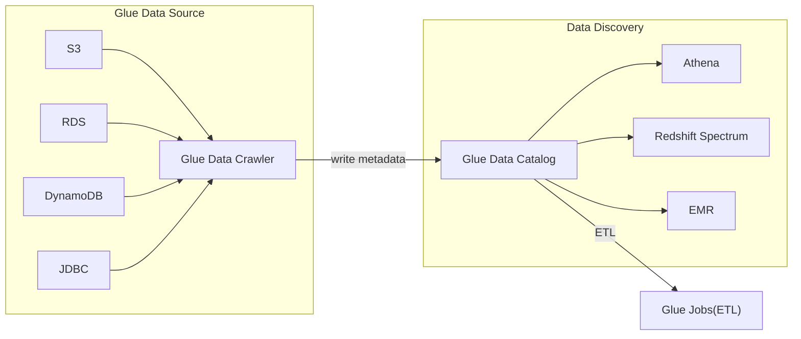

AWS Database && Storage related

# Databases

- DB Types
    - RDBMS(=SQL/OLTP)
        - RDS, Aurora, MySQL, ...
    - NoSQL
        - DynamoDB (~JSON)
        - ElastiCache (key-value pairs)
        - Neptune (graphs)
    - Object Store
        - Glacier
    - Data Warehouse (=SQL Analytics/BI)
        - Redshift (OLAP)
        - Athena
            - Query data on S3
    - Search
        - OpenSearch
    - Graphs
        - Neptune
- 關於 [Multi-AZ v.s. Multi-Region v.s. Read Replicas](https://aws.amazon.com/rds/features/read-replicas/) 的比較, 務必瞭解
    - 三者目的不同
    - Replication 方式不同
    - AA / AS 機制不同
    - backup 方式不同
    - span 方式不同


# ElastiCache

- [ElastiCache 機器規格比較表](https://instances.vantage.sh/cache/)
- Managed Redis 或 Memcache
- 需要提供 EC2 instance type
- 常見情境之一是, ALB 不做 sticky session, 改由快取 user session
- 需要認真考慮他的 Caching Stragegies:
    - Lazy Loading / Cache-Aside / Lazy Population
        - 先查 cache, 若無再查 DB && 寫入 cache
    - Write Through
        - 先查 cache; data 寫入 DB 後一併(再次)寫入 cache
    - Cache Evictions / Time-to-live(TTL)
        - 如果 memory 有限, 會有 cache 的優先驅逐順序, 一般用 LRU
- ElastiCache 可選擇是否啟用 Cluster Mode
    - 沒啟用 Cluster Mode
        - 1 primary + 0~5 replicas
        - async replication
        - Master rw  && Slave ro
        - 只有一個 Shard
            ```mermaid
            flowchart TB

            subgraph Shard
                p["Primary Node"]
                s1["Replica Nodes"]
                s2["Replica Nodes"]
                p -- async --> s1
                p -- async --> s2
            end
            ```
    - 啟用 Cluster Mode
        - 一個 Cluster 最多可以有 500 nodes
        - data partitioned across shards
        - 1 Parmary + 0~5 replicas (每個 Shard)
        - Master 與 Replica 為 cross-AZ
- Operations
    - 同 RDS
    - load data -> ElastiCache 有三種 pattern:
        - Lazy Loading
            - 所有 read data 皆 cached
        - Write Through
            - 從 DB 來做 add/update
        - Session Store
            - TTL
- Security
    - 自行處理 KMS, Security Group, IAM
    - 關於 IAM authentication
        - ElastiCache 裡頭, 不支援 *IAM authentication*, 這認證僅支援 API-level Security (delete cache, create cache, ...) 
        - if redis
            - 本身無 IAM 驗證, 但可藉由 RedisAuth 做驗證, "password/token"
            - SSL in-flight
        - if memcached
            - SASL-based authentication
- Reliability
    - Clustering, Multi AZ
- Performance
    - 毫秒級快取
- Cost
    - Pay for usage
- ElastiCache 重要比較
    - ElastiCache - Redis
        - 支援 Multi AZ with Auto-Failover
        - Read Replicas scale reads && HA
        - Data Durability using AOF
        - Backup && restore feature
        - HIPAA Eligible Service
    - ElastiCache - Memcache
        - Multi-node partitioning of data(sharding)
        - 無 HA && 無 persistent && 無 backup && restore
        - Multi-thread architecture
        - pure cache
- 建立時, 可選擇 Cloud 或 On-premise
    - On-premise, 需搭配 **AWS Outpost**


# DynamoDB

- [DynamoDB](./DynamoDB.md)


# S3

- [S3](./S3.md)


# Athena

- [How do I analyze my Amazon S3 server access logs using Athena?](https://aws.amazon.com/premiumsupport/knowledge-center/analyze-logs-athena/?nc1=h_ls)
    - 其實最難的就只有 UI 不熟 && Create Database && Create Table 而已...
    - 查詢起來還蠻直覺的
    - Case Sensitive!!
- use SQL query on S3, 用來做分析
    - file 可以是 CSV, JSON, ORC, Avro, Parquet(built on Presto)
    - 後面可以接 **Amazon QuickSight** 來做報表
- Use Case: log analytics
- Operations
    - Serverless, no operations needed
- Security
    - IAM + S3 security
- Reliability
    - use Presto Engine, HA
- Performance
    - Query scale based on data size
- Cost
    - per query / per TB of data scanned


# AWS Redshift

- [clf-Redshift](./cert-CLF_C01.md#redshift)
- [Getting started with Amazon Redshift](https://docs.aws.amazon.com/redshift/latest/gsg/getting-started.html)
- based on PostgreSQL, use SQL query
    - 不適用於 OLTP, 此為 OLAP
        - Analytics / BI / Data Warehouse
        - 可達 PB 量級
        - 整合了 BI tools, ex: 
            - AWS Quicksight
            - Tableau
    - Columnar Storage (非 row based)
- Redshift Cluster
    - 1 ~ 128 nodes (up to 128 TB per Node)
    - Leader Node  : Query planning && aggregating query results
    - Compute Node : Perform queries && return Query Result to Leader
- [RedShift] Data Sources:
    - S3
    - DynamoDB
    - DMS
    - other DBs
- 如果 S3 非常龐大, 又需要做 Query, 可使用 **Redshift Spectrum**
    - 直接對 S3 query (免 load), 資料不會進入我們的 Nodes, 會在 *Redshift Spectrum*(AWS Service) 查詢完後回傳結果
        - Query -> *Redshift Cluter* 內的 *Leader Node*
        - *Leader Node* 分派給 *Compute Nodes*
        - *Compute Nodes* 再分派給 *Redshift Spectrum*
        - *Redshift Spectrum* 會對 S3 做資料查詢
    ```mermaid
    flowchart TB

    Query -- jdbc/odbc --> rc;
    subgraph rc["Redshift Cluster"]
        direction TB
        n0["Leader Node"]
        n1["Compute Nodes"]
        n2["Compute Nodes"]
        n0 --> n1
        n0 --> n2
    end
    subgraph rs["Redshift Spectrum"]
        direction TB
        sn1["Node"]
        sn2["Node"]
        sn3["Node"]
    end
    rc -- aggregate --> rs;
    sn1 --> S3; sn2 --> S3; sn3 --> S3;
    ```
- Operations
    - like RDS
- Security
    - 存在於 VPC 之中, using IAM
    - KMS
    - Backup & Restore
    - monitoring
- Reliability
    - 無 Multi-AZ, all Cluster 都存在於 one AZ
    - Backup, 可 manual 或 automatically
        - if auto, AWS 每隔 8 hrs 或 異動達 5 GB, 會做 snapshot
        - if manual, snapshot 會保存到使用者自行刪除為止
    - 因應 DR, 可配置 auto copy snapshot Cluster 到其他的 Region, 來加強 Disaster Recovery Strategy
    - 對 Cluster 做 cross-region snapshot(point-in-time backup) ncrementally 保存到 S3
        ```mermaid
        flowchart LR;

        rc1["Redshift Cluster \n (Original)"];
        rc2["Redshift Cluster \n (New)"];
        c1["Cluster Snapshot"];
        c2["Copied Snapshot"];

        subgraph Region0
            rc1 -- "Snapshot" --> c1;
        end

        subgraph Region1
            c2 -- Restore --> rc2;
        end

        c1 -- Auto/Manual Copy --> c2;
        ```
- Performance
    - `Massively Parallel Query Execution(MPP) Engine`, 因而 high-performance
    - 宣稱比其他 Data WareHouse 強 10x
        - scale to PBs of data
- Cost
    - pay for node provisioned
    - 宣稱僅其他 WareHouse 1/10 Cost
- Redshift Enhanced VPC Routing
    - 藉由 `COPY Command` && `UNLOAD Command`, 可將 *VPC 內的 data (S3)* 直接走 private, Copy 到 RedShift
- 各種資料來源 **Load Data into Redshift**
    - KDF -> Redshift
        ```mermaid
        flowchart LR

        src["Data Source \n ex: S3"]
        kdf["KDF, Kinesis Data Firehose"]
        redshift["RedShift Cluster \n (執行 S3 COPY Command)"]
        src --> kdf;
        kdf -- load data --> redshift
        ```
    - [S3, DynamoDB, DMS, other DB] -> Redshift
        ```mermaid
        flowchart LR
        rc["Redshift Cluster"]
        S3 -- Internet --> rc;
        S3 -- "through VPC \n Enhanced VPC Routing" --> rc;
        ```
        - 由 Redshift 裡頭執行 `COPY Command`
        ```
        copy customer
        from 's3://my_bucket/my_data'
        iam_role 'arn:aws:iam::123456887123:role/MyRedshiftRole'
        ```
    - EC2 Instance, JDBC driver
        ```mermaid
        flowchart LR

        EC2 -- "jdbc \n (建議 batch 寫入)" --> rc["Redshift Cluster"]
        ```


# AWS Glue

- AWS managed extract, transform and load service(ETL)
    - Data Catalog Service
    - ETL, Serverless
- Serverless
- 家族服務:
    - Glue Data Catalog
        - catalog of databases
        - 可整合 Athena, RedShift, EMR


### Glue


### Glue Data Catalog




# AWS Neptune

- Graph DB
- Use Case
    - Social network relation
    - Wikipedia
- Point-in-time recovery
    - 不斷 backup to S3
- Security
    - KMS encryption + HTTPS
- Reliability
    - HA, multi-az, up to 15 read replicas
- Performance
- Cost: Pay per node provisioned (類似 RDS)


# AWS DMS, Data Migration Service

- [saa-DMS](./cert-SAA_C02.md#database-migration-service-dms)
- Data Migration Service
- 地端 DB 上雲端


# OpenSearch

- 可適用於 Big Data
    - Search / Indexing
- 整合了 *Kinesis Data Firehose*, *AWS IoT*, *CloudWatch Logs*, ...
- Operations
    - 類似 RDS
- Security
    - Cognito
    - IAM
    - KMS encryption
    - SSL
    - VPC
- Reliability
    - Multi AZ, Clustering
- Performance
    - Based on ElasticSearch; PB 量級
- Cost
    - Pay per node provisioned (類似 RDS)


# AWS snow Family

- [clf-SnowFamily](./cert-CLF_C01.md#aws-snow-family)
- 蒐集/處理 data && 將 data in/out AWS 的離線裝置
- Use Case:
    - 巨量資料要放 Glacier, 可藉由 Snow Family 相關服務 -> S3, 再藉由 `S3 lifecycle policy` -> Glacier


# AWS FSx

- 可在 AWS 使用 3rd file system
- [clf-FSx](./cert-CLF_C01.md#amazon-fsx)
- FSx 可選 HDD/SSD && 與 S3 整合 && on-premise infra 藉由 `VPN` 或 `Direct Connect` 來訪問
- FSx 的 Disk throughputs 在建立的時候就要先定義
- 各種 FSx:
    - AWS FSx for Windows File Server
        - 因為 EFS 只能運行在 POSIX (Linux 啦), 因而有這東西, 支援 `SMB` && `NTFS`
        - 支援 Windows Active Directory(AD), ACLs, user quotas (不知道這啥..)
        - 可以被 mount 到 Linux!!!
        - 支援秒級 scale (10s of GB/s, millions of IOPS), 可打 100s PB of data
        - Multi-AZ, HA
    - AWS FSx for Lustre (Linux & Cluster)
        - Lustre 為 parallel distributed file system, for large-scale computing
            - 名字結合字 Linux && Cluster
        - Good for HPC
            -Machine Learning, High Performance Computing(HPC)
            - Video Processing, Financial Modeling, Electronic Design Automation
        - Scale up to 100s GB/s && millions IOPS
        - Charge: Expensive
- FSx File System Deployment Options (不知在供三小)
    - Scratch File System
        - Temporary storage
        - data 沒做 replication (如果 file server fail, 資料就消失了!!)
            - 但速度非常快 (6x faster, 200MBps per TiB)
        - Use Case : short-term processing, optimize cost
    - Persistent File System
        - Long-term storage
        - Data replicate within same AZ
        - Use Case : long-term processing, sensitive data


# AWS Transfer Family

- transfer file <--> S3 或 EFS, via FTP
- Serverless, scalable, reliable, HA
- Charge: pay per provisioned endpoint per hour + data transfer in GB
- Security
    - 可在服務內儲存 user creds 或整合 Win AD, LDAP, Okta, Amazon Cognito, ...
- 支援的 protocols
    - AWS Transfer for FTP(File Transfer Protocol)
    - AWS Transfer for FTPS(File Transfer Protocol over SSL)
    - AWS Transfer for SFTP(Secure File Transfer Protocol)


