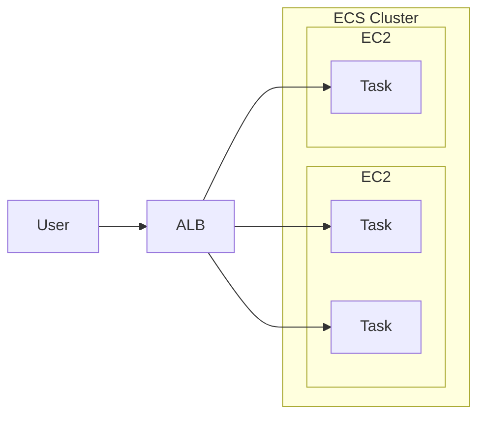

# ECS, Elastic Container Service

- 名詞定義:
    - Task (ECS Task):
        - The lowest level building block of ECS - Runtimes instances
    - Task Definition: 
        - Defines how to create ECS task (要先建這個, 才能建 ECS Service)
        - 如果有 Service 或 Task 要跑在 ECS Cluster 裡頭, 需要先定義這個
        - Templates for your *Tasks*, 定義 image 來源, Memory, CPU, 等
            - 像是 版本升級, 則須改這個, 來拉新版本 image
    - Container(EC2 Only)
        - Virtualized instance that run Tasks.
        - 如果運行 Farget Mode 的話, 我們在意的只有 Task (沒有 Container 的概念)
    - Cluster (ECS Cluster):
        - EC2 - A group of Containers which run Tasks
        - Farget - A group of Tasks
- 有 2 種的 Launch Types, 但都可用 EFS 作為儲存:
    - EC2 Launch Type
        - 需自行維護 EC2, 裡頭需要有 `ECS Agent`
        - 此模式運行在 EC2 內的多個 **Task**, 他們可能被賦予了不同的 **EC2 Instance Profile Role**
        - Web Console 操作階段, 需要在 **ECS Service** 裡頭, 定義 **Task Role**
    - Farget Launch Type
        - Serverless
        - Launch 時, 可決定 CPU && RAM
        - Scaling 時, 決定 tasks number 即可
    - Service
        - Task management system, 用來確保有多少個 tasks are up and running
- Run **ECS Task** on **ECS Cluster** defined in **Task Definition**
- Use Case:
    - Hybrid Environment
    - Batch Processing
    - Scale Web Applications
- ECS Rolling Update
    - 滾動式更新(服務不中斷), 需要設定兩個參數
        - Minimun Healthy Percent
            - 最少需存活多少 Nodes
        - Maximum Percent
            - 最多開到多少 Nodes
- 如果跑 EC2 launch type, 裡頭的 Container 不需設定 port mapping, ALB 會藉由 *Dynamic Host Port Mapping* 來找到對應的 port
    - 也因此, EC2 的 SG 需要 allow ALL from ELB
- ECS `Sidecar container`
    - 建立 *Task Definition* 的時候, 如果裡頭定義了 multiple container, 指 *Essential Container = No* 的這些
        - 如果 Sidecar container 關掉了, 並不會讓 ECS Task 關掉


# ECS - Auto Scaling

- ECS 對於 Auto Scaling 的依據, 有底下幾種:
    - CPU Utilization
    - Memory Utilization
    - ALB Request Count Per Target (metric coming from ALB)
- ECS 對於 Auto Scaling 的方式, 有底下幾種 (HERE):
    - Target Tracking - 依照 *CloudWatch Metric*
    - Step Scaling - 依照 *CloudWatch Alarm*
    - Scheduled Scaling
- ECS 的 EC2 Launch Type 做 Auto Scaling, 有底下幾種:
    - Auto Scaling Group Scaling
        - 依照 (HERE) 來 +- EC2 instances
    - ECS Cluster Capacity Provider (建議)
        - auto provision and scal infra for ECS Tasks
        - Capacity Provider paired with an Auto Scaling Group
        - add EC2 Instances when missing capacity


# ECS - Load Balancer

- Application Load Balancer
    - 適用多數情況
- Network Load Balancer
    - high throughput 情境使用
    - 可搭配 **AWS PrivateLink**
- Classic Load Balancer
    - 別用就是了




## ECS - Task Placement

- 僅適用於 *EC2 Launch Type*
- 僅適用於 *EC2 Launch Type*
- 僅適用於 *EC2 Launch Type*
- 用來定義, NEW ECS Task 應該要放到哪邊? 此外, OLD ECS Task 應該先死誰?
- 相關的衍生問題有 2:
    - Task Placement Strategy
        - Binpack - 盡可能都塞在同一台, 塞不下了再塞到另一台
            ```
            "placementStrategy": [
                {
                    "type": "binpack",
                    "field": "memory"
                }
            ]
            ```
        - Random
            ```
            "placementStrategy": [
                {
                    "type": "random",
                }
            ]
            ```
        - Spread - 可依照特定的 field 來放置
            ```
            "placementStrategy": [
                {
                    "type": "spread",
                    "field": "attribute:ecs.availability-zone"
                }
            ]
            ```
        - mix (混合策略)
    - Task Placement Constraints
        - distinctInstance - Task 都放到不同 Instance
            ```
            "placementConstraints": [
                {
                    "type": "distinctInstance"
                }
            ]
            ```
        - memberOf - 聲明 Task 只放到特定 SPEC 的 instance 之中
            ```
            "placementConstraints": [
                {
                    "type": "memberOf",
                    "expression": "attribute:ecs.instance-type =` t2.*"
                }
            ]
            ```
- ECS 新建/關閉 的決策順序是:
    - 是否滿足 CPU, memory, port 的 requirements
    - 是否滿足 Placement Constraints
    - 是否滿足 Placement Strategy


# ECS - IAM Role

- ECS 的 IAM Roles, 有底下 2 者:
    - EC2 Instance Profile
        - 僅適用於 *EC2 Launch Type*
        - 給 *ECS agent* 使用
            - *ECS agent* 會借助 Instance Profile 處理一堆事情, ex:
                - API call -> ECS Service
                - send container log -> CloudWatch logs
                - API call -> ECR to pull images
                - retrive data from [Secret Manager]
                - retrive data from [SSM Parameter Store]
    - ECS Task Role
        - 適用於 *EC2 Launch Type* && *Farget Launch Type*
        - Task Role 定義在 *task definition* 裡頭
        - *ECS agent* 藉由此 Role, 用來授予不同的 *ECS task* 擁有不同的 [Task Role], ex:
            - Task 需要訪問 S3, 因此讓 ECS agent 具備授權的權限, 用來給予 Container 必要的 *Task Role*
                - 白話文就是, 黑社會老大 派你去暗殺第二把交椅, 而授予你必要權限
                    - 老大(Agent)具備 授權的 Role
                    - 你(Task) 具備 Task Role
