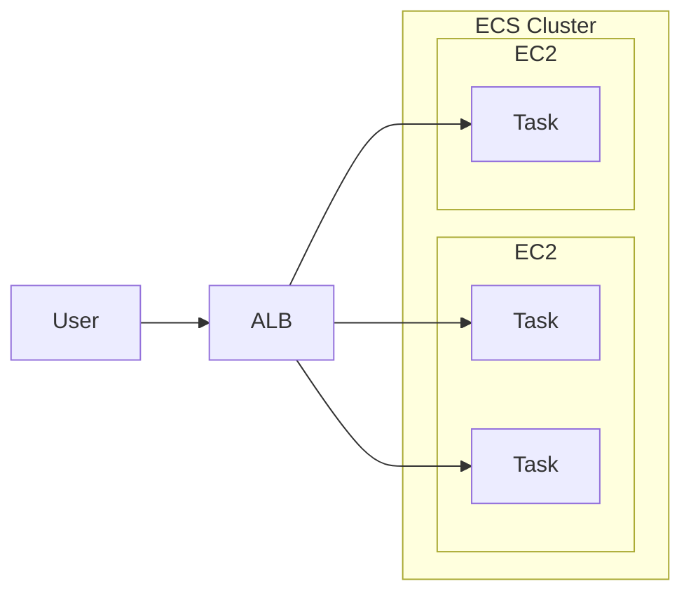

# ECS, Elastic Container Service

- 有 2 種的 Launch Types, 但都可用 EFS 作為儲存:
  - EC2 Launch Type
    - 需自行維護 EC2, 裡頭需要有 `ECS Agent`
    - 此模式運行在 EC2 內的多個 **Task**, 他們可能被賦予了不同的 **EC2 Instance Profile Role**
    - Web Console 操作階段, 需要在 **ECS Service** 裡頭, 定義 **Task Role**
  - Farget Launch Type
    - Serverless
    - Launch 時, 可決定 CPU && RAM
    - Scaling 時, 決定 tasks number 即可
  - Service
    - Task management system, 用來確保有多少個 tasks are up and running
- Run **ECS Task** on **ECS Cluster** defined in **Task Definition**
- Use Case:
  - Hybrid Environment
  - Batch Processing
  - Scale Web Applications
- ECS Rolling Update
  - 滾動式更新(服務不中斷), 需要設定兩個參數
    - Minimun Healthy Percent
      - 最少需存活多少 Nodes
    - Maximum Percent
      - 最多開到多少 Nodes
- Dynamic Host Port Mapping (如果使用的是 EC2 launch type)
  - 裡頭的 Container 不需設定對應到 Host 的 port
  - ALB 會藉由 _Dynamic Host Port Mapping_ 來找到對應的 port
  - 也因此, EC2 的 SG 需要 allow ALL from ELB
- ECS `Sidecar container`
  - ECS 的 `task definition JSON` 裏頭(定義 Container 的地方), 會有個 `essential` 的變數, default 為 true
    - 則表示此為此 task definition 的主要容器
    - 若沒聲明 or 聲明為 false, 則此 container 為 sidecar container
  - 建立 _Task Definition_ 的時候, 如果裡頭定義了 multiple container, 指 _Essential Container = No_ 的這些
    - 如果 Sidecar container 關掉了, 並不會讓 ECS Task 關掉

# ECS - Auto Scaling

- ECS 對於 Auto Scaling 的依據, 有底下幾種:
  - `CPUUtilization`
  - `MemoryUtilization`
  - `RequestCountPerTarget`
- ECS 對於 Auto Scaling 的方式, 有底下幾種:
  - **Target Tracking** - 依照 CloudWatch Metric
  - **Step Scaling** - 依照 CloudWatch Alarm
  - **Scheduled Scaling**
- ECS Capacity Provider 直接與 ASG 整合
- 使用 ECS ASG 的話, 會自動建立 Service Linked-Role : `AWSServiceRoleForApplicationAutoScaling_ECSService` (讓 ASG 有權限操作 ECS)

# ECS - Load Balancer

- ALB, Application Load Balancer
  - 適用多數情況
- NLB, Network Load Balancer
  - high throughput 情境使用
  - 可搭配 **AWS PrivateLink**
- GWLB, Gateway Load Balancer



## ECS - Task Placement

- 僅適用於 _EC2 Launch Type_
- 用來定義, NEW ECS Task 應該要放到哪邊? 此外, OLD ECS Task 應該先死誰?
- 相關的衍生問題有 2:
  - Task Placement Strategy
    - Binpack - 盡可能都塞在同一台, 塞不下了再塞到另一台
      ```
      "placementStrategy": [
          {
              "type": "binpack",
              "field": "memory"
          }
      ]
      ```
    - Random
      ```
      "placementStrategy": [
          {
              "type": "random",
          }
      ]
      ```
    - Spread - 可依照特定的 field 來放置
      ```
      "placementStrategy": [
          {
              "type": "spread",
              "field": "attribute:ecs.availability-zone"
          }
      ]
      ```
    - mix (混合策略)
  - Task Placement Constraints
    - distinctInstance - Task 都放到不同 Instance
      ```
      "placementConstraints": [
          {
              "type": "distinctInstance"
          }
      ]
      ```
    - memberOf - 聲明 Task 只放到特定 SPEC 的 instance 之中
      ```
      "placementConstraints": [
          {
              "type": "memberOf",
              "expression": "attribute:ecs.instance-type =` t2.*"
          }
      ]
      ```
- ECS 新建/關閉 的決策順序是:
  - 是否滿足 CPU, memory, port 的 requirements
  - 是否滿足 Placement Constraints
  - 是否滿足 Placement Strategy

# ECS - IAM Role

- ECS 的 IAM Roles, 有底下 2 者:
  - EC2 Instance Profile
    - 僅適用於 _EC2 Launch Type_
    - 給 _ECS agent_ 使用. _ECS agent_ 會借助 Instance Profile 處理一堆事情, ex:
      - API call -> ECS Service
      - send container log -> CloudWatch logs
      - API call -> ECR to pull images
      - retrive data from **Secret Manager**
      - retrive data from [SSM Parameter Store]
  - ECS IAM Role (此 Role 被定義在 Task Definition Level, 而非 Service Level)
    - 同時適用於 both **EC2** && **Farget**
    - Task Role 定義在 _task definition_ 裡頭
    - _ECS agent_ 藉由此 Role, 用來授予不同的 _ECS task_ 擁有不同的 [Task Role], ex:
      - Task 需要訪問 S3, Task 直接 `assume role` from ECS Task Role
      - Task 需要訪問 S3, 因此讓 ECS agent 具備授權的權限, 用來給予 Container 必要的 _Task Role_
        - 白話文就是, 老大(ECS) 派 你() 去幹掉敵人, 而 授予(via Task Role) 你必要權限
          - 老大(Agent)具備 授權的 Role
          - 你(Task) 具備 Task Role
- 非常容易搞混的比較 - ECS Task Role v.s. ECS Task Execution Role
  - [Amazon ECS task networking options for the Fargate launch type](https://docs.aws.amazon.com/AmazonECS/latest/developerguide/fargate-task-networking.html)
  - **Task execution role** : ECS 本身執行 provision ECS tasks 的時候, 所需的權限, ex:
    - login to ECR / pull image
    - 藉由 log driver send logs
    - 從 Secret Manager 取 Secrets
  - **Task role** : Task 執行時, 訪問 AWS Resources 所需的權限, ex:
    - 寫 logs 到 CloudWatch
    - 存放資料到 S3
    - 丟 message 到 SQS
    - Application 流量處理
    - 訪問 EFS 權限
  - **AWSServiceRoleForECS** (ECS Service-Linked Role)
    - 操作 ECS 的 user, 授予此 Role 給 ECS, 來讓 ECS 代表 user 去操作其他 AWS Services
    - 建立 Service Linked Role : `AWSServiceRoleForECS`
      - 指令 : `aws iam create-service-linked-role --aws-service-name ecs.amazonaws.com`

# ECS 實際使用問題 / ECS Error Messages

- 如果 ECS Deployment 看到底下的訊息, 表示服務接連不斷的 exponentially restart failure
  - `service YOUR_SERVICE_NAME is unable to consistently start tasks successfully.`

# Metrics

- CPUUtilization
  - cluster 或 service 使用的 CPU%
- MemoryUtilization
  - cluster 或 service 使用的 Memory%
