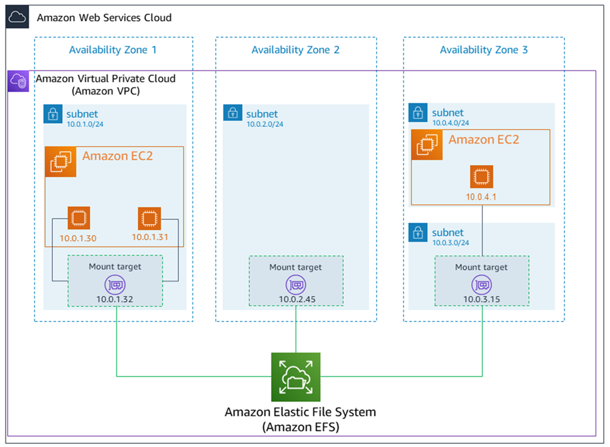

# EFS, Elastic File System



- 可 attach 到 EC2 Instance 的 NFS
  - Linux based, 無法用於 Windows (NFS protocol)
  - 不需事先 provision, EFS Volume Size 由 AWS 直接做掉
- Storage Class (儲存類別 選擇方案)
  - EFS Standard
  - EFS Standard-Infrequent Access (IA)
  - EFS One Zone
  - EFS One Zone-IA
- Performance 及 Throughput
  - Performance
    - 可有 10 GB+ throughput
    - 可增長到 PB 量級, automatically
  - Performance mode (Create EFS 時設定)
    - General Purpose (default)
    - Max I/O
  - Throughput mode (可用來設定 throughput limits 的決定方式)
    - Bursting : Throughput 會隨著 system size 變動
    - Provisioned : Throughput 固定
      - 這裡還有些聽不是很懂的細節...
        - _Provisioned Throughput (MiB/s)_ && _Maximum Read Throughput (MiB/s)_
- Charge
  - FREE_TIER: 前 12 個月, 僅限 1 個 Regional Standard - 5 GB
  - Pay per use
  - Expensive (相較 gp2 貴 3 倍).
    - 但可搭配 **EFS Lifecycle Policy** 來切換至 EFS-IA 來省錢
      - X days non-access files, 移動到 EFS-IA
      - EFS-IA, EFS Infrequent Access
      - 可省達 92%
- Security
  - Encryption 類型:
    - encryption of data in transit
      - mounting EFS filesystem 的時候設定
    - encryption at rest
      - 建立 EFS 的時候就需要設定了
- EFS 放置於特定 VPC 裡頭, 需要設定他的 SG
  - 此為 Regional Service
  - 能否跨 Region, 目前我還不曉得... (推測應該是不行, 但可藉由其他機制來同步)
- Availability and durability
  - Regional: (for prod env) Multi-AZ
  - One Zone: (for dev env) Single-AZ.
    - ex: 使用 EFS One Zone-IA, 可省下 90%
- 每個 EFS filesystem 只能建立 1000 個 Access point.

# 掛載 EFS

- 官方建議 EC2 掛載 EFS, 有底下方式, 不過建議使用 helper:
  - 使用 EFS mount helper 掛載 Volume
  - 使用 NFS util 掛載 Volume

```bash
EFS_DNS_NAME=

### ==================================== Mount helper ====================================
sudo yum install -y amazon-efs-utils
sudo apt install -y amazon-efs-utils

sudo mkdir /efs
sudo mount -t efs $EFS_DNS_NAME /efs/

### ==================================== NFS util ====================================

sudo yum install -y nfs-utils
sudo apt install -y nfs-common

sudo systemctl start nfs
# or
sudo systemctl start nfs-server


```
