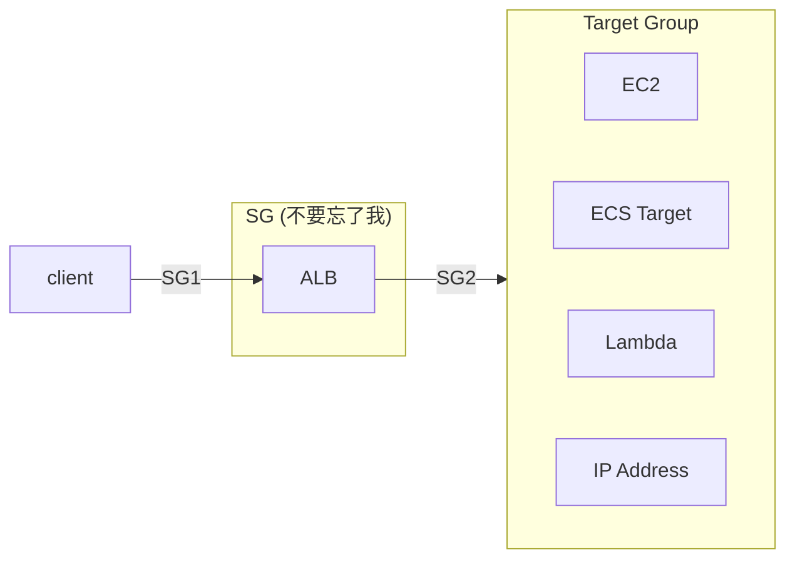
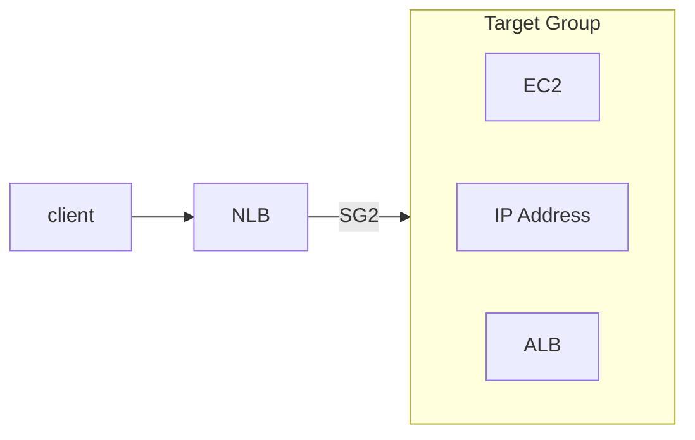
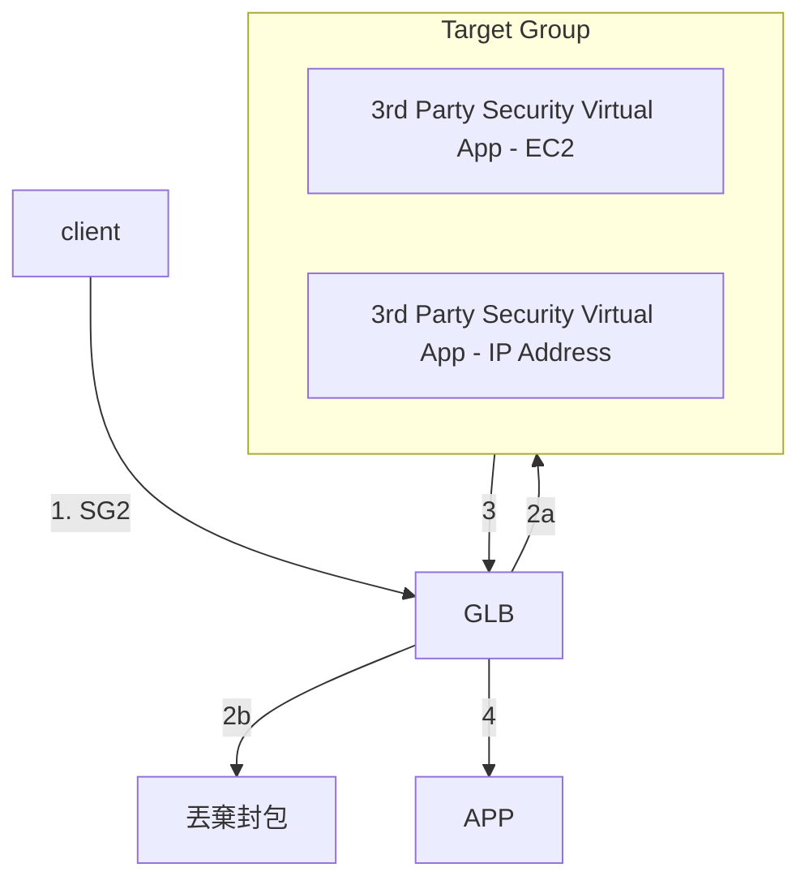

# [ELB, Elastic Load Balancer](https://docs.aws.amazon.com/elasticloadbalancing/latest/application/introduction.html)

- 一個 **Load Balancer** 可有多個 Listeners
    - 一個 **Listener** 起碼要有一個 Rule (作為 Default Rule)
        - Rule 用來決定將流量發到哪個 **Target Group**
            - Rule 裡頭設定 Redriction Rule
            - Rule 裡頭會有 priority, actions, conditions
                - action
                    - Forward to Target Groups
                    - Redirect to URL
                    - Return fixed response
- 同一個 **Target** 可重複出現在不同的 **Target Group**
- 可在 **Target Group** 有他自己的 **Health Check**
- ELB - Cross Zone Load Balancing
    - CLB (已棄用)
    - ALB
        - 預設 enabled, 且無法 disabled (always on)
        - AZ 內資料傳輸免錢
    - NLB
        - 預設 disabled
        - 若啟用, AZ 內傳輸要課金
    - GWLB
- ELB 有固定的 DNS Name :
    - `{ElbName}-{Account}.{Region}.elb.amazonaws.com`

# ELB 的 Sticky Session / Session Affinity

- Sticky 的問題要在 **Target Group** 裡頭處理
- 分成 2 種 Cookies (有效期限皆為 1 sec ~ 7 days):
    - Application-based Cookie
        - 有 2 個地方可以產生此 Cookie:
            - Custom cookie
                - Target(a.k.a. APPs) 自行產生, 可有任意客製屬性
                - Cookie name must be specified individually for each target group
                - ELB 已保留使用以下命名(別用這名字就是了):
                    - AWSALB
                    - AWSALBAPP
                    - AWSALBTG
            - Application cookie
                - Load Balancer 產生 cookie, 並且保留底下的命名(別用):
                    - AWSALBAPP
    - Duration-based cookie (Load balancer generated cookie)
        - 保留底下命名:
            - AWSALB (ALB 使用)
            - AWSELB (CLB 使用)

## CLB, Classic Load Balancer (Since 2009) (老東西了, 別鳥它)

- L4 && L7 : HTTP, HTTPS, TCP, SSL(secure TCP)

## ALB, Application Load Balancer (Since 2016)

- L7 : HTTP, HTTPS, WebSocket, HTTP/2
- ALB 背後的 Target Group, 裡面可以放置:
    - EC2 instances
    - ECS tasks
    - Lambda functions
    - private IP (可以是 On-premise Data Center Servers) (注意, 無法使用 Public IP)
- Target Group 裡頭的 Target 接收到的 Request, 裡頭有 ALB 額外附加的資訊:
    - `X-Forwarded-Proto` : client Protocol
    - `X-Forwarded-For`   : client IP
    - `X-Forwarded-Port`  : client Port
- 可以依照底下的設定(可將它們組合), 來將 traffic 送往不同的 Target Groups:
    - Request Method
    - Request Host Header, ex: **.example.com*
    - Request Path
    - Request Query String
    - Request Http Header
- 若 Target 為 ECS:
    - 支援 **Dynamic Port Mapping / Dynamic Host Port Mapping**
    - ECS 為 EC2 launch type 時, 跑在裡頭的 Container, 不需定義 port mapping, ALB 自己能找到
- 若與 Lambda 整合為 Serverless, [看這](./Lambda.md#lambda---serverless)
- logging & tracing
    - 預設 disable *Access Logs*
    - 如果打算啟用 *Access Logs*, 則這些 log 每隔 5 mins 會被送往 S3, 並以下列格式儲存:
        - `bucket[/prefix]/AWSLogs/aws-account-id/elasticloadbalancing/region/yyyy/mm/dd/aws-account-id_elasticloadbalancing_region_app.load-balancer-id_end-time_ip-address_random-string.log.gz`
    - 這些 *Access Logs* 包含: client's IP address / latencies / request paths / server responses

------

- 實作:
    - SG1 allow 0.0.0.0/0
    - SG2 allow from SG1

------

## NLB, Network Load Balancer (Since 2017)

- L4 : TCP, UDP, TLS(secure TCP)
- high performance, latency ~= 100ms (相較於 ALB ~= 400ms)
- 配置以後, 同時提供 *DNS Name* && *Elastic IP* 來訪問
    - 相較之下, CLB && ALB, 只有 *DNS name*
- NLB 後面的 *Target Group*, 裡頭可以是:
    - EC2 Instance
    - private IP Address
    - ALB
- NLB 在每個 AZ 都有個 static IP (也可支援 assign Elastic IP)
- Charge: 需要課金, 收費方式尚未知
- NLB 僅作流量轉發, 因此後端的 SG 看到的請求皆來自 Client (而非NLB), 因此需要 allow HTTP 0.0.0.0

- 相較於 ALB 的上圖, NLB 無 SG (僅作 forwarding)
    - 因此這邊的 SG2 需要 allow 0.0.0.0/0

## GWLB(GLB), Gateway Load Balancer (Since 2020)
       
- deploy / scale / manage 第三方 network virtual app in AWS
- L3 : IP
- GENEVE protocol : port 6081
- 結合了 2 種功能
    - Transparent Network Gateway
    - Load Balancer
- GWLB 結合了 2 個功能:
    - Transparent Network Gateway
        - ex: 封包過濾防火牆
    - Load Balancer
        - 分流到 TG 內的 Targets
- Use **GENEVE** protocol on port 6081

- 上圖的最後, APP 如何回給 Client, 應該是先給 GLB, 再給 client 才對...

# Target Group

- 裡頭可以是:
    - EC2
    - ECS Task
    - IP Address
    - Lambda
    - ALB

## Cross Zone Load Balancing

- 可在 **Target Group** level 把 cross-zone balancing 做 disable

Type of LB | cross zone load balancing - default | Cross Zone Traffic Charge
---------- | ----------------------------------- | --------------------------
ALB        | enable                              | 不收費
GLB        | disable                             | 收費
NLB        | disable                             | 收費
CLB        | disable                             | 不收費

------

with cross-zone load balancing

without cross-zone load balancing

# SSL/TLS for ELB

- client 與 LB 之間的 in-flight encryption
- Public Certificate Authorities, CA
    - Comodo, Symantec, GoDaddy, GlobalSign, Digicert, Letsencrypt, ...
- LB 使用 X.509 certificate (SSL/TLS server certificate)
    - 可使用 ACM, AWS Certificate Manager 來託管

# SNI, Server Name Indication

- 解決了 loading multiple SSL Certs onto one web server (也就是一台主機提供多個站點啦)
- 此為新一代的 protocol, 客戶需告知 hostname of the target server in the initial SSL handshake
    - 支援的服務有: ALB, NLB, CloudFront
- LB 上頭使用 SNI 的話, 可以對應不同 TG, 使用不同的 SSL
    - 相對來說, 一個 CLB 只能使用一個 SSL

# ELB - 連線排水 & 啟動

- Service 即將進入維護狀態時, 對於殘餘 client 的處理機制
- 對於即將進行 maintenance 或 scale down 的 instance, 在此狀態下, 可避免立即下線 && 避免新流量進入此 instance
    - 可藉由 *draining connection parameter* 調整, 1~3600 secs. 
        - default: 300 secs
        - if set to 0 sec, 表示無 draining (直接斷線?)
- 有不同的稱呼
    - 使用 CLB, 稱之為 Connection Draining
    - 使用 ALB && NLB, 稱之為 Deregisteration Delay
- 可針對 TG 內的 target 設定 **slow start mode**
    - 讓 target instance 具備像是新手保護期的概念
    - 請求會慢慢的 *linearly increase* 進入到此 target
    - 如果想要 Disable, 則將 **slow start duration** 調整為 0

# ELB Tracing

- ELB 會對請求加入一個 Header 用來協助後續追蹤, example:
    `X-Amzn-Trace-Id: Root=1-5759e988-bd862e3fe1be46a994272793`

# [ELB troubleshoot](https://docs.aws.amazon.com/elasticloadbalancing/latest/application/load-balancer-troubleshooting.html)

- 501, Not Implemented
    - Request Header 的 `Transfer-Encoding` 不合乎要求
- 502, Bad Gateway
    - (背後的 Lambda) 回傳的 Response Body > 1 MiB
    - 還有其他超級無敵多的原因...
- 503, Service unavailable
    - Target Groups 裡頭沒有註冊 Targets
    - HTTP 503: Service unavailable