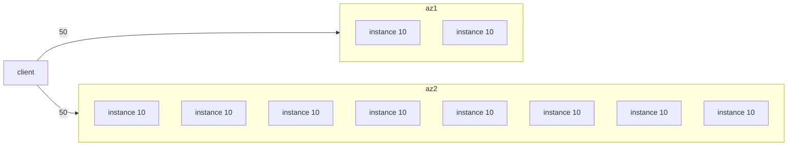
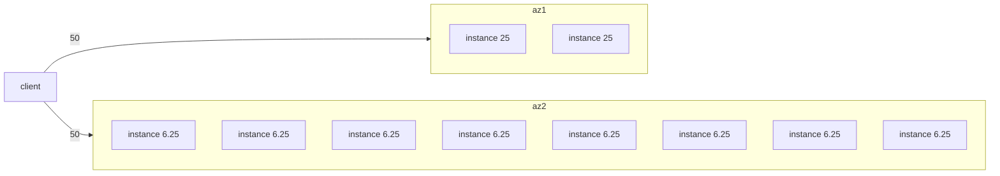
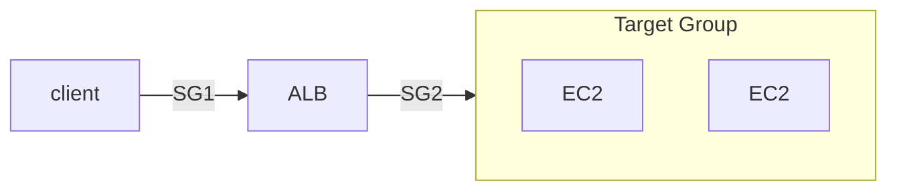
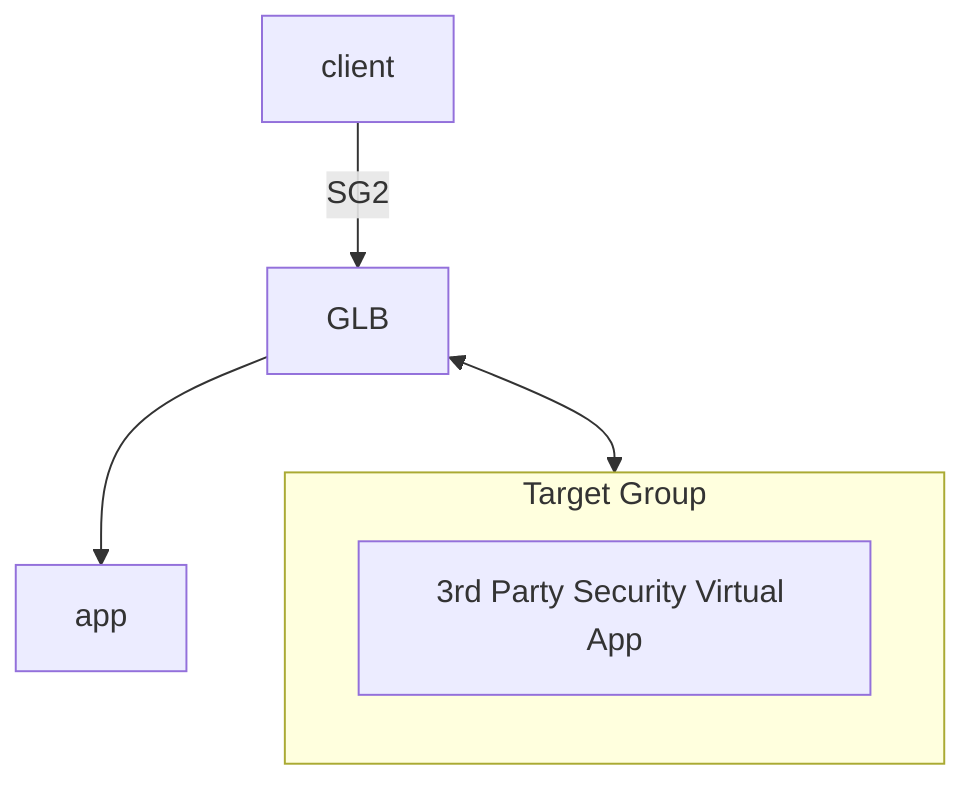

- [What is an Application Load Balancer?](https://docs.aws.amazon.com/elasticloadbalancing/latest/application/introduction.html)
- 
    - *Load Balancer* 可有多個 listener
    - listener 必須有一個 *default rule*
        - rule 裡頭會有 priority, actions, conditions
    - Rule 用來決定將流量發到哪個 *Target Group*
    - Target 可以跨重複出現在多個 *Target Group*
    - 可在 *Target Group* 制定 *Health Check*
- ELB 的 Sticky Session(Session Affinity) 相關問題
    - ALB, CLB 皆可處理此情境
    - client by `cookie`
        - Application-based Cookie
            - APP(a.k.a. Target) 自行產生, 可有任意客制屬性
            - Target Group 必須為此 Cookie Name 自行取名字, 但底下名字保留不可使用:
                - AWSALB, AWSALBAPP, AWSALBTG
        - Duration-based cookie (Load balancer generated cookie)
            - LB 產生特定時間到期的 Cookie, Cookie name 為
                - AWSALB for ALB
                - AWSELB for CLB
- ELB - Cross Zone Load Balancing
    - ALB
        - 預設 enabled, 且無法 disabled (always on)
        - AZ 內資料傳輸免錢
    - NLB
        - 預設 disabled
        - 若啟用, AZ 內傳輸要課金
    - CLB
        - 預設 disabled
        - AZ 內資料傳輸免錢

### With Cross Zone Load Balancing

### Without Cross Zone Load Balancing

# ELB

- 目前有 4 種 Load Balance
    - Classic Load Balancer, CLB (Since 2009)
        - L4 && L7 : HTTP, HTTPS, TCP, SSL(secure TCP)
    - Application Load Balancer, ALB (Since 2016)
        - L7 : HTTP, HTTPS, WebSocket, HTTP/2
        - ALB 後為 *Target Group*(也會處理 *Health Check*), 裡面可以放置:
            - EC2 instances
            - ECS tasks
            - Lambda functions
            - private IP (可以是 On-premise Data Center Servers)
        - Target 接收到 Request 後, 可由 Header 中的
            - `X-Forwarded-For` && `X-Forwarded-Port` && `X-Forwarded-Proto` 
            - 看到用戶真實 IP && Port && Protocol
        - 可依照不同的 *routing tables(hostname)* && *query string* && *HTTP Header*
            - 將請求送往後端不同的 Target Groups
            - CLB 則無此功能(需要設很多 CLB, 才能做對應流量轉發)
        - 對於 ECS 支援 dynamic port mapping
    - Network Load Balancer, NLB (Since 2017)
        - L4 : TCP, UDP, TLS(secure TCP)
        - high performance, latency ~= 100ms (相較於 ALB ~= 400ms)
        - 配置以後, 同時提供 *DNS Name* && *Elastic IP* 來訪問
            - 相較之下, CLB && ALB, 只有 *DNS name*
        - NLB 後面的 *Target Group*, 裡頭可以是:
            - EC2 Instance
            - private IP Address
            - ALB
        - 細節
            - NLB 在每個 AZ 都有個 static IP (也可支援 assign Elastic IP)
            - 需要課金才能使用
            - NLB 僅作流量轉發, 因此後端的 SG 看到的請求皆來自 Client (而非NLB), 因此需要 allow HTTP 0.0.0.0
    - Gateway Load Balancer, GWLB (Since 2020)
        - deploy / scale / manage 第三方 network virtual app in AWS
        - L3 : IP
        - GENEVE protocol : port 6081
        - 結合了 2 種功能
            - Transparent Network Gateway
            - Load Balancer
- AWS Load Balancer 整合了一堆 AWS Services:
    - EC2, EC2 ASG, ECS, ACM, CloudWatch, Route53, AWS WAF, AWS Global Accelerator, ...
- 兼具 Health Check 功能

---

---

---

### SSL/TLS for ELB

- client 與 LB 之間的 in-flight encryption
- Public Certificate Authorities, CA
    - Comodo, Symantec, GoDaddy, GlobalSign, Digicert, Letsencrypt, ...
- LB 使用 X.509 certificate (SSL/TLS server certificate)
    - 可使用 ACM, AWS Certificate Manager 來託管

#### SNI, Server Name Indication

- 解決了 loading multiple SSL Certs onto one web server (也就是一台主機提供多個站點啦)
- 此為新一代的 protocol, 客戶需告知 hostname of the target server in the initial SSL handshake
    - AWS 僅 ALB && NLB && CloudFront 支援
- LB 上頭使用 SNI 的話, 可以對應不同 TG, 使用不同的 SSL
    - 相對來說, 一個 CLB 只能使用一個 SSL

### ELB - Connection Draining

- 對於即將進行 maintenance 或 scale down 的 instance, 在此狀態下, 可避免立即下線 && 避免新流量進入此 instance
    - 可藉由 *draining connection parameter* 調整, 1~3600 secs. 預設 300 secs
- 有不同的稱呼
    - 使用 CLB, 稱之為 Connection Draining
    - 使用 ALB && NLB, 稱之為 Deregistration Delay
