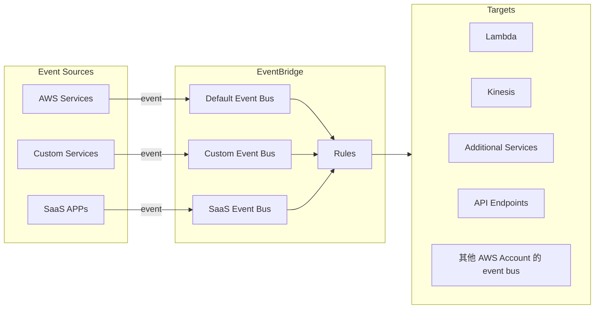
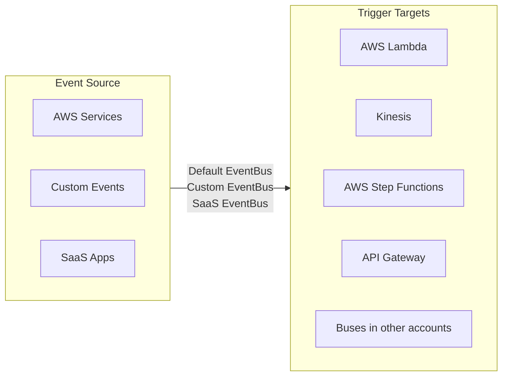

# [Amazon EventBridge](https://docs.aws.amazon.com/eventbridge/latest/userguide/eb-what-is.html)

- **CloudWatch Event** 的新一代產品
- 有個 Default Event Bus
    - AWS Services && CloudWatch Events 產生的 Events
- 可建立 **Parent Event Bus**, 也可為 APP 建立 **Custom Event Bus**
    - Parent Event Bus, 從 SaaS Service 或 Application 收到 Events
- EventBridge 附帶(come with) *Schema Registry*, 此為 *user model event schema*
- 可用來做 Event-Driven App at scale
    - 由 Developer 開發的 APP 丟出 Event
- Serverless, *Serverless Application Model, SAM* (不知為何講師突然冒出這句話)
    - 也就是背後的東西, 基本上都是 Serverless 搞出來的架構
    - 似乎在說背後是 API Gateway, Lambda, DynamoDB
- 下圖的 *Event*, 其實就是 **Stream of Real-Time Data**

------------

- EventBridge 核心名詞:
    - Message Bus : (等同於 SNS 的 Topic) Container of event
    - Event : 來自 AWS / SaaS / 
    - Rule : 將 incoming events 做規則配對, 並送到對應的 Targets 做後續處理
    - 特定一個 Rule, 最多只能有 5 個 Targets (致命缺陷)
    - Rules 會依照 event 的 *Event Pattern* 來配發到不同的 Target
    - Target : (等同於 SNS 的 subscriber) 針對 Events 做對應處理
- EventBridge 等同於 CloudWatch
    - 早期兩者是不一樣的東西
    - 基本上 EB 是架構在 CWE 上頭, 使用相同的底層 API
    - EB 可完全取代 CWE, 不過 EB 更加強大.
    - 如今的 CWE, 已等同於 EB 了
    - EventBridge 具備 *Schema Registry* capability
- EventBridge 相較於 SNS
    - 可與 3rd services(for FREE) && your APP 整合
    - ex: Zendesk, DataDog, Segment, Auth0, ...
- EventBridge 可以是 Schedule 或 Cron
- 可在 Event Bus 上頭制定 **Resource-based Policy**, 來讓 cross region 或 cross account 使用
    - 每個 EventBus 可配置 300 個 Rules
    - Rule 定義了如何 process event && 要將 event redirect 到哪個 Service
    - 可將發送到 Event Bus 的 events 做 archive, 並作適當的 長期/永久 保存
    - Default Event Bus : 接收來自 AWS Services 的 events
    - 幾乎等同於舊版的 CloudWatch Events
    - Partner Event Bus : 接收來自 SaaS Services or APPs, ex:
    - Custom Event Bus
    - 可針對裡頭的 events 做 Archive (可自行配置保存期限 or 永久保存)
- Event Bridge 會自行分析發送到他身上的 events 的 schema
    - > Console > EventBridge > Sandbox
        - 這邊的功能, 可以模擬發生特定事件, 可用來協助測試, 特定的 Tested Event 是否能被 Event Pattern 捕獲到
- *Schema Registry* 會在 APP 裡頭 generate code, 
    - 來讓 APP 可事先得知 how data is structured in the event bus
    - 而這些 Schema 可版控
- 假設 AccountA 想把 event 發送到 AccountB, 則:
    - AccountA 需設定 [partner event source](https://docs.aws.amazon.com/eventbridge/latest/userguide/eb-saas.html)
    - AccountB 需把 event 關聯到上述的 *partner event source*

------------

------------

# Lab

- [Building an event-driven application with Amazon EventBridge | Amazon Web Services](https://www.youtube.com/watch?v=mOysNzNFDRw&t=1s)
- [Serverless Patterns Collection](https://serverlessland.com/patterns)