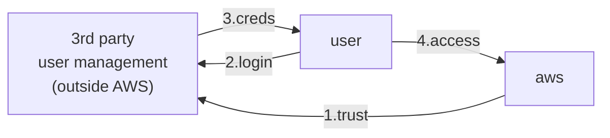

# Identity providers and federation

- AWS 的外部如果要訪問 AWS Resources 的話, 可藉由下列方式:
    - OIDC, OpenID Connect
    - SAML 2.0, Security Assertion Markup Language 2.0

# Identity Federation

有各種不同的 Federation 方式:

- [1. SAML 2.0](#saml-20-federation)
- [2. Custom Identity Broker](#2-custom-identity-broker)
- Web Identity Federation without Web Identity
    - 如果要用這方法... 算了吧@@, 務必使用 Cognito
    - 需要自行處理一堆外部的 IAM user
- [3. Web Identity Federation with Web Identity](#3-web-identity-federation-with-web-identity)
    - 建議使用 Cognito
- [4. AWS Cognito](./Cognito.md)
- Single Sign On, SSO
- Non-SAML with AWS Microsoft AD

