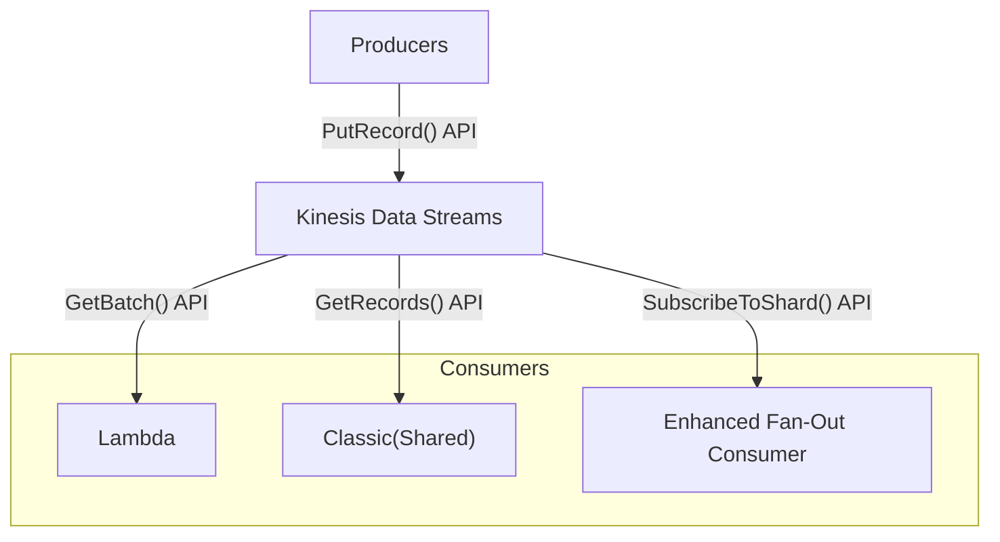
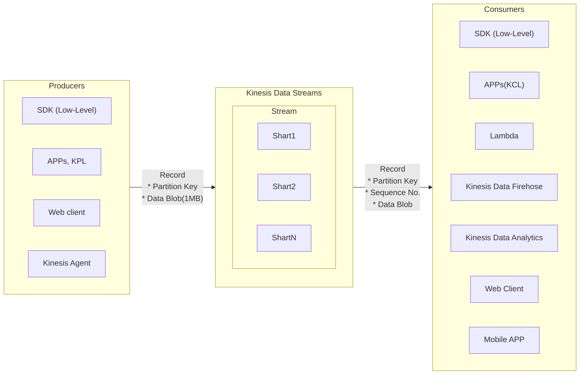
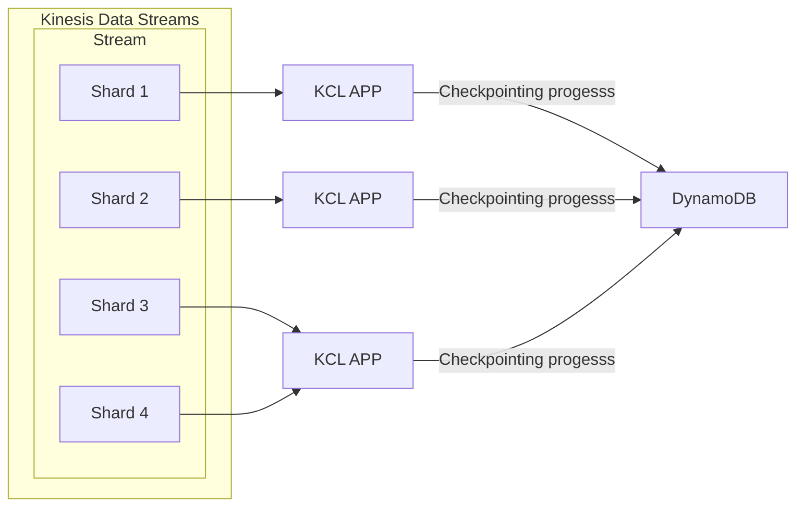
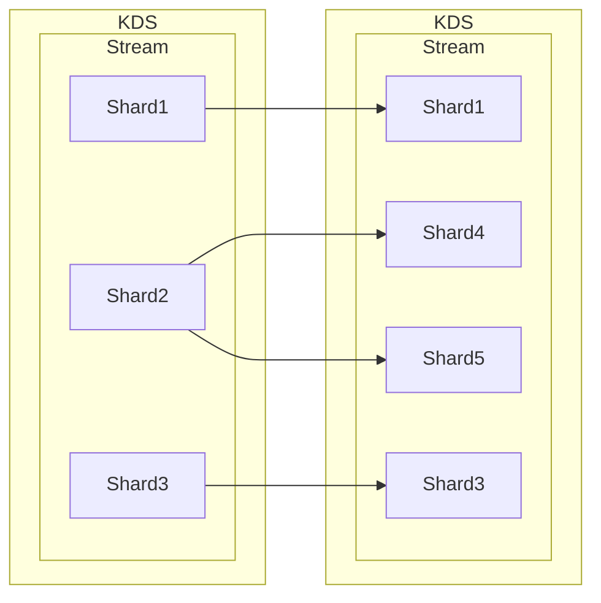
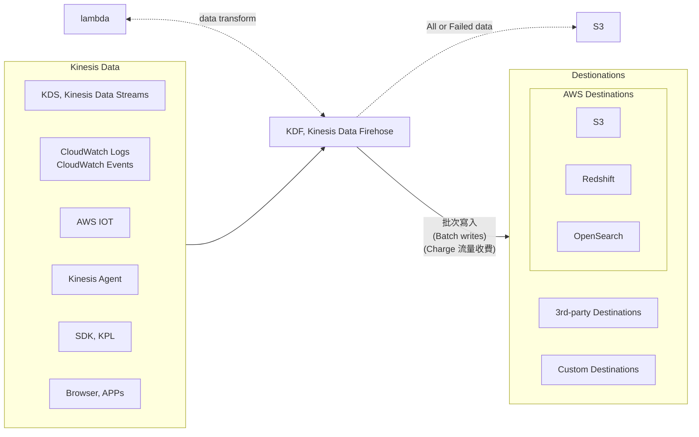
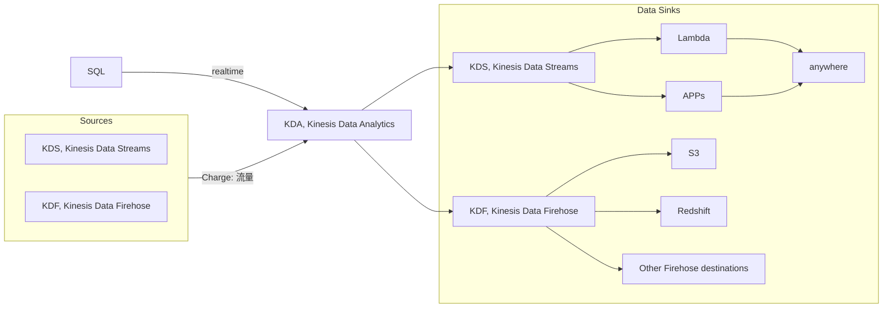

# Kinesis

- 即時 collect && process && analyze Streaming data
    - ex: app logs, metrics, Web Click streams, IOT telemetry data
    - 用來即時 蒐集, 處理, 分析 串流資料
- Kinesis 用 Partition ID 作為 PK
    - 相同的 Partition ID 資料, 會進入到相同的 Shard
- Kinesis 家族服務:
    - [Kinesis Data Streams](#kinesis-data-streams-kds): capture, process, store data streams
    - [Kinesis Data Firehose](#kinesis-data-firehose-kdf): load sata stremas -> AWS data stores
    - [Kinesis Data Analytics](#kinesis-data-analytics-kda): analyze data streams with SQL or Apache Flink
    - [Kinesis Video Streams](#kinesis-video-streams): capture, process, store video streams


# Kinesis Data Streams, KDS

- 名詞術語: https://docs.aws.amazon.com/streams/latest/dev/key-concepts.html
    - KCL, Kinesis Client Library
    - KPL, Kinesis Producer Library
- 特性
    - KDS 會針對 Shards 的數量 + 傳輸量 計費
    - Data Retention 1 ~ 365 天
        - 因此可 reprocess(replay) data
    - 資料一但進 Kinesis, 無法刪除(immutable)
    - 有 2 種 Capacity Modes:
        - I. Provisioned Mode (historic capacity mode, 若能事先規劃用這個)
            - Charge: per Provisioned Shard / hr 計費
            - throughput
                - 1 MB/sec in  或 1000 records/sec
                - 2 MB/sec out (classic) 或 enhanced fan-out consumer
            ```mermaid
            flowchart LR

            kds["KDS, Kinesis Data Stream"]
            Producers -- "1 MB/sec" --> kds;
            kds -- "2 MB/sec" --> Consumers;
            ```
        - II. On-demand Mode   (neuro mode, 若無法事先 規劃 or 預估 用量)
            - Charge: per Stream / hr + data transfer in/out per GB 計費
            -  Default capacity 4 MB/sec 或 4000 records/sec
            - 會依照過去 30 days 尖峰用量來做 (自幹版的) auto-scaling
- data stream consumers
    - app(SDK, KCL), Lambda, Kinesis Data Firehose, Kinesis Data Analytics
- Data that shares the *same partition* goes to the *same shard (ordering)*




- 一個 **Kinesis Data Stream** 由一系列的 Shards 所構成
    - 每個 Shard 可有 1 MB/sec 的傳輸 or 1000 Messages/sec
    - KDS 處理後, 每個 Shard 都有一個 sequence of data records
        - (每個 Data Record 都會被賦予一個 Sequence Number)
- 每個進入 KDS 的 Record 裡頭有 
    - Partition Key
    - Data Blob (up to 1 MB/sec 或 1000 msg/sec)
- 每個由 KDS 出去的 Record 裡頭有 *Partition Key* && *Sequence no* && *Data Blob*
    - 可有 2 種 throughputs
        - 2 MB/sec (shared), Per Shard all consumers
        - 2 MB/sec (enhanced), Per Shard per consumers  (燒錢)


## KDS - Kinesis Producers

- Kinesis Producers:
    - Devices
    - Web Client
    - AWS SDK
        - simple producer...
    - KPL, Kinesis Producer Library
        - 具備 batching, compression, retry 的功能
        - C++, Java 程式語言整合
    - Kinesis Agent
        - 基於 KPL, 能夠做更多事情. ex: 將 *monitor log files* stream into KDS
    - 使用 `PutRecord API` 來將 data 放到 KDS
- Producer 的重點就是, 必須要挑選好的 `PartitionId`
    - Producer 會依照 `hash(PartitionId)` 得出的結果, 將之發送到 *特定 Shard*
    - 因此 PartitionId 必須要能夠 highly distributed, 避免 "hot partition"
        - 白話文, 有人累死, 有人沒事幹
    - 如果真發生此狀況, 可能發生 `ProvisionedThroughputExceeded Exception`
        - Note: 每個 KDS Shard, 只能有 1MB/sec 或 1000 Messages/sec
        - 還須考量針對此 ProvisionedThroughputExceeded 的情況的 retry 機制
            - exponential backoff
        - 此外還得考量 Shard-splitting (也就是 auto scaling 啦, 分割原有 Shard)


## KDS - Kinesis Consumers

- Kinesis Consumers:
    - [Lambda](#kinesis-consumer---aws-lambda)
    - KDA
    - KDF
    - KCL, Kinesis Client Library
        - library to simplify reading from KDS
    - AWS SDK, 有 2 種 模式:
        - Classic(Shared)
            - 2 MB/sec per shard across all consumers
            - 每個 Shard, 不管他有多少 Consumers, 只有 2MB/sec
            - pull model. `call GetRecords() API`
            - Charge: 低, latency ~200 ms
            - 一次最多 5 `GetRecords API` calls/sec
                - 因此, 5 secs 的話, 每個 Shard 只能有 10 MB 或 10000 records
        - Enhanced Fan-Out
            - 2 MB/sec per consumer per shard
            - 每個 Shard, 對於每個 Consumers, 各自 2MB/sec
            - push model. `call SubscribeToShard() API`
                - push data over HTTP/2
            - Charge: 貴, latency ~70 ms
            - 每個 Data Stream (軟性)限制在 5 consumer applications(KCL)


### KDS - Kinesis Consumer - AWS Lambda

- 對於 Kinesis Stream Lambda Consumer, 同時支援了 *Classic(Shared)* 及 *Enhanced Fan-Out* consumers
- Lambda `call GetBatch() API` 來批量取得 data, 需要配置
    - batch size
    - batch window
- Can process up to 10 batches per shard simultaneously


### KDS - Kinesis Consumer - KCL

- Kinesis Client Library, Java Library
- 一個 Shard 一次只能給一個 Consumer Read
    - 如果有 8 shards, 則最多只能有 8 consumers
    - 並非 一個 Consumer 只能 Read 一個 Shard
- Progress is checkpointed into DynamoDB
    - Track other workers and share the work amongst shards using DynamoDB
    - 會藉由 DynamoDB 來追蹤其他 Consumers 的工作進度, 並在這之上共享工作
    - 因此需要 IAM access to DynamoDB
- 可安裝在 On-Premise, EC2, ... 各大場所
- Versin
    - KCL 1.x : 僅支援 shared consumer
    - KCL 2.x : 支援 shared consumer 以及 enhanced fan-out consumer



- 如上圖
    - 一個 Shard 同時只能給一個 KCL APP Read
    - 如果 KCL 遇到瓶頸, 可 scaling KCL APPs
        - 但最多僅止於 Shards 的數量
    - 如果 Stream 遇到瓶頸, 可 scaling Shards
    - *KCL APPs* 之間透過 DynamoDB 來共享彼此進度
        - 若有人掛了, 其他 KCL APP 可從中得知他的進度, 並接著工作


## KDS Operation - Shard Splitting


- 如上圖, Shard2 稱作 `hot shard`, 分割的動作稱為 `Shard Splitting`
    - 反過來則稱為 `Merging Shards`
- 操作一次 Shard operation,
    - Shard Splitting - 只能 一分為二, 無法 一分為N (N>2)
    - Merging Shards  - 只能 二合為一, 無法 N合為一 (N>2)
- *Shard Splitting* 這動作只能自幹自己的 auto-scaling, 目前官方沒提供自動判斷機制
- 


# Kinesis Data Firehose, KDF



- SaaS, Serverless, Auto-Scaling
- Store data into Destination
- 可送入 KDF 的 data stream 有
    - data stream producers
    - kinesis data streams
    - CloudWatch Logs & CloudWatch Events
    - AWS IOT
    - ...
- kDF 本身支援 AWS Lambda, 自行決定是否用來做資料轉換(data transform)
- KDF 使用 batch write 來寫入到 Destination
    - Near Real Time, 60 secs latency 或 一次最少寫入 32 MB
    - Destination 如下:
        - 3rd
            - Data Dog, Splunk, MongoDB, ...
        - AWS Services
            - S3, RedShift, OpenSearch, ...
        - Custom
            - HTTP Endpoint (API)
- Charge: Pay for data going through KDF


Kinesis Data Streams                | Kinesis Data Firehose
----------------------------------- | -------------------------------
需要自幹 consumer & producer         | Fully managed
delay 200 ms                        | 有 buffer, 最小 delay 60s
自行 Scale(shard splitting/merging)  | Auto-Scaling
data store 1 ~ 365 days(可 replay)   | no data store (無法 replay)
從資料來源端取資料                     | load streaming data to store


# Kinesis Data Analytics, KDA



- KDS, KDF 資料進入到 KDA 做分析
- KDA 支援 realtime SQL
    - 可用此 Query 創造出 streams
- 之後資料又可輸出到
    - KDS
        - 接 lambda 處理 or 客制 program
    - KDF
        - 接 S3, RedShift, ...
- 特色
    - real-time analytics
    - fully-managed, serverless
    - Auto-Scaling
    - by SQL
- Charge: by streams out of real-time queries
- Use Case:
    - Time-Series analytics
    - Real-Time Dashboards
    - Real-Time Metrics


# Kinesis Video Streams

- N/A
