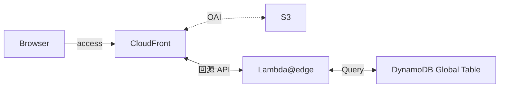
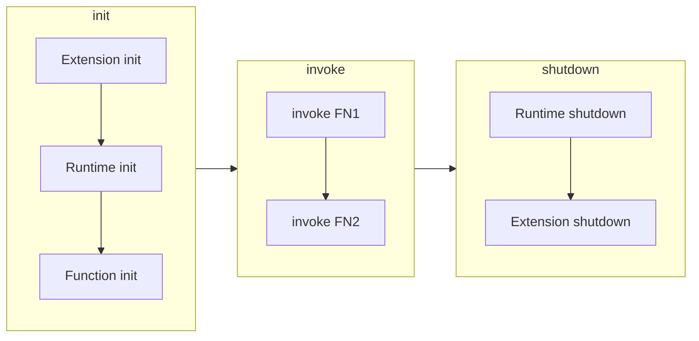
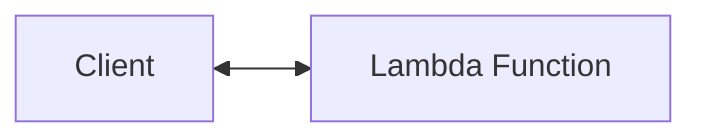
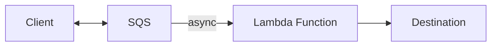
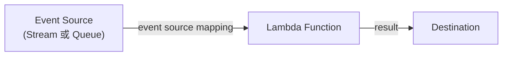

- [Serverless Land](https://serverlessland.com/patterns)

# AWS Lambda

- 常見 Lambda Function 的 Execution Roles:
  - `AWSLambdaBasicExecutionRole`
  - `AWSLambdaDynamoDBExecutionRole`
  - `AWSLambdaKinesisExecutionRole`
  - `AWSLambdaSQSQueueExecutionRole`
  - `AWSLambdaVPCAccessExecutionRole`
  - `AWSXRayDaemonWriteAccess`
- Lambda Destionation
  - 不同於 SQS DLQ, 也可以用來存放 Success Result
  - 可用來作為 Destination 的 Services: SQS | SNS | Lambda | EventBridge
- Lambda Execution environment lifecycle (Lambda 運行階段):
- init 階段, 包含了 Lambda Function 運行前的 main function 以外的 Codes
- Lambda 永久性儲存:
  - 這篇講述如何使用 Lambda, 將資料 encrypted 以後, 存入 Lambda 的 /tmp
    - Lambda Function 使用 `/tmp` 可使用 10 GiB

# Lambda - Scaling & Performance

- 跑 Lambda FN 只能調整 memory.
  - Memory : 1792 MiB, 可獲得完整 1 顆 CPU
- 關於 **Reserved concurrency** 與 **Provisioned concurrency**
- 首先, 每個 AWS Account 預設會有 1000 concurrent executions 的 concurrency limit (此限額可藉由修改 quota 來提昇)
  - Concurrency = (平均每秒請求數) \* (平均每次請求佔用秒數)
    - ex: 平均每秒請求 100 次 \* 平均每次佔用 5 secs, 則 concurrency 為 500
    - ex: 平均每秒請求 100 次 \* 平均每次佔用 0.5 secs, 則 concurrency 為 50
- 如果有一些 Lambda FN 非常重要, 不可因為達到 Concurrency 而被限流的話, 可配置 Reserved Concurrency 給它使用
  - 此 Reserved Concurrency 具備排他性, 配置了以後, 即使沒使用到, 也無法被其他 Lambda FN 使用
- 如果有一些 Lambda FN 很講究效率, 希望能夠儘早給回應, 可配置 Provisioned Concurrency 給它使用
  - 若此 Provisioned Concurrency 額度用完, 再若此 Lambda FN:
    - 沒有配置 Reserved Concurrency, 其餘流量會使用 Unreserved Concurrency
    - 有配置 Reserved Concurrency, 其餘流量會使用 Reserved Concurrency
  - 會先處理完成 Lambda FN 的 init 階段 (將來尻 Lambda FN 時可以直接進行 invoke 免需再 init)
  - 因為需要 預先佈建, 因而會有額外費用問題

# Lambda - Serverless

- 若與 ALB 整合為 Serverless, 則會要求 Lambda 回傳 規範格式, 才能正常顯示 JSON 給 Browser (否則 Browser 會把 Response 下載)
  - [Using AWS Lambda with an Application Load Balancer](https://docs.aws.amazon.com/lambda/latest/dg/services-alb.html)
- ALB 可以啟用 `Multi-Header`
  - Web Console > EC2 > Target Groups > YOUR_TARGET_GROUP > Attributes > enable~
  - Request: *http://demo.com/path?name=tony&name=chou*
  - Server 接收到的資訊則為 `"queryStringParameters": {"name": ["tony", "chou"]}`
  - 如果啟用這個的話, 又要與 Lambda 結合, 建議再次調整 [Lambda functions as targets](https://docs.aws.amazon.com/elasticloadbalancing/latest/application/lambda-functions.html#enable-multi-value-headers)
    - 如果不這麼做, Browser 接收 Response 以後, 一樣只會把它 Download...
    - Response Header 需要加上:

```json
{
  "multiValueHeaders": {
    "Set-cookie": [
      "cookie-name=cookie-value;Domain=myweb.com;Secure;HttpOnly",
      "cookie-name=cookie-value;Expires=May 8, 2019"
    ],
    "Content-Type": ["application/json"]
  }
}
```

# Lambda - 錯誤處理機制

- Handling Errors
  - API Gateway 與 Lambda 整合後, 發生錯誤時, Lambda 需附加必要的 Error Type
    - Lambda 可回應的 Error types 分成 2 種:
      - standard errors
      - custom errors (如下範例)

```jsonc
{
  "isBase64Encoded": "boolean",
  "statusCode": "number",
  "headers": {
    "X-Amzn-ErrorType": "InvalidParameterException",
    "(note)": "(上面是假設發生 Lambda Type Error)"
  },
  "body": "JSON string"
}
```

# Lambda@Edge

- [Using AWS Lambda with CloudFront Lambda@Edge](https://docs.aws.amazon.com/lambda/latest/dg/lambda-edge.html)
- 顧名思義, 由於 Lambda 是個 Regional Service, 可藉由 Edge location, 讓 Lambda 可被就近訪問
- 可針對 Request 及 Response 做額外加工 (有點類似 request hook, response hook, middleware):
  - Viewer Request - After CloudFront receives request from viewer
  - Origin Request - Before CloudFront forwards request to origin
  - Origin Response - After CloudFront receives response from origin
  - Viewer Response - Before Cloudfront forwards response to viewer
- 搭配 `Lambda@Edge` 的一種 Serverless 的架構範例:



---

# Lambda - Event Source Mapping

- [Lambda event source mappings](https://docs.aws.amazon.com/lambda/latest/dg/invocation-eventsourcemapping.html)
- 相較於 AWS Services 直接調用 Lambda, 有另一種方式稱之為 _event source mapping_
  - Lambda Event Source Mapping 會定期去 event sources 拉資料 (而非直接 invoke lambda)
  - Event Source 可能是: Stream / Queue

# Lambda Destination

```js
// 此範例為, Lambda Function A 設定 B 為它的 Failure Destination
// 當 A 執行失敗後, 會 async 再次嘗試, 若 RetriesExhausted 時, 則將 execution record 拋向 destination (也就是 B)
// 而 B 裏頭, 把 evnet 給 print 出來後, 可看到底下這包
// 而我測試的範例當中, A 的 3 次 invoke 時間分別是:
// 16:07:12
// 16:08:15
// 16:10:21
//
// 而 approximateInvokeCount 對應到 CloudFormation 的屬性則是 MaximumRetryAttempts 及 MaximumEventAgeInSeconds
// 對應到的 Web Console 則為 Retry attempts 及
{
  "version": "1.0",
  "timestamp": "2024-04-08T16:10:21.821Z",
  "requestContext": {
    "requestId": "ea6bc156-3430-4f5e-98fd-6267811b88bb",
    "functionArn": "arn:aws:lambda:ap-northeast-1:297886803107:function:demo-destination:$LATEST",
    "condition": "RetriesExhausted",
    "approximateInvokeCount": 3  // 這邊可以得知, 自從 invoke A 失敗後, 後續又不斷嘗試(包含原始調度的 總嘗試次數)
  },
  "requestPayload": {  // 這包是當初發送給 A 時候的 event payload
    "Success": false
  },
  "responseContext": {  // B 執行結果
    "statusCode": 200,
    "executedVersion": "$LATEST",
    "functionError": "Unhandled"
  },
  "responsePayload": {
    "errorType": "Error",
    "errorMessage": "Authentication Failed",
    "trace": [
      "Error: Authentication Failed",
      "    at Runtime.handler (file:///var/task/index.mjs:19:11)",
      "    at Runtime.handleOnceNonStreaming (file:///var/runtime/index.mjs:1173:29)"
    ]
  }
}
```

# Lambda Aliases & Lambda Versions (與 Api Gateway 搭配)

- 假設現在寫了一個 Lambda Function, 名為 「demo-lambda」, 然後發佈了 3 個 Versions
- Lambda Console
  - 然後希望有不同的 Lambda Aliases 指向不同的 Lambda Versions, 如下:
    - DEV -> version: $LATEST
    - TEST -> version: 2
    - PROD -> version: 1
  - 上述動作在 Lambda 分別 Deploy 完成後, 建立他們的 Versions, 並將 Aliases 指向對應 Versions
- API Gateway Console
  - 之後發布 API Gateway, 希望有 3 個 Stages, 指向 3 個 Lambda Aliases, 如下:
    - dev -> DEV stage
    - test -> test stage
    - prod -> prod stage
  - 在 API Gateway > Resources > ${LOCATION} > ${METHOD} > Lambda Function 裡頭
    - 輸入 `$LAMBDA_FUNCTION:${stageVariables.YOUR_STAGE_NAME}`
    - 會被告知, 因為並沒有一個 Lambda 叫做上面這樣的名字, 因此需要分別賦予給 3 個 Lambda 的 execution role 給這個 API Gateway
    - 因此需要授權給 Api Gateway 不同的 Stage 可以調用 Lambad Function
      - `aws lambda add-permission ...`
- API Gateway
  - Resources > Actions > Deploy API > 分別發布 dev/test/prod
  - Stages > 分別編輯 dev/test/prod > Stage Variables > Add Stage Variable
    - Name: lambdaAlias
    - Value: 分別輸入 DEV/TEST/PROD
  - 屆時訪問時的 URL 如下:
    - https://${RANDOM}.execute-api.ap-northeast-1.amazonaws.com/dev/stagevariables
    - https://${RANDOM}.execute-api.ap-northeast-1.amazonaws.com/test/stagevariables
    - https://${RANDOM}.execute-api.ap-northeast-1.amazonaws.com/prod/stagevariables

# Lambda 調用模式



- invoke Lambda Function 有底下 3 種 patterns:
  - sync invoke
  - async invoke
  - polling invoke

### [1/3 sync invoke](https://docs.aws.amazon.com/lambda/latest/dg/invocation-sync.html)

- 無 retry 機制



- 適用的 AWS Services:
  - API Gateway
  - CloudFormation
  - CloudFront
  - Alexa
  - Lex
- 例如我們有設定 S3 object upload 觸發 Lambda 做事情...
  - 此時大量的 Object 被上傳到 S3 Bucket, 導致 Lambda 被 throttled
  - 但由於此種觸發方式為 async. Lambda 會有 retry 機制, 最長 6 hrs
    - 並且採用 exponential backup (1 秒, 2 秒, 4 秒, ...最長 5 mins)

### [2/3 async invoke](https://docs.aws.amazon.com/lambda/latest/dg/invocation-async.html)

- retry 機制: Built in, retries twice



- 適用的 AWS Services:
  - SNS
  - S3
  - EventBridge

### [3/3 polling invoke](https://docs.aws.amazon.com/lambda/latest/dg/invocation-eventsourcemapping.html)

- retry 機制: Depends on event source



- The configuration of services as event triggers is known as event source mapping.
  - 觸發 event 的配置, 稱之為 `event source mapping`
- 需要使用 Lambda Function 的 execution role, 授予權限可至 Event Source 取得資料
- polling invoke pattern 比較適用於 streaming 或 queuing based services
- 特殊情況: 由於 _distributed nature of its pollers_, Lambda 極少數情況下會收到重複事件
- Event Source Services:
  - Kinesis
  - SQS
  - Amazon MQ
  - Kafka
  - DynamoDB

# Reference

[Using larger ephemeral storage for AWS Lambda](https://aws.amazon.com/blogs/compute/using-larger-ephemeral-storage-for-aws-lambda/)
