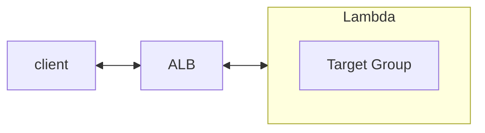

- [Operator - Lambda](https://docs.aws.amazon.com/lambda/latest/operatorguide/intro.html)
- [Developer - What is AWS Lambda?](https://docs.aws.amazon.com/lambda/latest/dg/welcome.html)
- [AWS Lambda FAQs](https://aws.amazon.com/lambda/faqs/?nc1=h_ls)


# Lambda - Serverless

- 若與 ALB 整合為 Serverless, 則會要求 Lambda 回傳 規範格式, 才能正常顯示 JSON 給 Browser (否則 Browser 會把 Response 下載)
    - [Using AWS Lambda with an Application Load Balancer](https://docs.aws.amazon.com/lambda/latest/dg/services-alb.html)
- ALB 可以啟用 `Multi-Header`
    - Web Console > EC2 > Target Groups > YOUR_TARGET_GROUP > Attributes > enable~
    - Request: *http://demo.com/path?name=tony&name=chou*
    - Server 接收到的資訊則為 `"queryStringParameters": {"name": ["tony", "chou"]}`
    - 如果啟用這個的話, 又要與 Lambda 結合, 建議再次調整 [Lambda functions as targets](https://docs.aws.amazon.com/elasticloadbalancing/latest/application/lambda-functions.html#enable-multi-value-headers)
        - 如果不這麼做, Browser 接收 Response 以後, 一樣只會把它 Download...
        - Response Header 需要加上:
            ```json
            {
                "multiValueHeaders": {
                    "Set-cookie": ["cookie-name=cookie-value;Domain=myweb.com;Secure;HttpOnly","cookie-name=cookie-value;Expires=May 8, 2019"],
                    "Content-Type": ["application/json"]
                },
            }
            ```




# Lambda Integrations

- 可以與底下一系列的 Serverless 整合
    - API Gateway
    - Kinesis
    - DynameDB
    - S3
    - CloudFront
    - EventBridge
    - CloudWatch Logs
    - SNS
    - SQS
    - Cognito
- 使用範例
    1. 結合 S3 event, 用戶上傳 img 以後, 藉由 Lambda 將圖片做縮圖, 另存到另一個 S3 Bucket
    2. 結合 EventBridge, 藉由 serverless cron, 定期 trigger Lambda 做事情, 省掉一台 EC2 的費用
    3. 結合 ALB, 作為 Serverless API Server
    4. 與 CloudFront CDN 整合, 使用 Lambda@Edge 作為 global AWS Lambda
        - 類似 middleware 或是 request/response hook, 還可使用:
            - Viewer Request  - After CloudFront receives request from viewer
            - Origin Request  - Before CloudFront forwards request to origin
            - Origin Response - After CloudFront receives response from origin
            - Viewer Response - Before Cloudfront forwards response to viewer


# cli Lambda

```bash
$# aws --version
aws-cli/2.7.20 Python/3.9.11 Linux/4.14.281-212.502.amzn2.x86_64 exec-env/CloudShell exe/x86_64.amzn.2 prompt/off

$# REGION=ap-northeast-1

### list lambda functions
$# aws lambda list-functions
$# aws lambda list-functions --region ${REGION}

$# aws lambda invoke --function-name lambda-apigw-proxy-root-get-0627 \
    --cli-binary-format raw-in-base64-out \
    --payload '{"key1": "value1", "key2": "value2", "key3": "value3" }' \
    --region ${REGION} \
    response.json
# (Terminal Print)
{
    "StatusCode": 200,
    "ExecutedVersion": "$LATEST"
}
# Out file "response.json" (local dir 會出現這個檔案)
$# cat response.json
{"statusCode": 200, "body": "Server 回覆的 Response Body", "headers": {"Content-Type": "application/json"}}


$# 
```