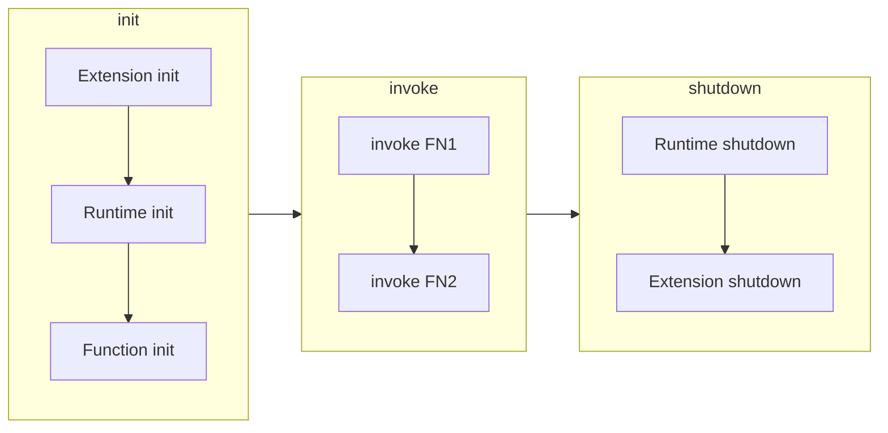
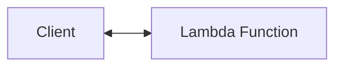
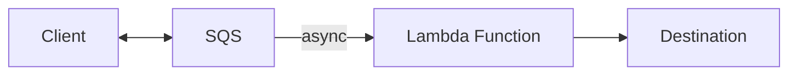
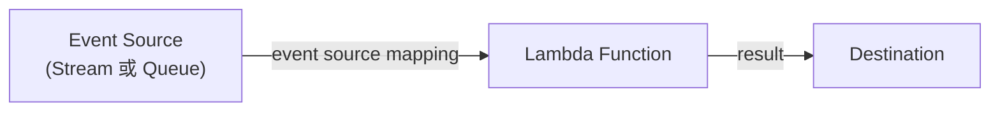
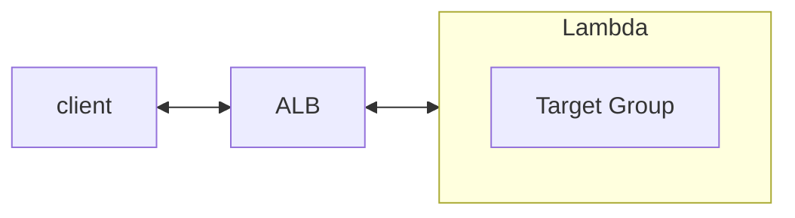
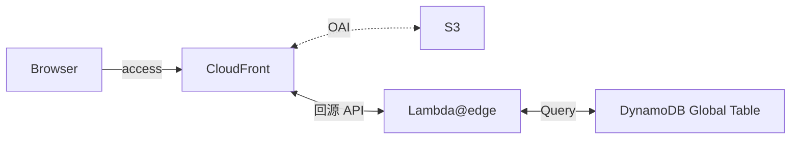

# Lambda

- [What is AWS Lambda?](https://docs.aws.amazon.com/lambda/latest/dg/welcome.html)
- [AWS Lambda FAQs](https://aws.amazon.com/lambda/faqs/?nc1=h_ls)
- [Operator - Lambda](https://docs.aws.amazon.com/lambda/latest/operatorguide/intro.html)
- Lambda Execution Role (IAM Role)
  - 執行 Lambda Function 的時候, 每個 Lambda Function 都會有它自己的 **Execution Role**
    - 預設, 這個 Execution Role 是用來授予 Lambda Function 寫入 Logs
  - 常見的 **Lambda Execution Role** 範例:
    - AWSLambdaBasicExecutionRole - 上傳 logs 到 CloudWatch
    - AWSLambdaDynamoDBExecutionRole - read from DynameDB Streams
    - AWSLambdaKinesisExecutionRole - read from Kinesis
    - AWSLambdaSQSQueueExecutionRole - read from SQS
    - AWSLambdaVPCAccessExecutionRole - deploy Lambda function in VPC
    - AWSXRayDaemonWriteAccess - 上傳 trace data 到 X-Ray
- Lambda Destionation
- 類似 SQS DLQ (用來存放 SQS 調用 failure 的 Message), 此方式可用來存放 Lambda Execution Result
  - 包含 success & failure
  - AWS 官方建議改使用 Lambda Destination 取代 SQS DLQ
- 可用來作為 Destination 的 Services:
  - SQS
  - SNS
  - Lambda
  - EventBridge bus
- invoke Lambda Function 有底下 3 種 patterns:
- [sync invoke](#sync-invoke)
  - retry 機制: 無
- [async invoke](#async-invoke)
  - retry 機制: Built in, retries twice
- [polling invoke](#polling-invoke)
  - retry 機制: Depends on event source
- Lambda Execution environment lifecycle (Lambda 運行階段):
- init 階段, 包含了 Lambda Function 運行前的 main function 以外的 Codes
- 效能
- 跑 Lambda FN 只能調整 memory. 
  - ex: Memory=1792 MiB, 可獲得完整一顆 CPU. 隨著 Memory 增加, CPU 也會跟著增加




### [sync invoke](https://docs.aws.amazon.com/lambda/latest/dg/invocation-sync.html)



- 適用的 AWS Services:
  - API Gateway
  - CloudFormation
  - CloudFront
  - Alexa
  - Lex


### [async invoke](https://docs.aws.amazon.com/lambda/latest/dg/invocation-async.html)



- 適用的 AWS Services:
  - SNS
  - S3
  - EventBridge


### [polling invoke](https://docs.aws.amazon.com/lambda/latest/dg/invocation-eventsourcemapping.html)



- The configuration of services as event triggers is known as event source mapping.
  - 觸發 event 的配置, 稱之為 `event source mapping`
- 需要使用 Lambda Function 的 execution role, 授予權限可至 Event Source 取得資料
- polling invoke pattern 比較適用於 streaming 或 queuing based services
- 特殊情況: 由於 *distributed nature of its pollers*, Lambda 極少數情況下會收到重複事件
- Event Source Services:
  - Kinesis
  - SQS
  - Amazon MQ
  - Kafka
  - DynamoDB

```bash
### Example
aws lambda create-event-source-mapping \
    --function-name my-function \
    --batch-size 500 \
    --maximum-batching-window-in-seconds 5 \
    --starting-position LATEST \
    --event-source-arn ${DynamoDB_Stream_ARN}
```


# Lambda - Scaling

- 關於 **Reserved concurrency** 與 **Provisioned concurrency**
- 首先, 每個 AWS Account 預設會有 1000 concurrent executions 的 concurrency limit (此限額可藉由修改 quota 來提昇)
  - Concurrency = (平均每秒請求數) * (平均每次請求佔用秒數)
    - ex: 平均每秒請求 100 次 * 平均每次佔用 5 secs, 則 concurrency 為 500
    - ex: 平均每秒請求 100 次 * 平均每次佔用 0.5 secs, 則 concurrency 為 50
- 如果有一些 Lambda FN 非常重要, 不可因為達到 Concurrency 而被限流的話, 可配置 Reserved Concurrency 給它使用
  - 此 Reserved Concurrency 具備排他性, 配置了以後, 即使沒使用到, 也無法被其他 Lambda FN 使用
- 如果有一些 Lambda FN 很講究效率, 希望能夠儘早給回應, 可配置 Provisioned Concurrency 給它使用
  - 若此 Provisioned Concurrency 額度用完, 再若此 Lambda FN:
    - 沒有配置 Reserved Concurrency, 其餘流量會使用 Unreserved Concurrency
    - 　有配置 Reserved Concurrency, 其餘流量會使用 Reserved Concurrency
  - 會先處理完成 Lambda FN 的 init 階段 (將來尻 Lambda FN 時可以直接進行 invoke 免需再 init)
  - 因為需要 預先佈建, 因而會有額外費用問題


# Lambda - Serverless

- 若與 ALB 整合為 Serverless, 則會要求 Lambda 回傳 規範格式, 才能正常顯示 JSON 給 Browser (否則 Browser 會把 Response 下載)
  - [Using AWS Lambda with an Application Load Balancer](https://docs.aws.amazon.com/lambda/latest/dg/services-alb.html)
- ALB 可以啟用 `Multi-Header`
  - Web Console > EC2 > Target Groups > YOUR_TARGET_GROUP > Attributes > enable~
  - Request: *http://demo.com/path?name=tony&name=chou*
  - Server 接收到的資訊則為 `"queryStringParameters": {"name": ["tony", "chou"]}`
  - 如果啟用這個的話, 又要與 Lambda 結合, 建議再次調整 [Lambda functions as targets](https://docs.aws.amazon.com/elasticloadbalancing/latest/application/lambda-functions.html#enable-multi-value-headers)
    - 如果不這麼做, Browser 接收 Response 以後, 一樣只會把它 Download...
    - Response Header 需要加上:

```json
{
    "multiValueHeaders": {
        "Set-cookie": ["cookie-name=cookie-value;Domain=myweb.com;Secure;HttpOnly","cookie-name=cookie-value;Expires=May 8, 2019"],
        "Content-Type": ["application/json"]
    },
}
```




# Lambda Integrations

- 可以與底下一系列的 Serverless 整合
  - API Gateway
  - Kinesis
  - DynameDB
  - S3
  - CloudFront
  - EventBridge
  - CloudWatch Logs
  - SNSs
  - SQS
  - Cognito
- Example:
  - 結合 S3 event, 用戶上傳 img 以後, 藉由 Lambda 將圖片做縮圖, 另存到另一個 S3 Bucket
  - 結合 EventBridge, 藉由 serverless cron, 定期 trigger Lambda 做事情, 省掉一台 EC2 的費用
  - 結合 ALB, 作為 Serverless API Server
- Handling Errors
  - API Gateway 與 Lambda 整合後, 發生錯誤時, Lambda 需附加必要的 Error Type
    - Lambda 可回應的 Error types 分成 2 種:
      - standard errors
      - custom errors (如下範例)

```jsonc
{
    "isBase64Encoded" : "boolean",
    "statusCode": "number",
    "headers": { 
        "X-Amzn-ErrorType":"InvalidParameterException",
        "(note)": "(上面是假設發生 Lambda Type Error)"
    },
    "body": "JSON string"
}
```


# Lambda@Edge

- [Using AWS Lambda with CloudFront Lambda@Edge](https://docs.aws.amazon.com/lambda/latest/dg/lambda-edge.html)
- 顧名思義, 由於 Lambda 是個 Regional Service, 可藉由 Edge location, 讓 Lambda 可被就近訪問
- 可針對 Request 及 Response 做額外加工 (有點類似 request hook, response hook, middleware):
    - Viewer Request  - After CloudFront receives request from viewer
    - Origin Request  - Before CloudFront forwards request to origin
    - Origin Response - After CloudFront receives response from origin
    - Viewer Response - Before Cloudfront forwards response to viewer
- 搭配 `Lambda@Edge` 的一種 Serverless 的架構範例:




# Lambda - Event Source Mapping

- [Lambda event source mappings](https://docs.aws.amazon.com/lambda/latest/dg/invocation-eventsourcemapping.html)
- 相較於 AWS Services 直接調用 Lambda, 有另一種方式稱之為 *event source mapping*
  - Lambda Event Source Mapping 會定期去 event sources 拉資料 (而非直接 invoke lambda)
  - Event Source 可能是:
    - stream
    - service queue
  - Event Source 可能是:
    - [KDS](./Kinesis.md#kinesis-data-streams-kds)
    - [SQS](./SQS.md)
    - [SNS](./SNS.md)
    - [DynamoDB Streams](./DynamoDB.md#dynamodb-streams)
    - MQ
    - Apache Kafka


# cli Lambda

### AWS-CLI 調用 Lambda FN

```bash
$# aws --version
aws-cli/2.7.20 Python/3.9.11 Linux/4.14.281-212.502.amzn2.x86_64 exec-env/CloudShell exe/x86_64.amzn.2 prompt/off

$# REGION=ap-northeast-1

### list lambda functions
$# aws lambda list-functions
$# aws lambda list-functions --region ${REGION}

### 調用 Lambda FN (必要參數及選項為 --function-name 及 Out file)
$# aws lambda invoke --function-name lambda-apigw-proxy-root-get-0627 \
    --cli-binary-format raw-in-base64-out \
    --payload '{"key1": "value1", "key2": "value2", "key3": "value3" }' \
    --region ${REGION} \
    response.json
# (下面為 Terminal Print)
{
    "StatusCode": 200,
    "ExecutedVersion": "$LATEST"
}
# Out file "response.json" (local dir 會出現這個檔案)
$# cat response.json
{"statusCode": 200, "body": "Server 回覆的 Response Body", "headers": {"Content-Type": "application/json"}}
```


### 上傳 Lambda FN via CloudShell

```bash
$# aws --version
aws-cli/2.7.21 Python/3.9.11 Linux/4.14.281-212.502.amzn2.x86_64 exec-env/CloudShell exe/x86_64.amzn.2 prompt/off

### 
$# zip -r function.zip .
# function.zip 裡頭, 包含了 execution code && dependencies
# ex 所需的 npm modules, python modules 都需要先壓縮進去

$# aws lambda create-function \
    --zip-file fileb://function.zip \
    --function-name demo_lambda_yoyoyo \
    --runtime nodejs16.x \
    --handler index.handler \
    --role arn:aws:iam::${ACCOUNT_ID}:role/${ROLE_NAME}
# 建立一個 Lambda FN, 指派對應的 Role (事先建立好, 具備 AWSLambdaBasicExecutionRole)
# handler 的 index.handler 意思是, Lambda FN 的 entrypoint 是從 index.js 這檔案的 handler 這個 Function 去做調用
```


# Usage

- [Using larger ephemeral storage for AWS Lambda](https://aws.amazon.com/blogs/compute/using-larger-ephemeral-storage-for-aws-lambda/)
    - 這篇講述如何使用 Lambda, 將資料 encrypted 以後, 存入 Lambda 的 /tmp