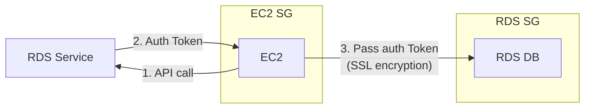
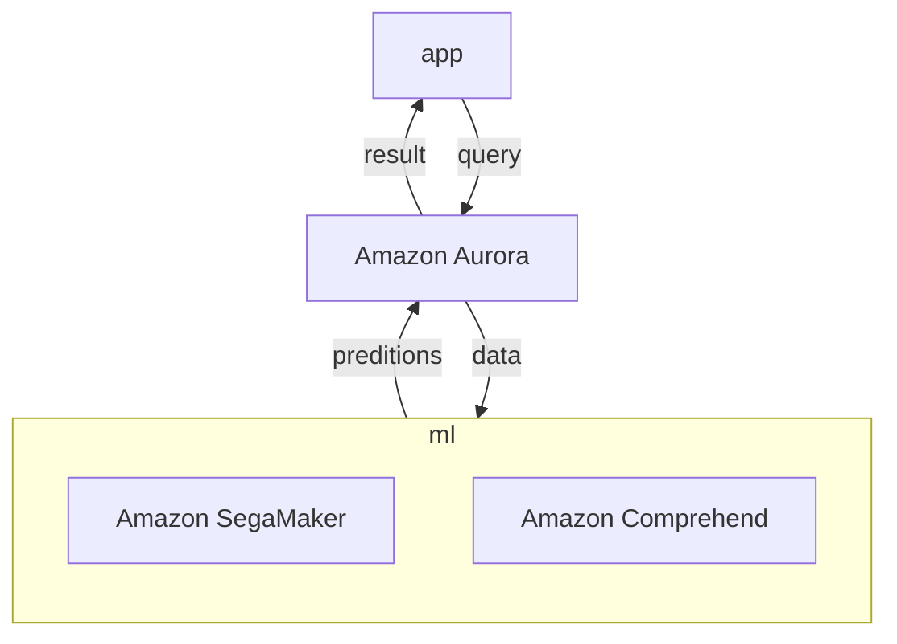

# RDS, Relational Database Service

- [RDS 機器規格比較表](https://instances.vantage.sh/rds/)
- 支援底下幾種 Engine Type:
    - Aurora
        - PostgreSQL Edition
        - MySQL Edition
    - PostgreSQL
    - MySQL
    - MariaDB
    - MsSQL
    - Oracle
- 此為 managed service, 但 RDS 會協助管理
    - 仍需指定 EBS Volume type(gp2, io1, ...) & size
    - 免管理機器, OS
    - Storage
        - RDS 具有 storage auto-scaling
            - scale volume size
            - for all RDS DB engines
        - 需告知 `Maximum Storage Threshold` (避免意外而無止境擴增是吧)
- 區分成 5 個了解方向:
    - Operations
        - 須自行處理 replicas, ec2 scaling, EBS restore, App Change, ...
    - Security
        - 自行處理 Security Group, KMS, SSL for encryption in transits, IAM Authentication
        - PostgreSQL && MySQL 皆支援 IAM Authentication
    - Reliability
        - 支援 Read-Replica && Multi AZ
    - Performance 依賴於 EC2 && EBS spec
    - Cost
        - based on EC2 && EBS
- Read Replicas
    - RDS 至多可有 5 個 Read Replicas (same AZ, cross AZ, cross Region 都行)
    - 為了 讀寫效能, 可改為 *讀寫分離*, 因而需要 **Read Replicas**
        - RDS 是 managed service, network traffic 僅對 cross Region 收費
            - cross Region 仍然要 $$
        - 因應 scalability 的 Read Replicas 之間採用 `ASYNC replication`
        - 讀寫分離後, 需修改 CONNECTION STRING
    - 為了 HA(DR, failover), 可勾選啟用 **enable multi-AZ**
        - standby(也可稱為 read replica), 採用 `SYNC replication`
            - same Region, 不用 $$
        - standby 無法做 scaling 用途, 因此正常情況下沒鳥用
        - 背後使用 DNS 來做 failover 切換, 因此 免修改 CONNECTION STRING
        - no downtime
        - 背後會幫忙做 snapshot && restore multi-AZ && continuous `SYNC replication`
- Reliability
    - 關於 Backup, RDS 協助處理:
        - daily full backup
        - 每隔 5 mins 的 transaction logs backup
        - dafault 保留 7 days (可調整 0 ~ 35 days)
    - 自己做 snapshot(lightly backup)
- 常見問題: Dev/Test 的 DB 需要具備 PubliclyAccess (公開訪問)
    - RDS Instance 需要具備 PubliclyAccessible
    - 

# Backups

- Backup (自動)
    - Full      : 每天 
    - Transaction logs : 每 5 分鐘
        - 因此可隨時還原 5 分鐘前資料
    - 預設保留 7 天, 但可增至 35 天
- DB Snapshot (手動觸發)
    - 可自行決定保留多久

# Security

- At rest encryption
    - launch time 的時候就得設定好
    - AWS KMS - AES-256 encryption
    - 對於 Oracle && MS-SQL, 可使用 Transparent Data Encryption(TDE)
- In-flight encryption
    - client 與 DB 之間傳輸, 採用 SSL certs
    - 各種 DB 的實作不同:
        - PostgreSQL : 要在 RDS Console 的 *Parameter Groups* 設定 `rds.force_ssl=1`
        - MySQL      : 要在 DB Console 初始化 user 時設定 `GRANT USAGE ON *.* TO 'DB'@'%' REQUIRE SSL;`
- Backups/Snapshots 的 encryption
    - 如果 RDS DB 原本是 un-encrypted, snapshot 後預設依然是 un-encrypted
    - 如果 RDS DB 原本是    encrypted, snapshot 後預設依然是    encrypted
    - 可設定將 un-encrypted, 藉由 `Copy snapshot` into encrypted
    - 如果原本 RDS DB 是 un-encrypted, 反悔了想要變成 encrypted 該怎麼做?
        1. create snapshot from un-encrypted (OLD)DB
        2. copy snapshot && enable encryption to encrypted snapshot
        3. restore DB from encrypted snapshot
        4. migrate APP to new DB && delete (OLD)DB
- 最多可設定 5 read replicas (same AZ / Cross AZ / Cross Region)
- 使用 SG && IAM 來控管訪問
    - 也可使用傳統的 帳密認證
    - 對於 MySWL && PosgreSQL, 可使用 *IAM-based authentication*
        - `authentication token` (15 mins life)
        - 藉由 IAM & RDS API call

# Aurora

- AWS 魔改 MySQL/PostgreSQL 以後的 CloudNative RDBMS
- 支援 **Cross Region Replication**
- 若為 multi-AZ, 則 data cross 3 AZ, 具有 6 copies(1M5S)
- Master + 0~15 Read Replicas
    - 可再決定是否 multi-AZ
        - 即使 Aurora 沒有 enable multi-AZ, Storage 依舊是 multi-AZ
- 如果節點掛了, 30 secs 自動作 failover 切換
- 支援 Multi-master
- auth 可用 IAM token 認證 (同 RDS)
- auto backups, snapshots and replicas (皆 encrypted)
- 可選擇建立 Auto Scaling Stragegy
    - by CPU rate
    - by Connection number
- Reliability
    - AWS 自行幫忙處理好 6 replicas
        - 這 6 個 replication 橫跨了 3 AZ - HA
            - 而他們的背後也是寫入到不同的 Volume(免 user 自管)
        - 具備 Self healing(peer-to-peer replication)
    - auto failover < 30 secs
        - 單一 Cluster 最多可設定 15 Read Replicas (可放在 Auto Scaling)
        - 若超過, 其餘 read replicas 會產生新的 master 來做 write
    - 本身支援 cross replication
    - Global for Disaster Recovery / latency purpose
    - Backtrack: restore data at any point of time without using backups
- Performance
    - MySQL && Postgresql 效能的 5x && 3x (宣稱)
        - 但是貴了 20%
- Charge: pay for use
- Aurora DB Cluster
    - 
    - Load Balancing 發生在 connection level (而非 statement level)
    - Aurora 建立完後, 會有 2 個 Endpoints(DNS Name):
        - Writer Endpoint
        - Reader Endpoint
- Auto Scaling for Aurora Replicas
    - 可針對 by CPU 用量 OR by conneciton 數量, 來增加 Read Replicas
    - 增加的 Replicas, 也可產生不同規格的大小
        - 針對 *Aurora DB Cluster* 那張圖, 產生 *Custom Endpoint*(取代掉 *Reader Endpoint*)
- Serverless Aurora
    - Client 連線到 *Proxy Fleet*(而非上述的 *Writer Endpoint* && *Reader Point*)
        - 背後怎麼做 scaling 由 AWS 控制
- 可設定 *Aurora Cross Region Read Replicas*, 但是使用 *Aurora Global Database* 較優
    - 擁有一個 Primary Region(rw)
    - 也可額外設定 5 個 Secondary Region(rr)
        - latency < 1 sec
        - 每個 Secondary Region 有高達 16 Read Replicas
    - 如果原本的 Primary Region 掛了, Promotion 到其他的 Secondary Region < 1 sec
- 整合了 ML
- 若需要更多的監控, 可配置 `enable Enhanced Monitoring`
- 因應 DR, 可配置 Backtrack 的 `Target Backtrack window`, 可用來還原到之前時間點的狀態

