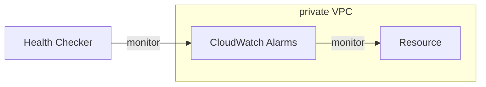

## Basic

- DNS Records : DNS 解析紀錄
- Zone File   : 包含所有的 DNS Records
- Cost: 12/year && 0.5/month
- Routing Policy
    - Simple
    - Weighted
    - Failure
    - Latency based
        - 會依照 user 所在位置, 去訪問他能訪問到最小 TTL 的位置
        - 會與 Health Check 搭配
    - Geolocation
    - Multi-Value Answer
    - Geoproximity (using Route53 Traffic Flow feature)


## Health Check

- 假如 APP 本身 cross region, 為了 HA, Route53 可以設定 Health Check
    - 
- Health Check, 為了達成 Automated DNS Failover
    - Health checks that monitor an endpoint
        - 世界各地 15 個 Health Checker 會對 endpoint 做 check
            - 因此, 被監控的 Resource, 需要允許 Health Checker's IP Range 做訪問
        - 18% 以上說 health, 即被視為正常
    - Health checks that monitor other health checks (calculated health check)
        - 可對 *Parent Health Check* 設定最多 256 個 *Child Health Check*
        - 讓 *Child Health Check* 針對單一 Resource 做監控
        - *Parent Health Check* 在設定針對 *Child Health Check* 的監控結果定義如何叫做 health
    - Health checks that monitor CloudWatch Alarms
        - 可做 private
            - 搭配 CloudWatch Metric, 然後安排 CloudWatch Alarms 在它上頭
        - more control




## 域名帳戶移轉

- [AwsCli_Configure](https://docs.aws.amazon.com/zh_tw/cli/latest/userguide/cli-configure-files.html)
- [Route53移轉](https://awscli.amazonaws.com/v2/documentation/api/latest/reference/route53domains/transfer-domain-to-another-aws-account.html)
- [Migrating a hosted zone to a different AWS account](https://docs.aws.amazon.com/Route53/latest/DeveloperGuide/hosted-zones-migrating.html#hosted-zones-migrating-install-cli)
- 2020/10/09

把 domain 由 aws 帳戶 移轉到另一個帳戶

```bash
$# PROFILE=r53
$# aws route53 list-hosted-zones --profile ${PROFILE}
{
    "HostedZones": [
        {
            "Id": "/hostedzone/XXXXXXXXXXXX",
            "Name": "tonychoucc.com.",
            "CallerReference": "XXXXXXXXXXXX-XX:XXXXXXXX-XXXX-XXXX-XXXX-XXXXXXXXXXXX",
            "Config": {
                "Comment": "HostedZone created by Route53 Registrar",
                "PrivateZone": false
            },
            "ResourceRecordSetCount": 22
        }
    ]
}
# profile 為 ~/.aws/credentials 裡面的其中一個帳戶 [profile] <- 這個

### 列出所有托轉的子域名
$# aws route53 list-resource-record-sets \
    --hosted-zone-id ${HOSTED_ZONE_ID} \
    --profile ${PROFILE}

### Route53 移轉到其他帳戶
$# aws route53domains transfer-domain-to-another-aws-account \
    --domain-name ${HOSTED_DOMAIN_NAME} \
    --account-id ${OLD_AWS_ACCOUNT_ID} \
    --profile ${PROFILE}
```


# note

2020/11/24 已改用 cloudflare 做為 NS, 原始 NS 如下

```
tonychoucc.com. NS 
ns-670.awsdns-19.net.
ns-474.awsdns-59.com.
ns-1669.awsdns-16.co.uk.
ns-1080.awsdns-07.org.
```

cloudflare

```
adrian.ns.cloudflare.com.
coby.ns.cloudflare.com.
```