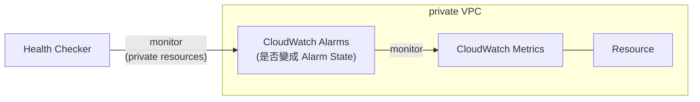
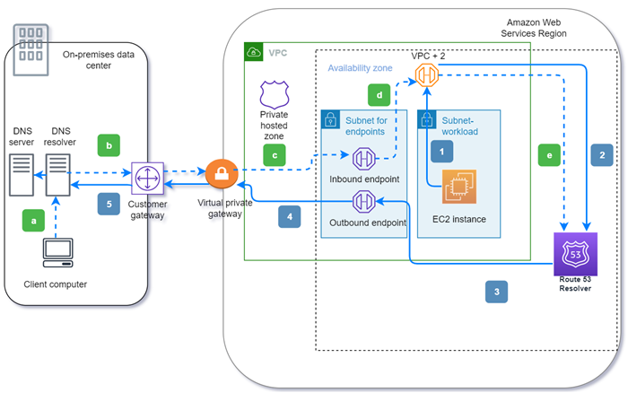
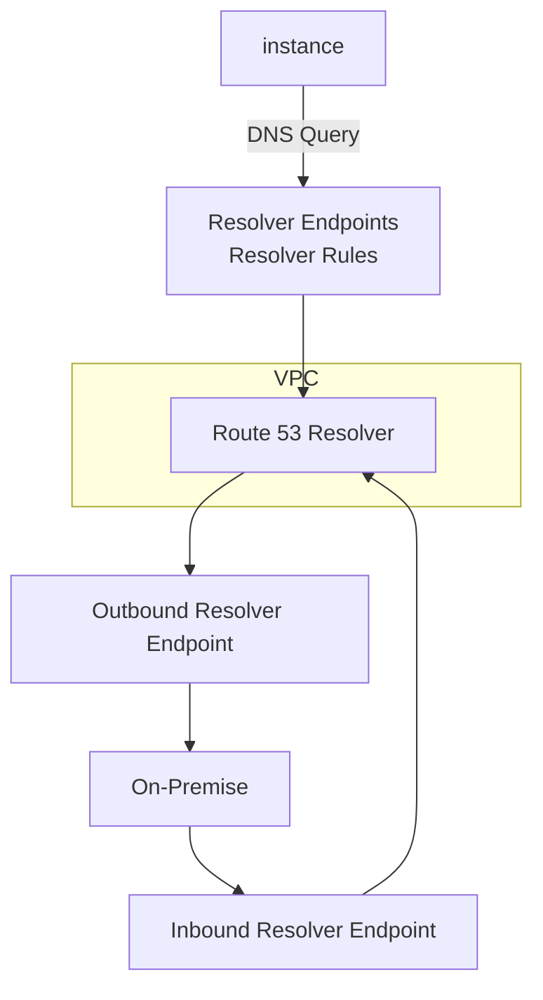

# Route 53, R53

- DNS Records : DNS 解析紀錄
  - Alias Record: 可選擇 alias (只能)指向到 AWS Resources ; 可使用 ROOT DOMAIN
    - 只能使用 A or AAAA
    - Record Target 可能是 ELB, CloudFront, S3 WebSite, Beanstalk, API Gateway, Global Accelerator, ...
  - CNAME Record: 不可使用 ROOT DOMAIN
- Zone File : 包含所有的 DNS Records
- Cost: 12/year && 0.5/month
- Routing Policy
  - Simple
    - 無 Health Check
  - Weighted
  - Failure
    - 只能有 1 master && 1 secondary
  - Latency
    - 與 user 最近的 Region (依照 TTL 判斷)
    - 如果 Service 有跨 Region 的話, 用這功能才有用
  - Geolocation
    - 容易與 Latency 及 Geoproximity 搞混@@
    - 依照 user 所在 _實際地理位置(洲, 國家)_ 來做 routing
    - 因此可用這方法來屏蔽特定國家
    - 需要給一個 Default
  - [Geoproximity](https://docs.aws.amazon.com/Route53/latest/DeveloperGuide/routing-policy-geoproximity.html)
    - 有點類似 Geolocation, 不過這方式可以針對 Resource 設定一個 bias
    - 除了用戶依照地理位置就進訪問 Resource 以外, 可再用 bias 來做地理空間的微調
    - 可設定 [1 to 99] 來增加流量, [-1 to -99] 減少流量
    - 使用了 _Route53 Traffic Flow_ feature
    - Traffic Flow Policy
    - 可依照 geographic 就近訪問
  - Multi-Value Answer
    - 把這個當成是有 Health Check 的 Simple routing policy 就是了~
    - client dig 出來的結果, 看起來與 Simple 長一樣
    - 但如果其後的節點為 unhealthy, 則 dig 出來以後看不到它
    - 可把這個視為 Client Routing
- 各種名詞解釋
  - Domain Registrar : 註冊(買) 域名的地方..., ex: _NameCheap_, _Route53_, _Godaddy_, ...
    - 基本上這些機構都會提供 DNS Service
  - Zone File : 註冊到的域名的所有相關的解析紀錄, 包含: SOA, NS, ...
  - Name Server : resolves DNS queries (Authoritative 或 Non-Authoritative)

## Traffic Policy

- Route53 的服務裡頭有個 Traffic Polies 可使用
- Charge: 非常貴! 一個 policy 50 美元 / month
- 可使用 visual 的方式, 並設定有點類似 pipeline 的方式, 來配置 routing 政策
  - 可用來做非常複雜的 routing decision tree (視覺化!)
- 具備 versioning
- cross domain name

# Health Check

- 假如 APP 本身 cross region, 為了 HA, Route53 可以設定 Health Check
- Health Check 基本上只能做 Public Resources 做檢測 (除了 CloudWatch Alarms)
- 全世界有 15 個 _Global Health Checkers_
  - Checkers' IP : https://ip-ranges.amazonaws.com/ip-ranges.json
- Health check (為了達成 Automated DNS Failover) 可以檢查底下幾個標的:
  - Endpoint
    - 如果 18% 以上的 _Global Health Checkers_ 檢測為 Health 則視為 Health
    - 預設 30 sec 檢測一次, 如果頻率要提高需要課金
    - health check 除了用 Response Status Code 來判斷檢測結果(2xx 或 3xx)
    - 可自行設定從 response 前 5120 bytes 來判斷 pass/fail
      - 前提是這個 response 是 text
    - 被監控的 Resource, 需要允許 Health Checker's IP Range 做訪問
  - other health checks (calculated health check)
    - _Parent Health Check_ 可對最多 256 個 _Child Health Check_ 做 calculated check
    - _Child Health Check_ 針對單一 Resource 做監控
    - 需自行定義怎樣的 calculated check 結果算正常 (要定義什麼才叫 parent pass 啦)
    - 最為實際的使用情境是, 檢測是否 所有的 Health Check 都掛了
  - [CloudWatch Alarms](./CloudWatch.md#cloudwatch-alarms)
    - 可以對 Private Resources 做檢測!!
    - 搭配 **CloudWatch Metric**, 然後安排 **CloudWatch Alarms** 在它上頭
    - more control && helpful for private resources
    - 示意圖大概長這樣:

# Route 53 Resolver (蠻進階的東西...)

### Outbound (solid arrows 1-5):

1. An Amazon EC2 instance needs to resolve a DNS query to the domain internal.example.com. The authoritative DNS server is in the on-premises data center. This DNS query is sent to the VPC+2 in the VPC that connects to Route 53 Resolver.
2. A Route 53 Resolver forwarding rule is configured to forward queries to internal.example.com in the on-premises data center.
3. The query is forwarded to an outbound endpoint.
4. The outbound endpoint forwards the query to the on-premises DNS resolver through a private connection between AWS and the data center. The connection can be either AWS Direct Connect or AWS Site-to-Site VPN, depicted as a virtual private gateway.
5. The on-premises DNS resolver resolves the DNS query for internal.example.com and returns the answer to the Amazon EC2 instance via the same path in reverse.

### Inbound (dashed arrows a-e):

1. A client in the on-premises data center needs to resolve a DNS query to an AWS resource for the domain dev.example.com. It sends the query to the on-premises DNS resolver.
2. The on-premises DNS resolver has a forwarding rule that points queries to dev.example.com to an inbound endpoint.
3. The query arrives at the inbound endpoint through a private connection, such as AWS Direct Connect or AWS Site-to-Site VPN, depicted as a virtual gateway.
4. The inbound endpoint sends the query to Route 53 Resolver at the VPC +2.
5. Route 53 Resolver resolves the DNS query for dev.example.com and returns the answer to the client via the same path in reverse.

## Route 53 Resolver

# 域名帳戶移轉

- [AwsCli_Configure](https://docs.aws.amazon.com/zh_tw/cli/latest/userguide/cli-configure-files.html)
- [Route53 移轉](https://awscli.amazonaws.com/v2/documentation/api/latest/reference/route53domains/transfer-domain-to-another-aws-account.html)
- [Migrating a hosted zone to a different AWS account](https://docs.aws.amazon.com/Route53/latest/DeveloperGuide/hosted-zones-migrating.html#hosted-zones-migrating-install-cli)
- 2020/10/09
