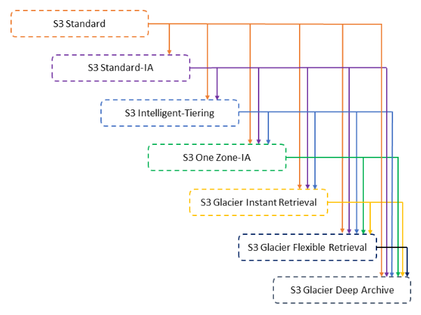
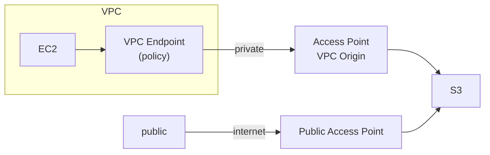

# S3

- key 由 prefix && object name 組成
  ```
  s3://Bucket/Folder/Sub_Folder/File.txt
              ^^^^^^^^^^^^^^^^^^^^^^^^^^  key , Full path
              ^^^^^^^^^^^^^^^^^           Prefix
                                  ^^^^^^^^  Object Name
  ```
- S3 Object Size 最大為 5 TB
- S3 Object 上傳時, 最大僅能 5GB, 超過得用 `multi-part upload`
- S3 Versioning 啟用前, 既有 Objects 的版本會是 null
- S3 Versioning 啟用後, 若停用 Versioning, 則先前版本 不會刪除
- S3 batch operations 用來一口氣操作 S3 Bucket all Objects
- S3 Events:
  - 可針對 S3 Bucket 設定各種 events 用來觸發: LambdaFunction / SNS / SQS
  - 更進階一點則可觸發 EventBridge, 不過需要撰寫 **filtering options**
- S3 Object Tags 與 User-Defined Object metadata
  - User-Defined Object metadata 必須要是 `x-amz-meta-` 開頭, 只能用來做人工識別
  - S3 Object Tags 可用來做更細部的權限控管
  - 不過兩者都無法用來作 select 相關的 filtering
    - 如果有需要對 Object metadata/Object Tags 搜尋的話, 可搭配使用 DDB 來記錄這些, 再來做搜尋

# S3 Inventory

- S3 Inventory 用來協助管理儲存. 用來做 audit & report 關於 replication & encryption status
- 可用來列出 S3 bucket 裡頭的所有 S3 Objects 的 metadata
- 適用情境像是要做 S3 Objects audit & report, encryption status, ...
  - S3 Inventory 通常的目的, 不外乎是 business compliance 或 Regulatory
- 產出格式為: CSV / ORC / Apache Parquet
  - 後續可用 Athena / Redshift / Presto / Hive / Spark 來做分析
  - 可搭配 S3 Select 來產生相關報告
    - Report 再交由 S3 batch 做後續動作...
- 配置 S3 Inventory 方式
  - > 要配置 S3 Inventory 的 S3 Bucket > Management > (往下拉) Inventory configurations
  - 每天(會頻率更高) 都會不斷運行, 將 S3 Objects 的 metadata 做保存
  - 配置完成後, 需要等待 48 hrs

# S3 batch operations

- 藉由一個指令動作, 來一口氣執行更新一整批的 S3 objects 異動
- S3 Batch Operations 相較於傳統的 Scripts 的好處是, 封裝了 retries, track progress, notifications, reporting, ...
- 可搭配使用 `S3 Inventory` 來取得 object list, 並且使用 `S3 Select` 做 filter, 將結果交給 `S3 batch operations`
- ex:
  - 一次性修改 all objects metadata & properties
  - S3 Buckets 之間 copy objects
  - 一次性 encrypt all un-encrypted objects
  - 一次性修改 ACLs & Tags
  - 一次性 restore objects from S3 Glacier
  - 一次性針對 multiple objects 調用 LambdaFN 做操作

# Encryption

- Encrypt in-flight (傳送中加密)
  - HTTPS
    - 若使用 SSE-C, 則必須使用 HTTPS
    - 此外, AWS Console 都是使用這個
- Server Side Encryption, SSE
  - 有下列方式來做 S3 Object Encryption
    - SSE-S3 : 使用 AWS 管理的 encryption keys
      - HTTP / HTTPS
      - 上傳時必須告知 header:
        - `"X-amz-server-side-encryption":"AES256"`
      - S3 便知道要使用該方式加密
      - AES-256
      - 此 key 完全由 AWS 管理
    - SSE-KMS : 使用 AWS KMS 管理的 encryption keys
      - HTTP / HTTPS
      - 自行將 key 托管至 AWS KMS
      - 預設會有 **aws/s3** 這把可以使用 (免錢)
        - 但如果要自行使用其他的 KMS key 則要每月繳錢
      - 上傳時必須告知 header:
        - `"X-amz-server-side-encryption":"aws:kms"`
    - SSE-C : 使用自行管理的 encryption keys
      - HTTPS Only, 只能由 AWS CLI / SDK
        - Web Console 上頭沒這選項
      - AWS 以外的地方, 自行管理 keys
      - 每次發送請求時, 都需要把 key 夾帶在 header 裡頭
      - 指定用哪一把 Key 來作加密:
        - `"x-amz-server-side-encryption-aws-kms-key-id":"arn:aws:kms:{Region}:{AccountID}:key/{KeyID}"`
    - Client Side Encryption, CSE
      - 自行先將要上傳的檔案加密後再上傳, ex: **Amazon S3 encryption clients** 提供了此服務
    - DSSE-KMS
      - 2023/06 新增的機制, double encryption based on KMS

# S3 Object - MFA-Delete

AWS S3 有個保護 Object 的機制, 啟用後, 則無法在 AWS Console 刪除 Object

需要驗證 MFA 才能刪除

Bucket 必須先啟用 Versioning

啟用/關閉 MFA-delete (必須要是 root account && Bucket Owner)

- [Configuring MFA delete](https://docs.aws.amazon.com/AmazonS3/latest/userguide/MultiFactorAuthenticationDelete.html)

```bash
#ENABLED=enabled
#ENABLED=disabled
aws s3api put-bucket-versioning \
    --bucket $BUCKET_NAME \
    --versioning-configuration Status=$ENABLED,MFADelete=Enabled \
    --profile $CONFIG_NAME \
    --mfa "$MFA_DEVICE_ARN $MFA_CODE"
# CONFIG_NAME 預設為 default
# MFA_DEVICE_ARN 長得像這樣 「arn:aws:iam::000000000000:mfa/$USER」
```

# Bucket Policy - Encryption

- S3 Bucket 可設定 _Default Encryption_, Server-Side Encryption:
  - Disable
  - Enable (可設定 customer-provided encryption key(SSE-C))
    - Amazon S3 Key(SSE-S3)
      - 如果用這個, 將來 user 上傳 file
        - 若有 encrypt, 則照 user 使用的方式 store,
        - 若沒 encrypt, 則依照此設定 encrypt & store
    - ## AWS Key Management Service key(SSE-KMS)

# Access Logs

- [Enabling Amazon S3 server access logging](https://docs.aws.amazon.com/AmazonS3/latest/userguide/enable-server-access-logging.html)
  - Bucket 可 Enable _Server access logging_, 需要指定一個目標 Bucket 作爲儲存 log 的位置.
  - 配置完後, 將來的操作, 要等數十分鐘, 甚至數小時才會有 access log 寫入
  - Web Console 配置方式 > 要 log 的 Bucket > Properties > Server access logging > Enable > 指定 logging Bucket
- [Server Access Log Format](https://docs.aws.amazon.com/AmazonS3/latest/userguide/LogFormat.html)
  - 則將來任何 access Bucket 的操作, 都會有操作的 logging 被保存下來 (後續可用 Athena 分析)
- IMPORTANT: 不要把 logging bucket 與 monitoring bucket 設為相同
- 備註: API call 也可被記錄在 Cloudtrail

# Bucket Replication (CRR & SRR)

- CRR, Cross Region Replication
  - near real-time
- SRR, Same Region Replication
- 不支援 chained replication
  - 「A -- replicate --> B && B -- replicate --> C」沒這東西
- 若要啟用的話, 需要在 Source && Destionation Bucket 皆啟用 Versioning
- 可額外 Enable _Delete Marker Replication_, 則可對 Source 刪除的物件, Replicate 它的 Delete Marker 到 Destionation Bucket
  - 如果沒這麼做的話, Destionation 依舊會存在著 Source 早已刪除掉的 Object

# S3 Pre-Signed URLs

- 可用來產生 供 Download/Access 的 URL(by CLI / AWS Console)
  - 預設為 3600s
  - 可用 `--expires-in [TIME_BY_SECONDS]` 變更 timeout
- 用來產生 供 Upload 的 URL(by SDK)
- Use case
  - 特定期間有效的 URL (ex: 1 hr 後到期)
- **S3 Pre-Signed Url** 容易與 **CloudFront Signed URL** 搞混

# Storage Class

- Durability & Availability
  - Durability : ex: 99.999999999% (11 9's), 表示儲存在 S3 1000w 個 objects, 放個 10000 years, 會有一個壞掉
    - 各種 Storage Classes Durability 皆為 11 9's
    - 每 100000 年, 1000w 個 objects 平均會壞 N 個, 此為 Durability
  - Availability : ex: 99.99%, 表示一年大概有 53 mins 為 not vaailable
    - 每一年會有 N 分鐘無法使用, 此為 Availability
- 分為下列各種儲存類別. 僅 Standard 存取資料為 Free, 其餘會 Charge
  - Standard-General Purpose
    - Availability: 99.99%
    - Sustain 2 concurrent facility failures
  - Standard-Infrequent Access, IA
    - Availability: 99.9%
    - 相較 General Purpose 便宜, 但是取得資料較慢一點
    - Use Case: Disaster Recovery
  - One Zone-Infrequent Access
    - 如果 AZ 毀了資料也跟著毀了
    - Availability: 99.5%
    - Use Case: Secondary backup
  - S3 Glacier Storage Class
    - Charge: storage + retrive
    - S3 Glacier Instant Retrieval
      - 最少需要保存 90 days
      - 存取速度同 Standard
    - S3 Glacier Flexible Retrieval (一般稱 S3 Glacier)
      - 最少須保存 90 days
      - 有三種 Retrieval Options(S3 Glacier 取資料的模式):
        - Expedited (取資料 1~5 mins)
        - Standard (取資料 3~5 hrs)
        - Bulk (取資料 5~12 hrs)
    - S3 Glacier Deep Archive
      - 最少須保存 180 days
      - 有兩種 flexibility
        - Standard (取資料 12 hrs)
        - Bulk (取資料 48 hrs)
  - Intelligent Tiering
    - Charge: monthly monitoring + auto-tiering fee
      - No retrive Fee
    - AWS 會自動協助變更 S3 Class
      - 會產生 monthly monitoring && auto-tiering fee
- 除了 _Glacier Deep Archive_ 與 _Glacier Deep Archive_ 以外, 其餘儲存類別的存取速度都是 milliseconds
- [Performance across the S3 Storage Classes](https://aws.amazon.com/s3/storage-classes/?nc1=h_ls)
- [Comparing the Amazon S3 storage classes](https://docs.aws.amazon.com/AmazonS3/latest/userguide/storage-class-intro.html#sc-compare)
- S3 Storage Classes 之間的 transition 的可行方式如下圖:
  - 

# S3 Life Cycle Rules

- 可藉由此配置, 來設定一系列規則, 讓 AWS 依照這些規則來協助調整 Storage Class
  - Transition actions - 不同 Storage Class 之間的轉換規則
  - Expiration actions - 過一段時間以後, Delete Object. 也可用來刪除 Old Versioning
- 而上述的這些, 可設定 Rules, ex: `s3://mybucket/mp3/*`. 看要套用 Bucket 內的哪些 Objects
- Use Case:
  - 用戶上傳圖片, 程序會製作縮圖, 分別將 src img 及 thumbnail 做儲存(需 45 天內可隨時取得)
    - 將 src img 存入 Standard General Purpose, 搭配 life cycle, 45 天後, 移至 Glacier
    - 將 thumbnail 存入 One-Zone IA(可隨時取得 && 若壞了可隨時由 src img 還原), life cycle 則 45 天後移除
  - 對於 15 天內已移除的資料, 能被隨時還原(即使很少發生), 此外 365 天內移除的資料, 也可在 48 hrs 還原
    - 需啟用 S3 Versioning, 來確保資料移除後可被還原
    - 因而移除後的 Versioning, 會被 Delete Marker 給遮蔽 (也可輕易地被還原)
    - 而 non-current Versions, 則可放入 Standard IA(省成本 && 需求有提到較少發生)
    - 再搭配 life cycle, 15 天後將 non-current versions 移入 Deep Archive
  - 移除 14 天前的 OLD data (適用於 daily backup small files)
    - xxx
- 除了自行配置 Life Cycle Rules 以外, 也可使用 **S3 Analytics**, 來讓 AWS 幫忙決定 Storage Class 該如何自動配置
  - 透過機器學習
  - 不適用 _One-Zone IA_ && _Glacier_, 僅適用 _Standard_ && _Standard IA_
  - 起碼需讓他運行個 24 - 48 hrs, 才能開始運作

# S3 Lifecycle Policy

- 關於使用 S3 的 [Transitioning objects using Amazon S3 Lifecycle](https://docs.aws.amazon.com/AmazonS3/latest/userguide/lifecycle-transition-general-considerations.html)
  - 裏頭有說明各種 Storage Classes 的支援 && 限制(Object Size, 轉換期間的 LifeCycle)
- 重要概念釐清
  - current 與 noncurrent : 差在 object 上頭是否有個 `delete marker`. 並且, 要啟用 Versioning 才會有這東西
  - `delete marker` 可以當作是 versioning object 的一個屬性, 這個屬性並不會因為配置了 delete noncurrent version 而被刪除
- Lifecycle rule actions (Web Console 可選擇的勾選)
  - **Transition current versions of objects between storage classes**
    - _current version_ 表示為 most recent(尚未切換 show versioning 的時候看到的那個最新的)
    - 很單純的,幾天後就將 Objects 變更 Storage Class (變更的標的是 _current version_)
    - 此規則建立以後, 後續的 Objects 才會套用 (先前就已經存在的 Objects 似乎不會管用!?)
  - **Transition noncurrent versions of objects between storage classes**
    - 基本上同上, 只不過標的為 (已經啟用 Versioning 以後的) _noncurrent version_
  - **Expire current versions of objects**
    - 對於啟用 Versioning 的 buckets, N days 後, 加上 delete marker
    - 對於沒有 Versioning 的 buckets, N days 後, 直接移除
  - **Permanently delete noncurrent versions of objects**
    - 對於 (以啟用 Versioning 的) noncurrent objects,
      - (required) 僅將此 noncurrent version 保留 N days
      - (optional) 或者, 保留 N 個 noncurrent version
  - **Delete expired object delete markers or incomplete multipart uploads**

# S3 Storage Lens

- 用來針對 org 的 S3 Storage 做 analyze 及 optimizes
  - 拿到的 report 可以配置讓他們儲存到 S3, 保存成 CSV, Parquet format, 內容有:
    - Summary Insights
    - Data protection
    - Cost Efficiency
  - 可拿到 30 days 內的 usage 及 activity metrics
- Storage Lens 會將 Organization / Accounts / Regions / Buckets 的資料做 aggregate 及 analyze
  - 會有個 Default Dashboard
    - 裡頭有 _Multi-Region_ 及 _Multi-Account_ data
- Storage Lens 費用
  - Free Metrics
    - 預設每個帳戶都會有, 可查 14 days 內的紀錄, 有 28 metrics
  - Advanced Metrics and Recommendations
    - 可與像是 CloudWatch 結合, 並且有其他正進階的 Metrics 可供參考, 可查 15 months 內的紀錄
- S3 Analytics - S3 Storage Class Analysis
  - 建議有哪些 Standard 可以轉換成 Standard-IA (沒其他種的建議了= =)
    - 可用來結合 S3 Lifecycle Policy 的制定
  - 得花上 24 ~ 48 hrs 來做分析
    - 日後每天都會做分析
    - 會產出一份 csv

# S3 - Baseline Performance (S3 效能及限制)

- `S3 請求限制(Request limits)`
  - GET/HEAD, 5500/sec
  - PUT/COPY/POST/DELETE, 3500/sec
  - AWS 對於 API call 有軟性限制, ex:
    - EC2 DescribeInstances API, 100 次/sec
    - S3 GetObject API, 5500 次/sec
  - 如果收到 5XX && `ThrottlingException`, 就表示遇到 `API Rate Limit` 了
    - 如果 code 裡頭有 retry 機制, 會被帶入 _Exponential Backoff_
      - 因此 retry 需要使用 _Exponential Backoff Strategy_
      - 遇到此情況, 1 sec 內無法重複請求, 若再次遇到, 則需等 2 sec, 若再次則 4 sec, 再來 8 sec, 16 sec, ...
    - 如果遇到 4XX 就不要再為難 Server 了, 好好檢討自己吧 XD
  - 解法: request an API throttling limit increase
- `S3 - KMS 請求限制(Request limits)`
  - 如果有啟用 KMS, 則可能會遇到 KMS limits 的限制, 導致 S3 吞吐量下滑
    - 無論是 Upload/Download Object <-> S3, 使用到 KMS Key, 都會呼叫到與此對應的 API 來作加解密
    - 此 API 會有訪問限額(不同 Region 不相同), 但可藉由 **Service Quotas Console** 調整此限額
- 上傳
  - `Multi-Part upload`
    - 針對特大物件(>5GB), 一定得用這個來上傳
    - 建議 > 100MB, 就用這個來做上傳
  - `S3 Transfer Acceleration`
    - 可借助 `Edge Location` 來加速上傳 (再走 AWS private 到 S3)
    - 傳輸時, 建議搭配 `Multi-Part upload` 來加速上傳
    - 容易與 [AWS Global Accelerator](./cert-SAA_C02.md#global-accelerator) 搞混
- 下載/查看
  - `S3 Byte-Range Fetches`
    - S3 加速 GET Request -> **S3 Byte-Range Fetches**
    - parallelize GET by requesting 特定的 byte ranges (可只用來取特定 partial data), ex:
      - 要從非常龐大的 Bucket 分析 metadata, 一定得好好善用這個. 可用來快速取得 first N bytes of object
  - `S3 Select` && `S3 Clacier Select`
    - Server Side Filtering by SQL (Server Filter 來減少傳輸量)
    - 減少 Client Side CPU && Networking
    - 可針對 檔案特定欄位 做 select
    - 只能做簡單 Query, 不支援 aggregation (若要使用, 請用 Athena)

# S3 Website

- S3 託管靜態網頁, 需做底下作業:
  - Bucket 改為 Public Access
  - 制定 Bucket Policy > allow GetObject
    - https://docs.aws.amazon.com/AmazonS3/latest/userguide/WebsiteAccessPermissionsReqd.html
  - enable _Static website hosting_, 填寫 index.html 等
- WebSite URL :
  - `http://${BUCKET_NAME}.s3-website.${AWS_REGION}.amazonaws.com`
  - 或 (website. 改成 website-)
  - `http://${BUCKET_NAME}.s3-website-${AWS_REGION}.amazonaws.com`

# S3 Cross-Origin Resource Sharing, CORS

- 若要允許跨站請求, Target Bucket 需 Allow CORS
  - 需要配置 CORS Policy, 參考 [CORS configuration](https://docs.aws.amazon.com/AmazonS3/latest/userguide/ManageCorsUsing.html)
- 用戶要做跨站(cross.com) 請求時, 會有底下動作:
  - Browser 先對 Cross Origin Site 發一個 Preflight Request
    ```
    OPTIONS /
    Host: cross.com
    Origin: https://origin.com
    ```
  - 之後拿到 Cross Site 的 Response
    ```
    Access-Control-Allow-Origin: https://origin.com
    Access-Control-Allow-Methods: GET, PUT, DELETE
    ```
  - Browser 分析後得知有權限訪問後再次發出 Request
    ```
    GET /
    Host: cross.com
    Origin: https://origin.com
    ```
- 而 S3 要允許別人 Cross Site Access 的一方, 需完成底下作業才行:
  - Enable CORS
  - 配置 [CORS configuration](https://docs.aws.amazon.com/AmazonS3/latest/userguide/ManageCorsUsing.html)

# S3 Requester pays

- S3 會針對請求的流量對 S3 擁有者計費, 但也可設定讓 資源請求者 來付費
  - 因此, 資源的請求者, 必須是 AWS Account (無法為 anonymous)

# 關於 S3 及 Glacier 的永久保存機制

- Glacier 裡頭的每個東西都稱之為 Archive
  - 每個 Archive 最多可高達 40 TiB
  - Archives 都被保存在 Vaults(Bucket 的概念) 裏頭
  - 預設都使用 AES256/AES-256 做 encryption
- 每個 Vault 都會有一個 Vault Access Policy (等同於 S3 Bucket Policy)
- 每個 Vault 都會有一個 Vault Lock Policy - 因 Regularity/Compliance 的目的, 而制定一個 "無法被改變的政策"
  - 例如, 一年內的資料, 無法被刪除, 且此規定無法被改變
  - 這類的 Lock 有底下這些機制:
    - I. S3 Object Lock
      - create Bucket 的時候, enable Object Lock
        - 此 Bucket 就無法被刪除了
        - Bucket 會自動啟用 versioning
        - 此會套用 WORM(Write Once Read Many) model
        - Policy 一旦制定以後, 連同 Object && Polciy, 都無法被 刪改 (即使是 root/admin 也無法更動)
    - II. Glacier Vault Lock
      - 針對 S3 Glacier 設定此保護機制, 裡頭的東西無法被任何人刪除 (除非砍帳號)
      - 一旦設定了以後, 就拔不掉了!!!
    - III. Legal Hold
      - 無期限的保留 S3 Object
      - 一旦 S3 Object 設定了 Legal Hold, 則會無視 S3 Bucket 已經設定好的 Retention Period
      - IAM 如果具備了 `s3:PutObjectLegalHold` 權限的話, 則可 GET/PUT/DELETE object
      - 此機制並不會像 **Vault Lock** 或是 **S3 Object Lock - Compliance mode** 那麼的強制
- S3 Object Lock, 對於 Object 的防護模式, 區分成
  - Governance mode
    - 權限足夠的人 可以 刪除/修改
  - Compliance mode
    - 權限足夠的人 無法 刪除/修改, 一旦設定了以後, 就拔不掉了!!!
- 而因為 S3 Glacier 本身都是 async, 因此會執行一段時間後, 最好都要有相對應的 notification
  - 可在 Vault Configuration 設定 notification
  - 可配置 S3 Event Notification (S3 > Properties)
    - 可針對特定的 S3 Event 設定 Notifiation, 例如: `s3:ObjectRestore:Post`, `s3:ObjectRestore:Completed`, ... (很多)
    - 可將 notification 發送到 LambdaFunction / SNS / SQS

# S3 - Access Points

- 用來簡化 S3 Bucket Policy 的管理 (假如 S3 裡頭東西很多, 訪問的受眾分類也很廣泛)
- 可針對 Bucket 底下的 Prefix (例如: `/sales/`, `/finance/`) 設定 Access Point, 將之授權給特定人訪問(Read / Write)
  - 每個 **Access Point** 都有它自己的 **Access Point Policy** (等同於 **IAM Policy**)
- 每個 Access Point 都有他們自己的 DNS Name
- 可將 Access Point 設定為, 只允許由 VPC 內部訪問, 此時需要建立 **VPC endpoint**
- 202309 的現在, 無法在 AWS Console 上頭設定 「 藉由 **VPC access point** 訪問 S3 」
  - 需使用 CLI, SDK, API 設定
- 如果來自 global client 要訪問 S3, 可使用 **S3 Multi-Region Access Points** 選擇最低 latency 訪問 S3
  - S3 Bucket 背後會做 **Bi-directional Cross-Region Replication**
  - S3 Multi-Region Access Points 操作方式:
    - 進入 S3 Console, 先建立 N 個不同 Region 的 S3 Buckets
    - (左)Multi-Region Access Points > Create
    - 需要等待 30 mins ~ 24 hrs 等它建立完畢
    - > Create replication rules
  - S3 Multi-Region Access Points - 針對用量計費

---



- 上圖的 **VPC Endpoint**, 會有它的 **Endpoint Policy**, 需要授權訪問
  - Access Point VPC Origin
  - S3 Bucket
- 上圖的 **Access Point**, 會有 **Access Point Policy**
- 上圖的 **S3 Bucket**, 也會有 **Bucket Policy**

---

# S3 like

- MinIO, 這東西是可以 self-hosted 的類 S3 服務.
