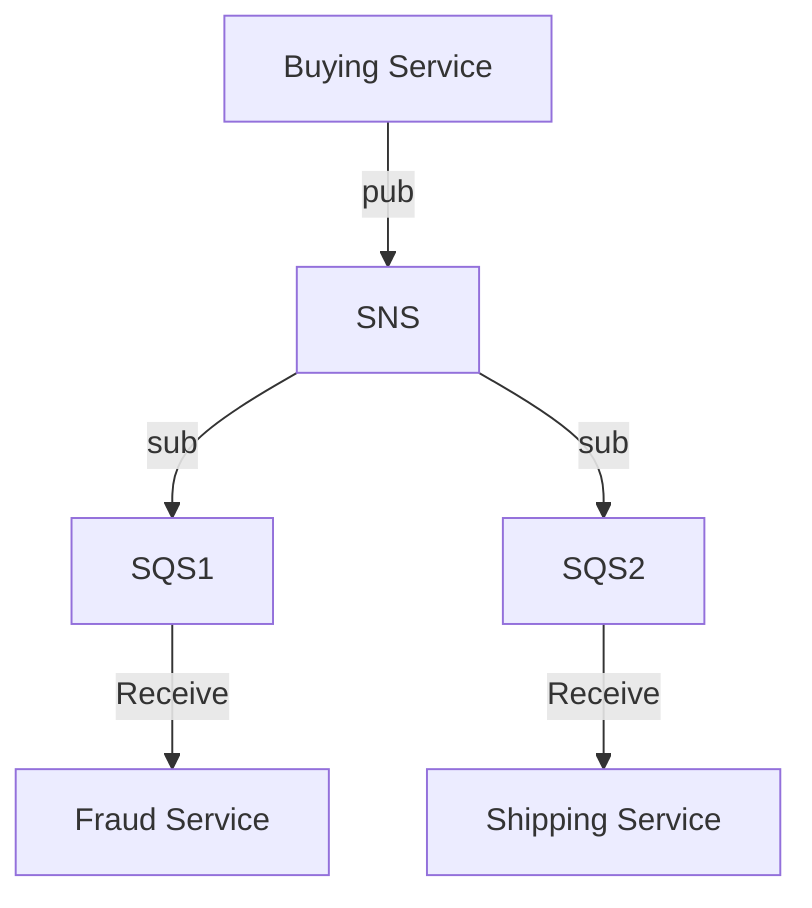

# SNS, Simple Notification Service

- 不同於 SQS, 可設定多個 Receivers
- Pub/Sub Pattern
- up to 1250w 個 Subscribers
- up to 10w 個 Topics / account
- 一堆 AWS Services 都可 publish 到 SNS (using SDK)
- SNS 可 publish 到
    - KDF
    - SQS
    - Emails
    - Lambda
    - HTTP(S)
    - SMS && mobile Notification
- SNS 直接整合 **KDF, Kinesis Data Firehose**
    ```mermaid
    flowchart LR

    bs["Buying Service"]
    sns["SNS Topic"]
    kdf["Kinesis Data Firehose"]
    other["Any supported KDF Destination"]

    bs --> sns;
    sns --> kdf;
    kdf --> S3;
    kdf --> other;
    ```
- SNS 也可做 FIFO
    - 可去重複
    - 具有 content-based ID && deduplication ID 來設定唯一
    - naming 結尾 ".fifo"
    - 至今只有 SQS FIFO 可 Read SNS FIFO
    ```mermaid
    flowchart LR

    bs["Buying Service"]
    sns["SNS FIFO Topic"]
    q1["SQS FIFO Queue"]
    q2["SQS FIFO Queue"]
    q3["SQS FIFO Queue"]

    bs --> sns;
    sns --> q1 --> s1["Fraud Service"];
    sns --> q2 --> s2["Shipping Service"];
    sns --> q3 --> s3["Paying Service"];
    ```
- SNS - Message Filtering
    - JSON policy used to filter messages sent to SNS topic's subscriptions
    - Message 需為 JSON
    - 讓 SNS Topic subscription 用來 filter message 的 JSON Policy
        - 只允許取得特定欄位給訂閱者 (而非全部欄位都給)
        - 如上圖, *Shipping Service* 不需要客戶帳單資訊, 因此可藉由 *Message Filtering* 來把不必要的欄位過濾掉
- 替代品
    - 相較於 [EventBridge](./CloudWatch.md#aws-eventbridge), SNS 無法整合第三方
- Notification
    - 可將 SNS 設定為 `notification rule` 的 target


# Security

- 幾乎等同於 [SQS-Security](./SQS.md#security)
- 若 SNS 要搭配 SQS 做 fan out
    - SQS 需 allow SNS write




# CLI

```bash
### Create Topic
aws sns create-topic --name my-topic


### 使用 email 訂閱
aws sns subscribe --topic-arn arn:aws:sns:ap-northeast-1:668363134003:my-topic --protocol email --notification-endpoint tonychoucc@gmail.com
# 去收信, 確認訂閱後, 可以取得目前用戶的 subscription-id, 如下:
# arn:aws:sns:ap-northeast-1:668363134003:my-topic:0dee22e1-c4a0-4b32-a75c-3a829de4cc44


### Send messages
aws sns publish --topic-arn arn:aws:sns:ap-northeast-1:668363134003:my-topic --message "Hello World!"


### 列出訂閱戶清單
aws sns list-subscriptions


### 取消訂閱用戶
aws sns unsubscribe --subscription-arn arn:aws:sns:ap-northeast-1:668363134003:my-topic:0dee22e1-c4a0-4b32-a75c-3a829de4cc44


### Remove Topic
aws sns delete-topic --topic-arn arn:aws:sns:ap-northeast-1:668363134003:my-topic
```
