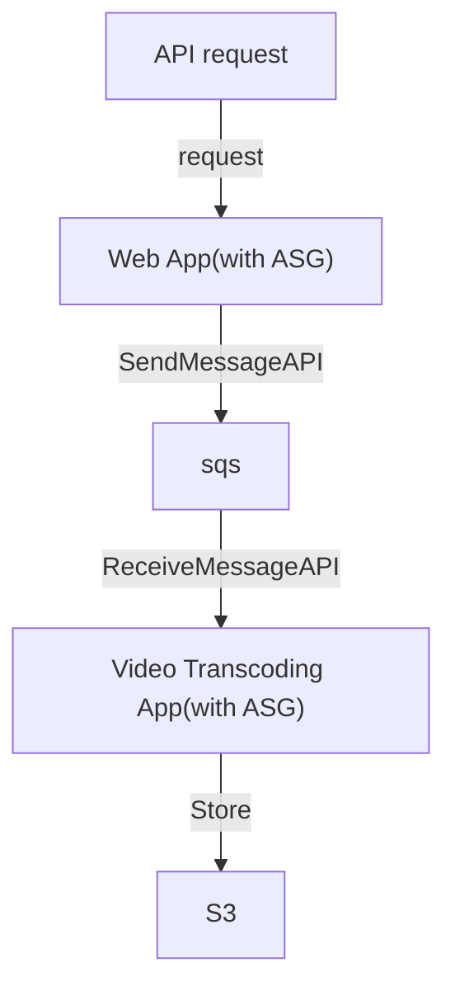

# Simple Queue Service, SQS

- Queue Model. Producer Send && Consumer poll
- 無 messages 的數量限制
- Latency < 10 ms
- message 可能會被 read > 1 次
- 可重複 Deliver Message (因此, coding 時應考慮這個)
- 盡力而為的維持 Message 順序, 但不保證, 除非使用 FIFO SQS
- Consumer 一次可拉 10 個 messages
- message 可存活 1 min ~ 14 days
- 每個 message 最大 256 KB
- SQS 可搭配 ASG (讓 EC2(Consumer) in it), 來達到 Auto Scaling
    - **CloudWatch Metric** 監控 **SQS Queue**
        - Queue Length (`ApproximateNumberOfMessages`)
        - Queue Length / Number of Instances
    - **CloudWatch Metric** Alarm for breach **CloudWatch Alarm**, 來對 ASG 做 Auto Scaling
    - 需設定兩條規則, 分別做 Scaling up && Scaling down
- SQS - Queeu Access Policy
    - 類似 S3 的 Resource Policy
- SQS - Message Visibility Timeout (預設 30s)
    - 如果 Consumer 無法在既定時間內完成的話, 可考慮調大它
    - Consumer 在此時間內處理不完的話, 會再次放回 SQS, 因此 Message 可能被多次 Read
        - 若 Read 次數過多, 應考慮使用 SQS - Dead Letter Queue, DLQ
    - 使用 `ChangeMessageVisibility API` 調整 timeout
- SQS - Dead Letter Queue, DLQ
    - 藉由調整 Source SQS Queeu 的 `MaximumReceives`, 超過此 Read time, 則放入此
    - 後續 Developer 在針對此裡頭的 Message debugging
    - 需要給 SQS Queue permission 來 write
- SQS - DelayQueue
    - default: 0 (max 15 mins)
    - 過多久後再傳送到 Queue
- SQS - Long Polling
    - default: 0 (range 0 ~ 20 s)
    - Consumer 可設定此參數, 減少 API call 的次數
    - 可在兩個地方設定　
        - Queue Level
        - API Level (設定 `WaitTimeSeconds`)
- SQS - Request-Response System
    - Producer 送 Message 可告知 Reply 位置, 將來 Consumer 處理完後, 會放到 Reply 指定的 SQS Queue
- SQS - FIFO Queue
    - 保證 FIFO, 但有限制:
        - 300 Messagess/sec (without Batching)
        - 3000 Messages/sec
    - 具備 *Exactly-once send capability* (一次性發送, 可去除重複)
    - Naming 需要 ".fifo" 結尾
    - 可設定兩個參數來去除重複
        - Message Group
        - Message Deduplication

# Encryption

- in-flight Encryption: 傳輸 message 的過程, 預設已有加密(HTTPS API). 
- Server Side Encryption: 也可額外設定這個, 來再次加密
    - by "KMS key"

# Access Control

- by IAM Policies
- by SQS Access Policies
    - 等同於 S3 Bucket Policy
    - 可 Cross Account
        - SQS Policy 需 allow action: `["SQS:ReceiveMessage"]`
    - 可 Cross AWS Services
        - ex: SNS, S3 events, 來寫入 Message -> SQS
            - 檔案上傳到 S3 以後, 自動 trigger, SendMessage -> SQS
                - SQS Policy 需 allow action: `["SendMessage"]`

# API

- Producer 藉由 
    - SendMessage API 發送 Message
- Consumer 藉由 
    - ReceiveMessage API 拉 Message
    - DeleteMessage API 將已處理好的 Message 移除

# Example

