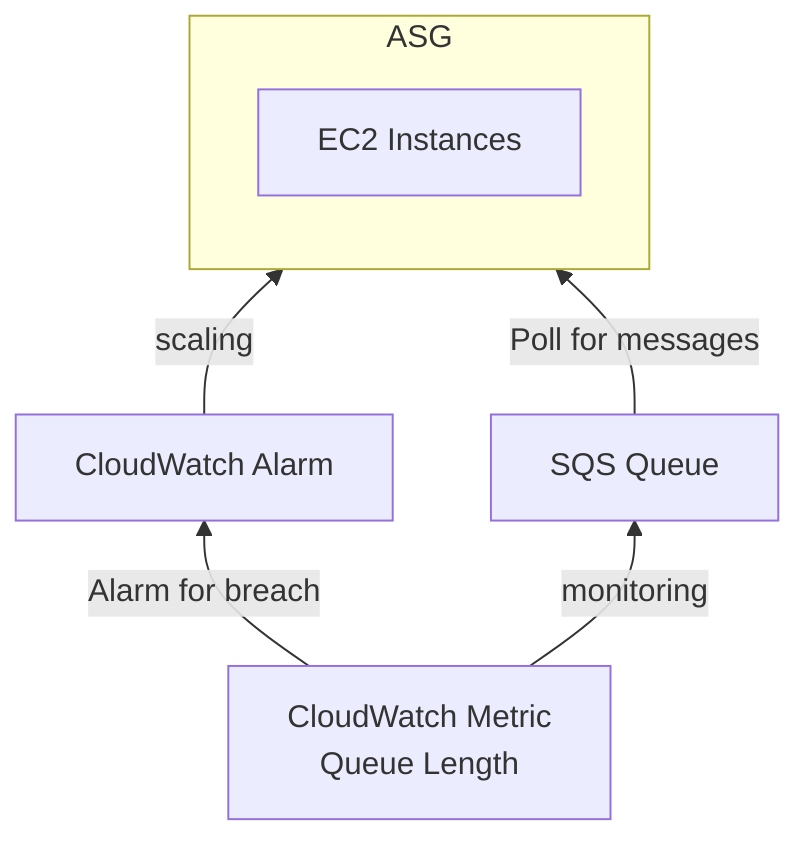
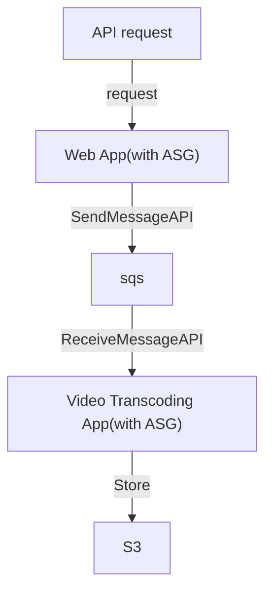

# [SQS, Simple Queue Service](https://docs.aws.amazon.com/AWSSimpleQueueService/latest/SQSDeveloperGuide/welcome.html)

- Queue Model. Producer Send && Consumer poll
- Consumer 一次可拉 10 個 messages
- SQS + ASG
    - ASG 準則可參考:
        - Queue Length - `ApproximateNumberOfMessages`
        - Queue Length / Number of Instances
    - Scaling 需設定 2 條規則, *Scale Up* && *Scale Down*

## SQS - Queue Types

1. Standard Queues
    - Unlimited Throughput && Unlimited Messages in Queue
    - At-Least-Once Delivery
    - Best-Effort Ordering
        - 盡力而為的維持 Message 順序, 但不保證
    - message 可能會被 read > 1 次
    - Latency < 10 ms
    - Retention period, MessageRetentionPeriod
        - 可自行設定 Message 存活期間 Between : 1 min ~ 14 days, default to 14 days
    - Maximum message size, 1 ~ 256 KB
2. FIFO Queues
    - Throughput
        - 300 Messages/sec (without batching)
        - 3000 Messages/sec (with batching, 最多可一次 batch 10 Messages)
    - Exactly-once send capability (一次性發送, 可去除重複)
    - First-In-First-Out Delivery
    - Naming 需要 ".fifo" 結尾
    - 可設定 2 個參數來處理 Deduplication (刪除重複數據 重複數據刪除)
        - 預設的 De-duplcation interval 為 5 mins
            - 也就是說, 5 mins 內, 如果重複發了訊息, 後面那則 Message 會被移除
        - Message Group ID
            - 發送 Message 時(也需要給 Group ID), 會依照這個 Message Group 來判斷是否有重複
            - 1 個 Group ID 只能統一由 1 個 Consumer 處理 (反過來說就是, 1 個 Consumer 只能處理一個 Message Group)
            - Group(Consumer) 之中的 Messages 保證 ordering, 但是他們之間不保證 ordering
        - Message in Queue (Content-based deduplcation)
            - 會依照 `sha-256(Message Body)` 來做唯一性判斷, 去重

## SQS - Delay Queues

- default: 0 (min 0 sec, max 15 mins)
- p 丟 message 到 queue 以後, 在 delay time(此時間內), Consumer 看不到此 message
- `Delay queues` 類似於 `visibility timeouts`, 兩者都是讓 Consumer 在一段時間內, 看不到 messages
- SQS - Long Polling
    - SQS 的 API call 是要錢的 (但有一定的免費額度)
    - default: 0 (range 0 ~ 20 s)
    - Consumer 可設定此參數, 減少 API call 的次數
    - 可在兩個地方設定
        - Queue Level
        - API Level (設定 `WaitTimeSeconds`)
- SQS - Request-Response System
    - Producer 送 Message 可告知 Reply 位置, 將來 Consumer 處理完後, 會放到 Reply 指定的 SQS Queue
- Standard SQS Queue 可以設定 `prioritize`, 來讓 Consumer 優先 poll 優先度高的 Message

## SQS - Message Visibility Timeout (visibilityTimeout)

- 預設為 30 secs
- 因為 SQS 為 distributed service, 因此當 Consumer 從 SQS poll message 之後, 該 Message 依舊會存在於 Queue
    - SQS 會將此 Message 設計 Visibility Timeout, 用以避免其他 Consumer 再次 poll
- 如果 Consumer 無法在既定時間內完成的話, 可考慮調大它
    - 可調整範圍: 0 sec ~ 12 hrs
    - 可使用 `ChangeMessageVisibility API` 調整 timeout
- Consumer1 如果已經 Poll this message
- 此 Visibility Timeout 裡頭, 其他 Consumer 無法 poll 到此 message
- Timeout 期間內處理不完的話, 會再次放回 SQS Queue
    - 其他 Consumer poll 會 "再次" Receive/Read this Message
    - 因此一個 Message 可能會被多次 Receive/Read
    - 若 Read 次數過多, 應考慮使用 DLQ

## DLQ, Dead Letter Queue

- 藉由調整 Source SQS Queeu 的 `MaximumReceives`, 超過此 Read time, 則放入此
- 後續 Developer 在針對此裡頭的 Message debugging (建議這個 DLQ 的保存時間可以調長一點(14 days))
    - 如此一來, 在此期間針對這個 Message Debug 完以後, 還可將此 Message "Redrive to Source"
    - 也就是再次放回原本的 Queue 去做處理
- 需要給 SQS Queue permission 來 write

# Security

- [Basic examples of Amazon SQS policies](https://docs.aws.amazon.com/AWSSimpleQueueService/latest/SQSDeveloperGuide/sqs-basic-examples-of-sqs-policies.html)
- Access Control
    - IAM Policy (identity-based policy)
        - 起碼要有個 能夠 access SQS API 的 IAM Policy
    - Queue Access Policies (resource-based policy)
        - Cross Account
            - SQS Policy 需 allow action: `["SQS:ReceiveMessage"]`
        - Cross AWS Services, ex: S3 events Message -> SQS
            - SQS Policy 需 allow action: `["SendMessage"]`
- Encryption
    - in-flight Encryption   : HTTPS
    - Server Side Encryption
        - KMS 的 CMK (對稱式金鑰)

# SQS Extended Client

- 如果要把大包的 (> 256 KB) Message(Object) 丟入 SQS...
- 可藉由 Programming Language 的 SQS Extended Client 來協助處理
- 此 Library 會協助將 Object 丟入 S3
- Metadata -> SQS Queue
- 再由 Consumer 處理後續動作

# API

- Producer 藉由 
    - SendMessage API 發送 Message
- Consumer 藉由 
    - ReceiveMessage API 拉 Message
        - 有個參數 `MaxNumberOfMessages` (範圍 1~10), default: 1
            - 也就是說一次只能拉 1 條 Message
    - DeleteMessage API 將已處理好的 Message 移除
- CreateQueue, DeleteQueue
- PurgeQueue
- SendMessage(DelaySeconds), ReceiveMessage, DeleteMessage
- ReceiveMessageWaitTimeSeconds (long polling)
- ChangeMessageVisibility, API 階段設定 message timeout
- 若使用 Batch APIs:
    - SendMessage, DeleteMessage, ChangeMessageVisibility
    - 可有效減少 API call, 減少 cost

# SQS Metrics

- ApproximateAgeOfOldestMessage
    - Queue 裡頭最舊的未刪除 message 的存在時間
- ApproximateNumberOfMessagesDelayed
    - 發生於 Queue 被配置為 `delay queue` 或 `message 具備 delay parameter`
    - The number of messages in the queue that are delayed and not available for reading immediately.
- ApproximateNumberOfMessagesVisible
    - SQS 裡頭有多少個 Messages

# 操作

- 必會操作
    - 設定 SQS Queue, 當 S3 Bucket 發生上傳事件, 能有訊息寫入 SQS Queue

# Example

# 不懂的各種問題

- SQS 的 partial batch response
