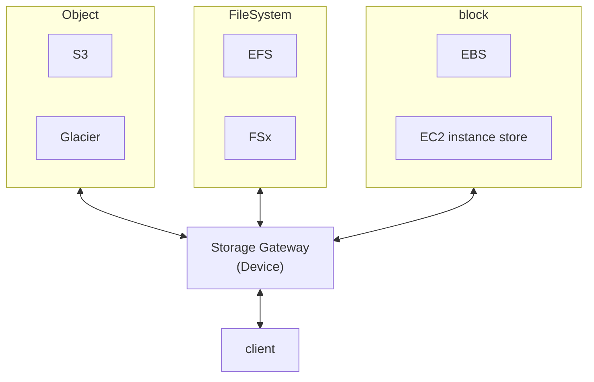
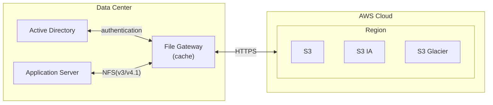
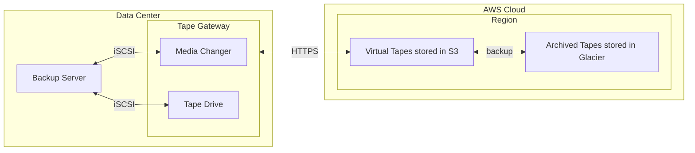
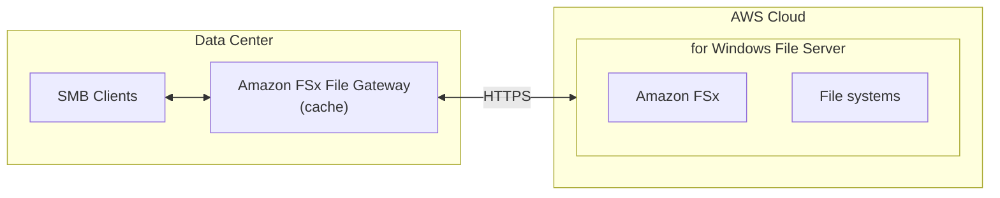

- [AWS Storage Gateway Documentation](https://docs.aws.amazon.com/en_us/storagegateway/?id=docs_gateway)
- [AWS Storage Gateway FAQs](https://aws.amazon.com/storagegateway/faqs/?nc=sn&loc=6)

> AWS Storage Gateway is a service that connects an on-premises software appliance with cloud-based storage to provide seamless and secure integration between your on-premises IT environment and the AWS storage infrastructure in the AWS Cloud.

- [clf-StorageGateway](./cert-CLF_C01.md#storage-gateway)
- 有各種不同的 Storage Gateway
    - [Amazon S3 File Gateway](https://docs.aws.amazon.com/filegateway/latest/files3/what-is-file-s3.html)
    - [Volume Gateway](https://docs.aws.amazon.com/storagegateway/latest/vgw/WhatIsStorageGateway.html)
    - [Tape Gateway](https://docs.aws.amazon.com/storagegateway/latest/tgw/WhatIsStorageGateway.html)
    - [Amazon FSx File Gateway](https://docs.aws.amazon.com/filegateway/latest/filefsxw/what-is-file-fsxw.html)
- 上述的這些 Gateway, 都需要安裝在 DataCenter
    - 另一種方式是, 跟 AWS 下訂 `Storage Gateway-Hardware appliance` (硬體裝置)
        - 此為運行 Storage Gateway 的實體裝置, 可與上述的 gateway 整合
        - 適用於 DataCenter 做 daily backup to NFS
- exam 的關鍵字
    - File access/NFS - user auth with AD => File Gateway (backed by S3)
    - Volumes/Block Storage/iSCSI => Volume Gateway (backed by S3 with EBS snapshots)
    - VTL Tape solution/Backup with iSCSI => Tape Gateway (backed by S3 and Glacier)
    - No on-premises virtualization => Hardware Appliance          

# File Gateway

- via NFS && SMB, access S3 bucket
- 支援: S3 standard && S3 IA && S3 one-zone IA && S3 Glacier
- 使用 IAM Role 管控 access
- 可使用 on-premise AD 來做 user auth
- 最近使用的檔案會被 cache
- Charge:
    - Storege: 儲存費用等同於 S3
    - Traffic: 由 gateway 寫入的資料, 每 GB 計費

# Volume Gateway

- [How Volume Gateway works (architecture)](https://docs.aws.amazon.com/storagegateway/latest/vgw/StorageGatewayConcepts.html)
- [What is Volume Gateway?](https://docs.aws.amazon.com/storagegateway/latest/vgw/WhatIsStorageGateway.html)
    - A Volume Gateway provides cloud-backed storage volumes that you can mount as Internet Small Computer System Interface (iSCSI) devices from your on-premises application servers.
    - Volume Gateway 是個 storage volume, 可從本地資料中心 mount, 當作是 iSCSI 來使用 
    - 只不過這個 Volume Gateway, 需要跑在下列 2 者之一:
        - on-premises VM as a hardware applianceas
        - EC2 instance
    - iSCSI protocol 到 S3
- Volume Gateway 支援下列的 volume configurations:
    - Cached Volumes : cache 最近使用的 data, 降低 latency
    - Stored Volumes : 對整個 dataset, schedule backups 到 S3
        - 最主要功能之一就是 backup, 背後有 EBS snapshot
- Charge:
    - Storege: 針對 Volume Storage 每 GB 計費
    - Traffic: 由 gateway 寫入的資料, 每 GB 計費

## I. Volume Gateway - Cached volumes architecture

- 
    - iSCSI 裡頭的 Volume, 最多可擴增之 32 volumes
    - 每個 volume size, 1 GB ~ 32 TB
    - 因此最多可擴增之 1 PB 的 cached volume

## II. Volume Gateway - Stored volumes architecture

- 

# Tape Gateway

- [What is Tape Gateway?](https://docs.aws.amazon.com/storagegateway/latest/tgw/WhatIsStorageGateway.html)
- Cloud 使用 Virtual Tape Library(VTL), 可將資料以下列方式做保存: 
    - S3 Glacier Flexible Retrieval
    - S3 Glacier Deep Archive

# Amazon FSx File Gateway

- 新一代的 Gateway
- FSx for Windows File Server 原生支援 access Amazon
- local cache
- Windows AD, SMB, NTFS
- useful for group file shares && home directories (殺小?)

