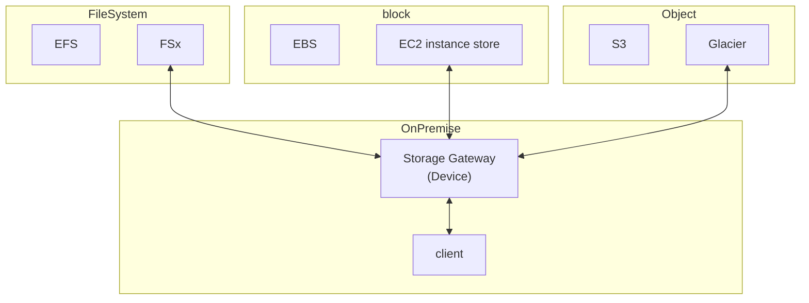
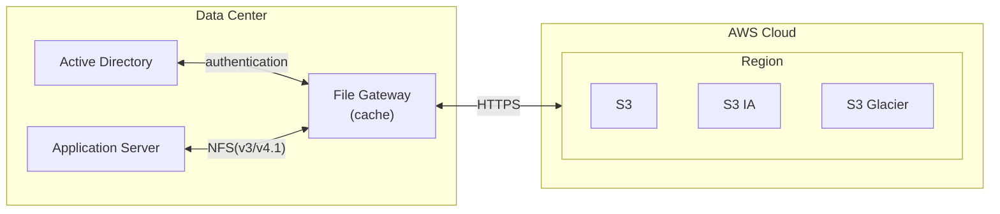
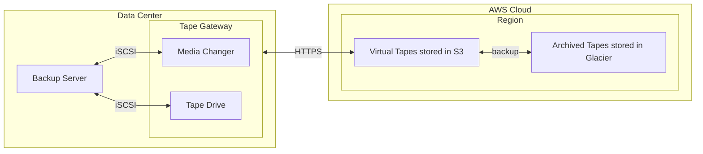
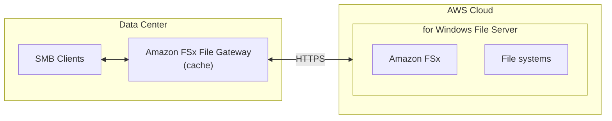

# [AWS Storage Gateway](https://docs.aws.amazon.com/storagegateway/)

> AWS Storage Gateway is a service that connects an on-premises software appliance with cloud-based storage to provide seamless and secure integration between your on-premises IT environment and the AWS storage infrastructure in the AWS Cloud.

- **AWS Storage Gateway** 用來將 本地軟體設備 (local IT environment) 與 雲端儲存設備(Cloud infra) 做一個無縫串接的服務 ((**把兩邊資料即時同步啦**))
    - 實現了 安全傳輸
    - 資料同步, 降低 Disaster Recovery 的時間
    - 減少資料存取時, 重覆取得的成本
- 對於 各種儲存類型, 會有不同的 Storage Gateway
    - [Amazon S3 File Gateway](#amazon-s3-file-gateway)
    - [Volume Gateway](#volume-gateway)
    - [Tape Gateway](https://docs.aws.amazon.com/storagegateway/latest/tgw/WhatIsStorageGateway.html)
    - [Amazon FSx File Gateway](https://docs.aws.amazon.com/filegateway/latest/filefsxw/what-is-file-fsxw.html)
- 上述的這些 Gateway, 都需要安裝在 DataCenter
    - 另一種方式是, 跟 AWS 下訂 `Storage Gateway-Hardware appliance` (硬體裝置)
        - 此為運行 Storage Gateway 的實體裝置, 可與上述的 gateway 整合
        - 適用於 DataCenter 做 daily backup to NFS

---

# [Amazon S3 File Gateway](https://docs.aws.amazon.com/filegateway/latest/files3/what-is-file-s3.html)

- 能透過 NFS / SMB 標準, 藉由統一的檔案介面來存取 S3
- 需要在 on-premise 環境的 VM 部署 gateway
    - 關於前述 VM, ex:
        - VMware ESXi
        - Microsoft Hyper-V
        - Linux Kernel-based Virtual Machine (KVM)
        - 跟廠商買的 gateway 相關的 hardware appliance
        - VMWare Cloud on AWS
        - Amazon EC2
    - 如此一來, Gateway 提供了 access to objects in S3 as files or file share mount points
- 支援的 S3 種類: 
    - S3 standard
    - S3 IA
    - S3 one-zone IA
    - S3 Glacier
- 權限:
    - 使用 IAM Role 管控 access
    - 可使用 on-premise AD 來做 user auth
- 收費:
    - Storege: 儲存費用等同於 S3
    - Traffic: 由 gateway 寫入的資料, 每 GB 計費
- 效率:
    - 最近使用的檔案會被 cache

# [Volume Gateway](https://docs.aws.amazon.com/storagegateway/latest/vgw/WhatIsStorageGateway.html)

- 將 Cloud Storage 視為 **Internet Small Computer System Interface (iSCSI) devices** mount 在 on-premise servers
    - 感覺有點像是, Servers 藉由 iscsi 協定, 直接存取 AWS Storage Volume
- Charge:
    - Storege: 針對 Volume Storage 每 GB 計費
    - Traffic: 由 gateway 寫入的資料, 每 GB 計費
- Volume Gateway 提供了 2 種主要的使用方式:
    - I. Cache Volume : 將經常訪問的 S3 data Cache 在本地
        - 既可降低 latency, 也可有效減少 從 S3 取出資料的流量成本
    - II. Stored Volume : 如果需要 低延遲 訪問整個 Dataset, 則可用此方式存存到 On-Premise
        - 由此降低 latency, 後續資料若有異動, 會藉由 PITR, async backup 到 S3

## I. Cached volumes architecture

- 
    - iSCSI 裡頭的 Volume, 最多可擴增之 32 volumes
    - 每個 volume size, 1 GB ~ 32 TB
    - 因此最多可擴增之 1 PB 的 cached volume

## II. Stored volumes architecture

- 

# Tape Gateway

- [What is Tape Gateway?](https://docs.aws.amazon.com/storagegateway/latest/tgw/WhatIsStorageGateway.html)
- Cloud 使用 Virtual Tape Library(VTL), 可將資料以下列方式做保存: 
    - S3 Glacier Flexible Retrieval
    - S3 Glacier Deep Archive

# Amazon FSx File Gateway

- 新一代的 Gateway
- FSx for Windows File Server 原生支援 access Amazon
- local cache
- Windows AD, SMB, NTFS
- useful for group file shares && home directories (殺小?)

