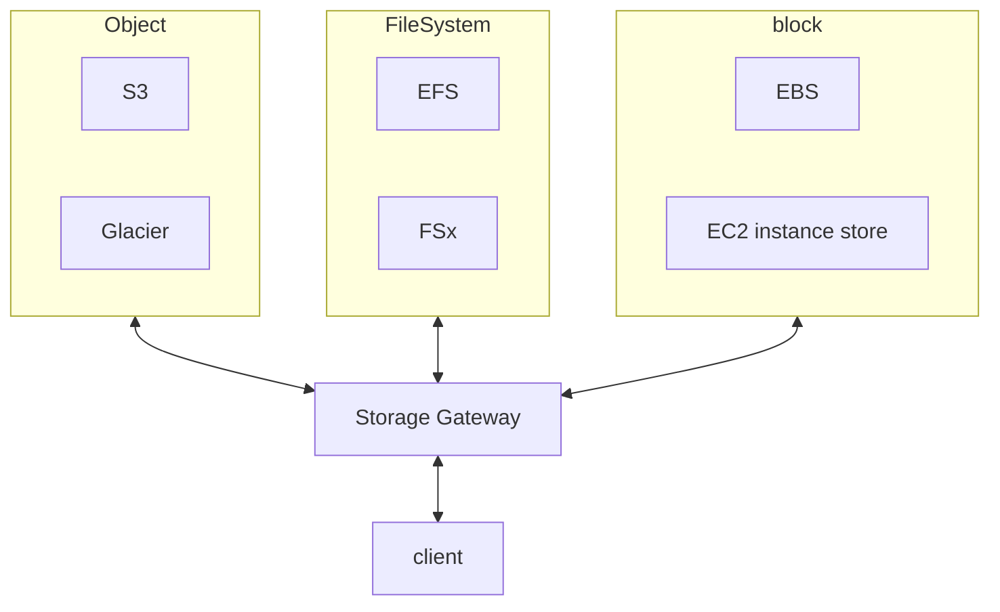

Storage Gateway

- Hybrid Cloud 使用~ 雲端之間傳輸資料的方式
- [clf-StorageGateway](./cert-CLF_C01.md#storage-gateway)
- 有不同種類的 Storage Gateway
    - Amazon S3 File Gateway
        - via NFS && SMB, access S3 bucket
        - 支援: S3 standard && S3 IA && S3 one-zone IA && S3 Glacier
        - 使用 IAM Role 管控 access
        - 可使用 on-premise AD 來做 user auth
        - 最近使用的檔案會被 cache
        - ```mermaid
            flowchart LR
            ap["Application Server"]
            fg["File Gateway \n (cache)"]
            ad["Active Directory"]

            subgraph Data Center
                ad <-- authentication --> fg;
                ap <-- "NFS(v3/v4.1)" --> fg;
            end
            subgraph AWS Cloud
                subgraph Region
                    s3["S3"]
                    ia["S3 IA"]
                    gg["S3 Glacier"]
                end
            end
            fg <-- HTTPS --> Region;
          ```
    - Volume Gateway
        - iSCSI protocol 到 S3
        - 最主要功能之一就是 backup, 背後有 EBS snapshot
        - 2 types of Volume Gateway
            - Cached Volumes : cache 最近使用的 data, 降低 latency
            - Stored Volumes : 對整個 dataset, schedule backups 到 S3
            - ```mermaid
                flowchart LR
                ap["Application Server"]
                vg["Volume Gateway \n (cache 或 stored)"]
                ad["Active Directory"]

                subgraph Data Center
                    ap <-- iSCSI --> vg;
                end
                subgraph AWS Cloud
                    subgraph Region
                        s3["S3"]
                        ebs["EBS snapshot"]
                    end
                end
                vg <-- HTTPS --> s3;
                s3 <-- backup --> ebs;
              ```
    - Tape Gateway
        - Cloud 使用 Virtual Tape Library(VTL), 背後為 S3 && Glacier
        - ```mermaid
            flowchart LR
            bs["Backup Server"]
            tg["Tape Gateway"]

            subgraph Data Center
                subgraph tg["Tape Gateway"]
                    mc["Media Changer"];
                    td["Tape Drive"];
                end
                bs <-- iSCSI --> mc;
                bs <-- iSCSI --> td;
            end
            
            subgraph AWS Cloud
                subgraph Region
                    s3["Virtual Tapes stored in S3"]
                    gg["Archived Tapes stored in Glacier"]
                end
            end
            tg <-- HTTPS --> s3;
            s3 <-- backup --> gg;
          ```
    - Amazon FSx File Gateway
        - 新一代的 Gateway
        - FSx for Windows File Server 原生支援 access Amazon
        - local cache
        - Windows AD, SMB, NTFS
        - useful for group file shares && home directories (殺小?)
        - ```mermaid
            flowchart LR
            smb["SMB Clients"]
            fsx["Amazon FSx File Gateway \n (cache)"]

            subgraph Data Center
                smb <--> fsx;
            end

            subgraph AWS Cloud
                subgraph win["for Windows File Server"]
                    fasx["Amazon FSx"]
                    fs["File systems"]
                end
            end
            fsx <-- HTTPS --> win;
          ```
- 上述的這些 Gateway, 都需要安裝在 DataCenter
    - 另一種方式是, 跟 AWS 下訂 `Storage Gateway-Hardware appliance`
        - 此為運行 Storage Gateway 的實體裝置, 可與上述的 gateway 整合
        - 適用於 DataCenter 做 daily backup to NFS
- exam 的關鍵字
    - File access/NFS - user auth with AD => File Gateway (backed by S3)
    - Volumes/Block Storage/iSCSI => Volume Gateway (backed by S3 with EBS snapshots)
    - VTL Tape solution/Backup with iSCSI => Tape Gateway (backed by S3 and Glacier)
    - No on-premises virtualization => Hardware Appliance          

