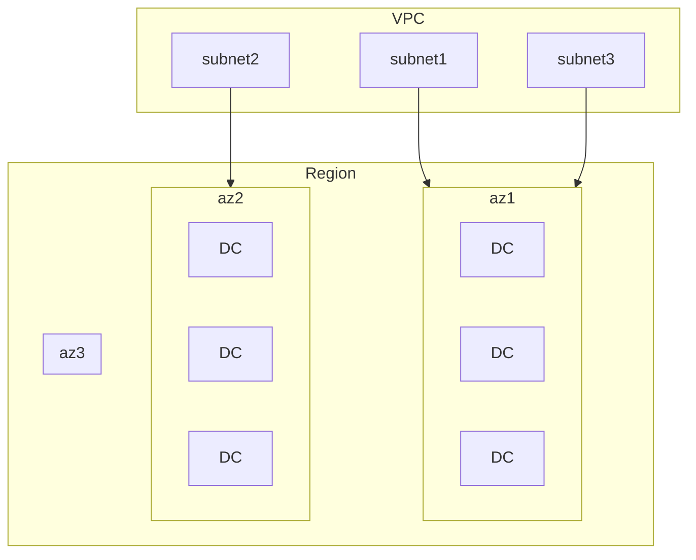
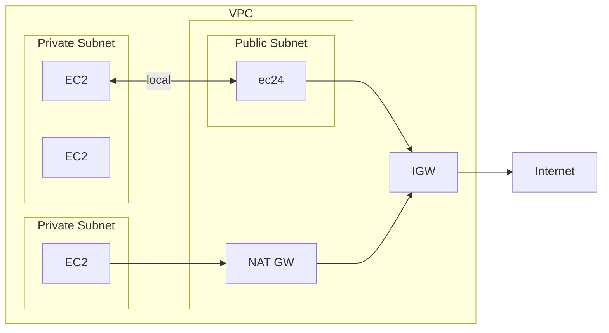
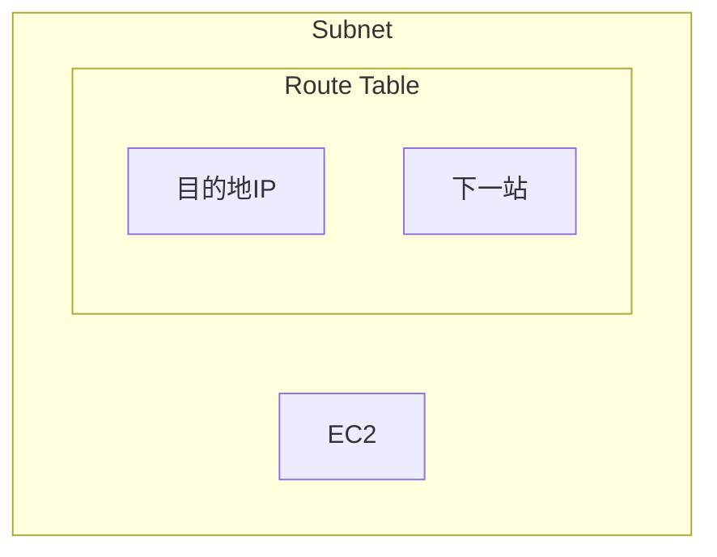
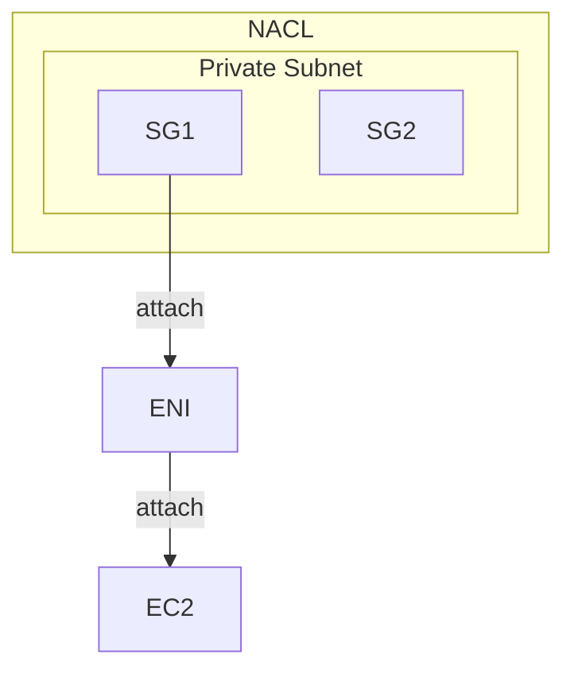

## VPC

- 一個 VPC link to 一個 Region
    - VPC 內有 Subnets
    - AZ 內有 Subnets

- [IPv4 CIDR 切分子網路](https://www.ipaddressguide.com/cidr)

## Subnet

- AWS 為每個 Subnet 裏頭, 保留了 5 個 IPv4 address, ex: 10.0.0.0/24
    - 10.0.0.0   : Network Address
    - 10.0.0.1   : for VPC router
    - 10.0.0.2   : for mapping to Amazon-provided DNS
    - 10.0.0.3   : for future use
    - 10.0.0.255 : Network Broadcast Address

## Retion/AZ vs VPC/Subnet

- 建立 VPC, 聲明 IP Range. ex: *10.1.0.0/16*
- Data Center, DC - 實體資料中心
- Virtual Private Network, VPC - 虛擬網路區域
    - 內有 2~N 個s Subnet
        - 一個 Subnet 對應一個 AZ
- Availability zone, AZ - 可用區域 (邏輯資料中心)
    - 一個 AZ 可能會對應多個 實體資料中心(Data Center)
    - 使用者操作 AWS Resources 時, 會將 Resource 放到特定 AZ
        - ex: 把 EC2 放到 ap-northeast1
    - HA, 其中一種對應做法, 就是把 Service 部署到不同 AZ
- Region 對應實際上的地理位置
    - Region 內部有多個 AZ

## Routes & Security

- Internet Gateway, IGW
    - IGW attach 的標的為 VPC
        - 如果 VPC 有 IGW, 則裡頭的 Subnet 可設定他的 Route Table 到此 IGW
            - 新增 Route, `Destination: 0.0.0.0/0` `Target: IGW`
                - 此時, 此 Subnet 即是 Public Subnet
- Public Subnet 裡頭有個 NAT Gateway, NAT GW
    - 給 Private Subnet 代理出門上網
    - NAT Gateway 也會有個 Elastic IP
- Private Subnet 
    - 裡頭的 EC2, 藉由 local 的中繼站來互通
    - 裡頭的 EC2, 藉由 Public Subnet 的 NAT GW 出去
        - Private Subnet > Route Table > Routes > Edit routes > Add route > `Destination: 0.0.0.0/0` & `Target: nat`
        - 如此一來, 此 Private Subnet, 前往 LAN, 會藉由 local, 前往未知位置, 會走 0.0.0.0 前往 NAT GW

## SG && ENI && EC2 && NACL

- Security Group, SG
    - 本身為 Stateful, 因此出得去的話, 預設會回的來
- Network ACL, NACL
    - 本身為 Stateless
- Elastic Network Interface, ENI
- SG 並非直接對 EC2 作用, 它其實是 attach 到 ENI
    - ENI 再 attach 到 EC2
    - 一個 ENI, 可有多個 SG
    - 一個 EC2, 可有多個 ENI
    - 因此, 也就是說, 一個 EC2, 可有多個 SG

## 