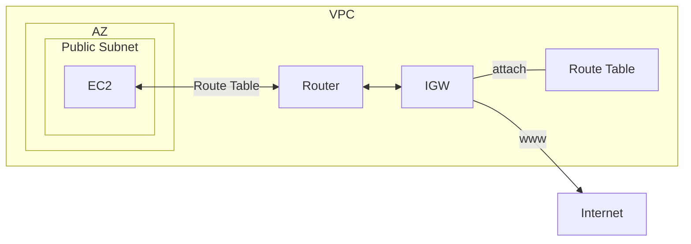
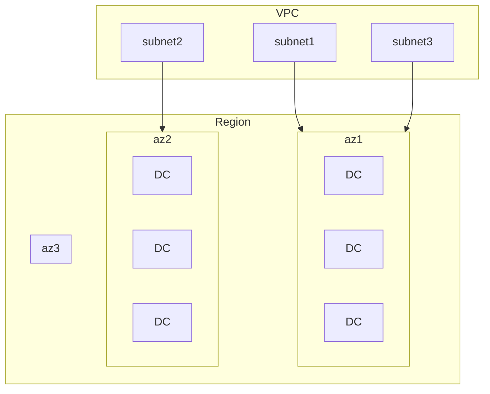
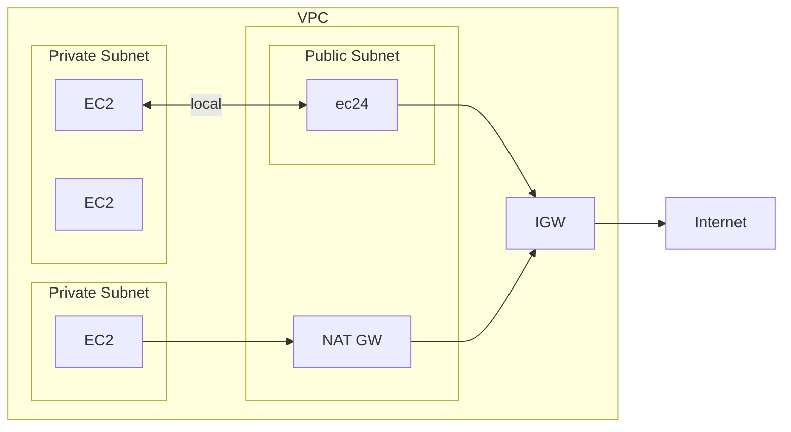
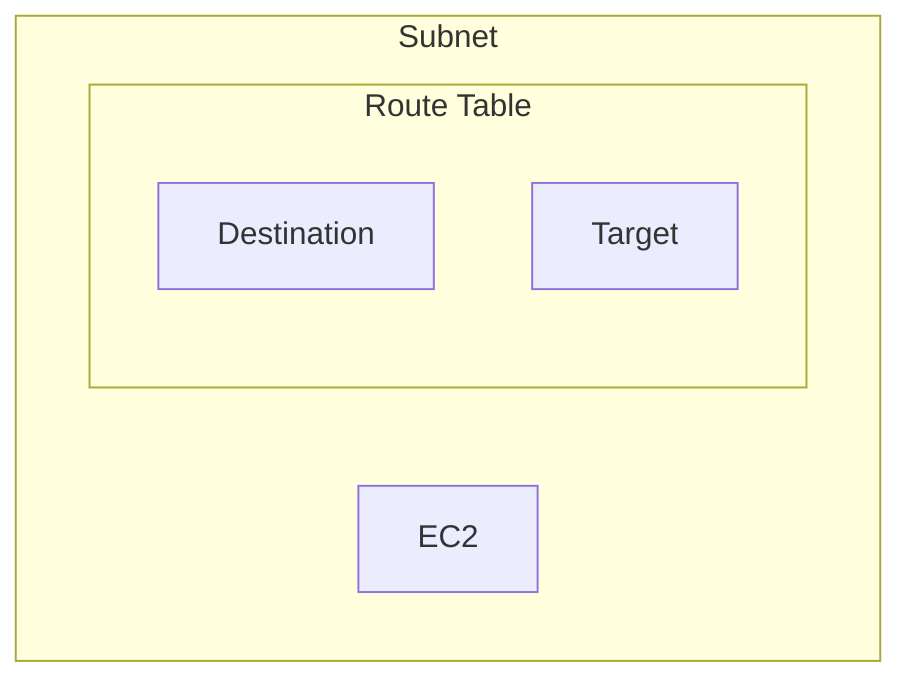
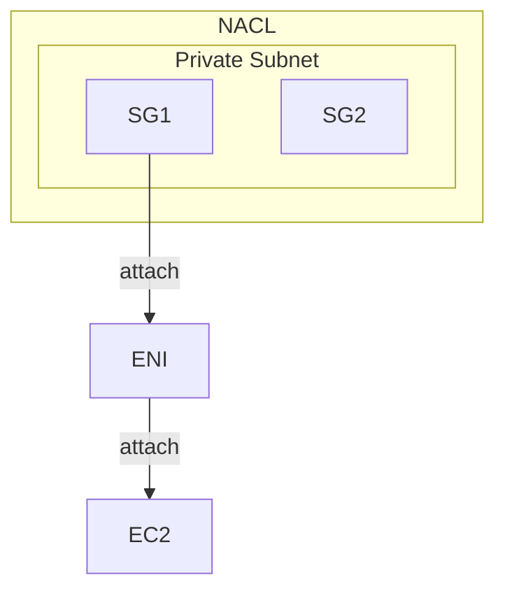
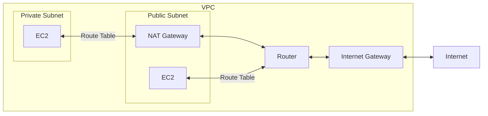

## VPC

- 一個 VPC link to 一個 Region
    - VPC 內有 Subnets
    - AZ 內有 Subnets
- VPC
    - 裏頭可有最多 5 組 CIDR
- Default VPC CIDR : `172.31.0.0/16`
    - VPC 及 Subnet, CIDR 範圍為 `/16 ~ /28`
- Private IPv4
    - 10.0.0.0 - 10.255.255.255 (10.0.0.0/8)
    - 172.16.0.0 - 172.31.255.255 (172.16.0.0/12)
    - 192.168.0.0 - 192.168.255.255 (192.168.0.0/16)
- [IPv4 CIDR 切分子網路](https://www.ipaddressguide.com/cidr)
    - CIDR, Classless Inter-Domain Routing
- VPC 裏頭有 2 個便利的東西 (最好都把它啟用, 除非有特殊原因)
    - DNS enableDnsSupport (default True)
        - 用來決定是否讓 DNS resolution from Route53 resolver is supported from the VPC
            - default True. 也就是說, VPC 內的 EC2, 可藉由以下 任意一個 DNS 來做 DNS query
                - `169.254.169.253` (Amazon provided DNS Server)
                - Subnet IP address 的 `.2` 位置
    - DNS Hostnames (enableDnsHostnames)
        - if Default VPC, default True
            - 因此, EC2 才會有個 Hostname 可做訪問
                - 此外, 也會有個 Public IP
        - if 自訂 VPC, default False
            - 建立新的 VPC 以後, 把這個也手動啟用吧~~
    - 很有趣的是, 可在 *Route53*, create private zone (也要花摳摳)
        - 綁定 hosted zone && VPC, 將來 VPC 裏頭就有自己私有的 DNS 了~

## Subnet

- AWS 為每個 Subnet 裏頭, 保留了 5 個 IPv4 address, ex: 10.0.0.0/24
    - 10.0.0.0   : Network Address
    - 10.0.0.1   : for VPC router
    - 10.0.0.2   : for mapping to Amazon-provided DNS
    - 10.0.0.3   : for future use
    - 10.0.0.255 : Network Broadcast Address (AWS 無支援 broadcast in VPC, 因此此為保留)
- 流量出入 Subnet, 需要由 `Route Table` 來做配置管理

## IGW, Internet Gateway

- 可讓 VPC 內的 AWS Resources/Lambda 具備 network connectivity
- HA
- 一個 VPC, 只能對應一個 IGW (反之亦然)
- IGW 必須要安排 *Route Table*, 才能夠上網
    - 並非 IGW attach 上去之後就能上網

## Retion/AZ vs VPC/Subnet

- 建立 VPC, 聲明 IP Range. ex: *10.1.0.0/16*
- Data Center, DC - 實體資料中心
- Virtual Private Network, VPC - 虛擬網路區域
    - 內有 2~N 個s Subnet
        - 一個 Subnet 對應一個 AZ
- Availability zone, AZ - 可用區域 (邏輯資料中心)
    - 一個 AZ 可能會對應多個 實體資料中心(Data Center)
    - 使用者操作 AWS Resources 時, 會將 Resource 放到特定 AZ
        - ex: 把 EC2 放到 ap-northeast1
    - HA, 其中一種對應做法, 就是把 Service 部署到不同 AZ
- Region 對應實際上的地理位置
    - Region 內部有多個 AZ

## Routes & Security

- Internet Gateway, IGW
    - IGW attach 的標的為 VPC
        - 如果 VPC 有 IGW, 則裡頭的 Subnet 可設定他的 Route Table 到此 IGW
            - 新增 Route, `Destination: 0.0.0.0/0` `Target: IGW`
                - 此時, 此 Subnet 即是 Public Subnet
- Public Subnet 裡頭有個 NAT Gateway, NAT GW
    - 給 Private Subnet 代理出門上網
    - NAT Gateway 也會有個 Elastic IP
        - NAT Gateway 要花摳摳
- Private Subnet
    - 裡頭的 EC2, 藉由 local 的中繼站來互通
    - 裡頭的 EC2, 藉由 Public Subnet 的 NAT GW 出去
        - Private Subnet > Route Table > Routes > Edit routes > Add route > `Destination: 0.0.0.0/0` & `Target: nat`
        - 如此一來, 此 Private Subnet, 前往 LAN, 會藉由 local, 前往未知位置, 會走 0.0.0.0 前往 NAT GW

## SG && ENI && EC2 && NACL

- Security Group, SG
    - 本身為 Stateful, 因此出得去的話, 預設會回的來
- Network ACL, NACL
    - 本身為 Stateless
- Elastic Network Interface, ENI
- SG 並非直接對 EC2 作用, 它其實是 attach 到 ENI
    - ENI 再 attach 到 EC2
    - 一個 ENI, 可有多個 SG
    - 一個 EC2, 可有多個 ENI
    - 因此, 也就是說, 一個 EC2, 可有多個 SG

## Bastion Host

- 放在 Public Subnet 的 堡壘機/跳板機

## NAT Gateway, Network Address Translation Gateway

- *NAT Instance* (Outdated, NAT Gateway 的前身)
    - NAT Instance 初始設定繁雜, 且無 HA
    - 必須 launch 在 *Public Subnet*
    - 必須 disable EC2 的 source/destination IP check
    - 必須為 private subnet 配置適當的 *Route table* 以使用 NAT Gateway
- NAT Gateway 建立以後, 就會被配置一個 EIP(Elastic IP) 在上頭
    - 流量為 5 Gbps, auto-scaling -> 45 Gbps
    - 無須管理 NAT Gateway 的 SG
- 無法在相同的 subnet 裏頭使用
    - EC2 與 NAT Gateway 必須在不同 subnet
- 同一個 AZ 裏頭具備 HA (無法 cross AZ)
    - 若要 cross AZ, 來做 HA, 需自行逐筆 create

