# VPC

- 一個 VPC link to 一個 Region
    - VPC 內有 Subnets
    - AZ 內有 Subnets
- VPC
    - 裏頭可有最多 5 組 CIDR
- Private IPv4
    - 10.0.0.0 - 10.255.255.255 (10.0.0.0/8)
    - 172.16.0.0 - 172.31.255.255 (172.16.0.0/12)
    - 192.168.0.0 - 192.168.255.255 (192.168.0.0/16)
- VPC 裏頭有 2 個便利的東西 (最好都把它啟用, 除非有特殊原因)
    - DNS enableDnsSupport (default True)
        - 用來決定是否讓 DNS resolution from Route53 resolver is supported from the VPC
            - default True. 也就是說, VPC 內的 EC2, 可藉由以下 任意一個 DNS 來做 DNS query
                - `169.254.169.253` (Amazon provided DNS Server)
                - Subnet IP address 的 `.2` 位置
    - DNS Hostnames (enableDnsHostnames)
        - if Default VPC, default True
            - 因此, EC2 才會有個 Hostname 可做訪問
                - 此外, 也會有個 Public IP
        - if 自訂 VPC, default False
            - 建立新的 VPC 以後, 把這個也手動啟用吧~~
    - 很有趣的是, 可在 *Route53*, create private zone (也要花摳摳)
        - 綁定 hosted zone && VPC, 將來 VPC 裏頭就有自己私有的 DNS 了~
- CIDR, Classless Inter-Domain Routing
    - [IPv4 CIDR 切分子網路](https://www.ipaddressguide.com/cidr)
    - IPv4 的 VPC && Subnet, CIDR range : `/16 ~ /28` (AWS CIDR 範圍)
        - [How Amazon VPC works](https://docs.aws.amazon.com/vpc/latest/userguide/how-it-works.html#VPC_Sizing)
        - Default VPC CIDR : `172.31.0.0/16`
- VPC 擴展議題
    - 如果事業做大(global), 想要做個全球版圖的網路空間, 可參考 [Extend a VPC to a Local Zone, Wavelength Zone, or Outpost](https://docs.aws.amazon.com/vpc/latest/userguide/Extend_VPCs.html). 如此一來, 會有底下的一堆服務可以納入考量:
        - Availability zones
        - local zones
        - aws outposts
        - wavelength zones

# Subnet

- AWS 為每個 Subnet 裏頭, 保留了 5 個 IPv4 address, ex: 10.0.0.0/24
    - 10.0.0.0   : Network Address
    - 10.0.0.1   : for VPC router
    - 10.0.0.2   : for mapping to Amazon-provided DNS
    - 10.0.0.3   : for future use
    - 10.0.0.255 : Network Broadcast Address (AWS 無支援 broadcast in VPC, 因此此為保留)
- 流量出入 Subnet, 需要由 `Route Table` 來做配置管理


# IGW, Internet Gateway

- 可讓 VPC 內的 AWS Resources/Lambda 具備 network connectivity
- HA
- 一個 VPC, 只能對應一個 IGW (反之亦然)
- IGW 必須要安排 *Route Table*, 才能夠上網
    - 並非 IGW attach 上去之後就能上網

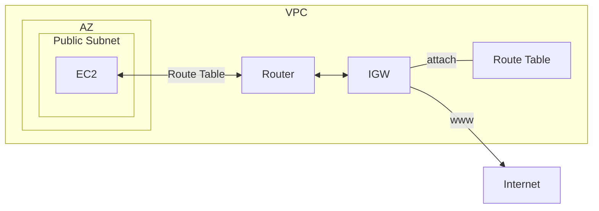


# Retion/AZ vs VPC/Subnet

- 建立 VPC, 聲明 IP Range. ex: *10.1.0.0/16*
- Data Center, DC - 實體資料中心
- Virtual Private Network, VPC - 虛擬網路區域
    - 內有 2~N 個s Subnet
        - 一個 Subnet 對應一個 AZ
- Availability zone, AZ - 可用區域 (邏輯資料中心)
    - 一個 AZ 可能會對應多個 實體資料中心(Data Center)
    - 使用者操作 AWS Resources 時, 會將 Resource 放到特定 AZ
        - ex: 把 EC2 放到 ap-northeast1
    - HA, 其中一種對應做法, 就是把 Service 部署到不同 AZ
- Region 對應實際上的地理位置
    - Region 內部有多個 AZ

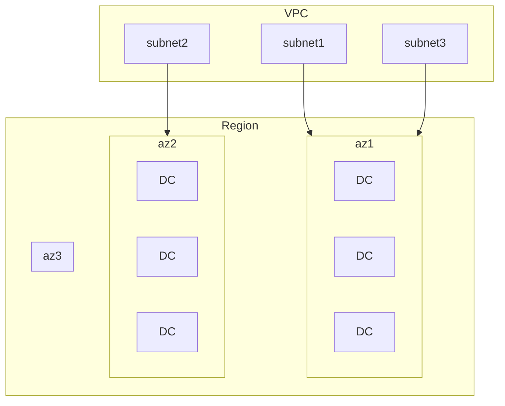


# Routes & Security

- Internet Gateway, IGW
    - IGW attach 的標的為 VPC
        - 如果 VPC 有 IGW, 則裡頭的 Subnet 可設定他的 Route Table 到此 IGW
            - 新增 Route, `Destination: 0.0.0.0/0` `Target: IGW`
                - 此時, 此 Subnet 即是 Public Subnet
- Public Subnet 裡頭有個 NAT Gateway, NAT GW
    - 給 Private Subnet 代理出門上網
    - NAT Gateway 也會有個 Elastic IP
        - NAT Gateway 要花摳摳
- Private Subnet
    - 裡頭的 EC2, 藉由 local 的中繼站來互通
    - 裡頭的 EC2, 藉由 Public Subnet 的 NAT GW 出去
        - Private Subnet > Route Table > Routes > Edit routes > Add route > `Destination: 0.0.0.0/0` & `Target: nat`
        - 如此一來, 此 Private Subnet, 前往 LAN, 會藉由 local, 前往未知位置, 會走 0.0.0.0 前往 NAT GW

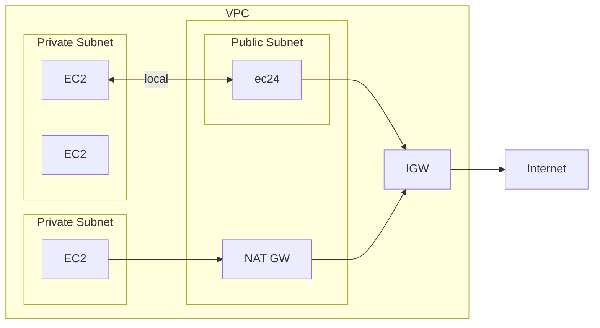

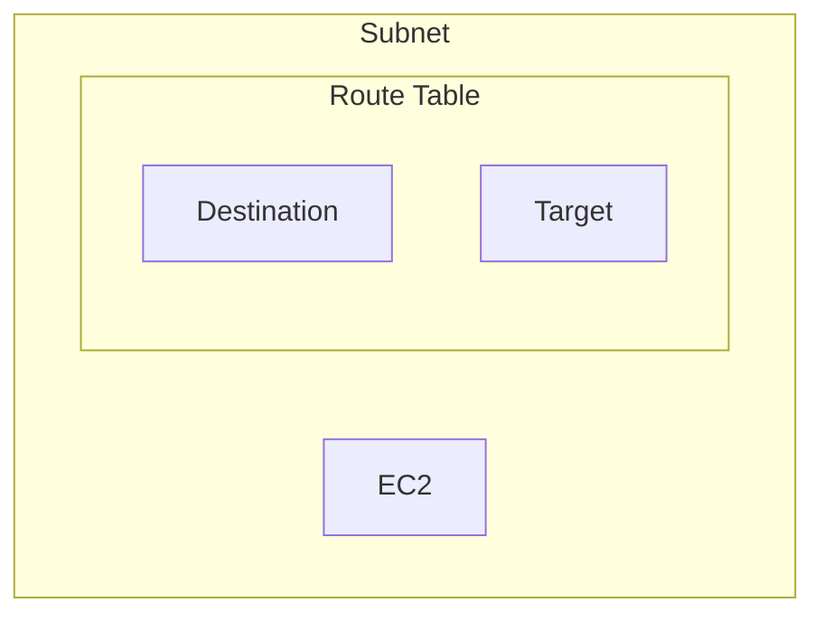


# SG && ENI && EC2 && NACL

- [clf-NACL](./cert-CLF_C01.md#vpcvirtual-private-network--networking)
    - NOTE: *VPC Peering* 的位置大概與 *IGW* 相同
- 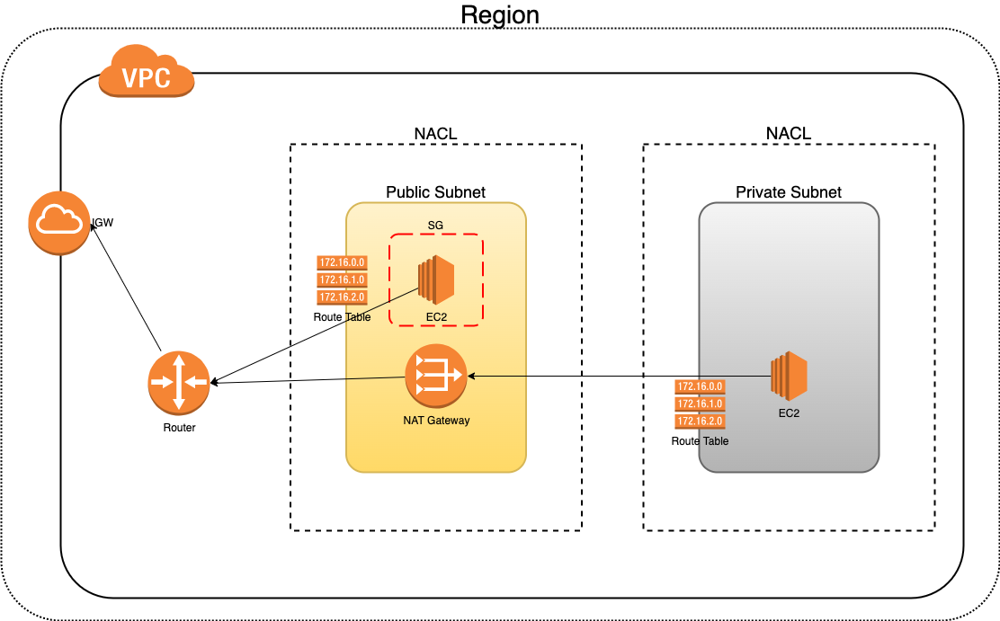
- 每個 Subnet 都會有個 *Default NACL*, 不過他預設 `Rule 100, ALLOW 0.0.0.0/0 all IPv4 in & out`
- Elastic Network Interface, ENI
- SG 並非直接對 EC2 作用, 它其實是 attach 到 ENI
    - ENI 再 attach 到 EC2
    - 一個 ENI, 可有多個 SG
    - 一個 EC2, 可有多個 ENI
    - 因此, 也就是說, 一個 EC2, 可有多個 SG
- Ephemeral Ports
    - NACL 往返流量時, 會與 client 建立 connection
    - port range:
        - IANA && Win10, client port: `49152 - 65535`
        - Linux: `32768 - 60999`
- 關於 NACL && Security Group && ENI && Route Table 的 network access, 可使用 **VPC Reachability Analyzer Tools**
    - 針對 配置 來評估, 網路是否可通 (並非真正 send packets)
    - Charge: 每跑一次要價 $0.1 美元

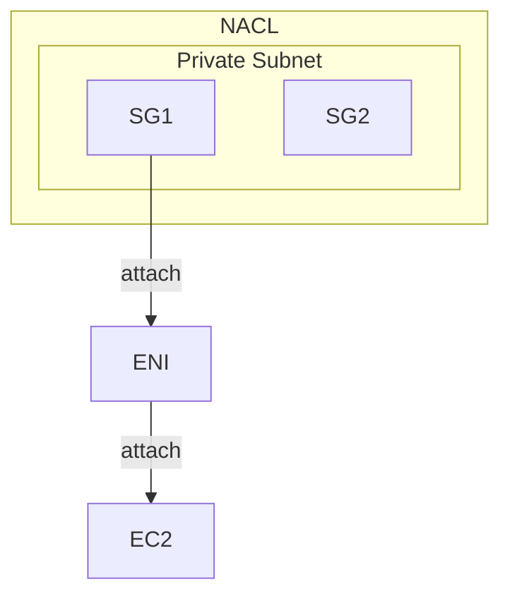

Security Group     | NACL
------------------ | --------------------------
instance level     | subnet level
apply to an EC2    | allpy to all EC2
ALLOW only         | ALLOW/DENY
Stateful           | Stateless


## ELastic Network Interface, ENI

- 一台 EC2 可有多個 ENI
- 一個 ENI 有一個 *Primary private IPv4*
- 一個 ENI 可有 0~N 個 *Secondary private IPv4*
- 每個 *Private IP* 可有多個對應 EIP
- 一個 ENI 可有一個 *Public IP*
- 一個 ENI 可有 0~N 個 SG
- 一個 ENI 有個 *MAC Address*
- ENI 受限於 AZ 之下, 無法 cross AZ
- 手動增加 ENI 不收費~


# Bastion Host

- 放在 Public Subnet 的 堡壘機/跳板機


# VPC Peering

- Privately connect two VPCs using AWS' network
    - 利用 AWS network privately connect 2 VPC (連結不同 VPC 啦)
    - 讓 VPCs 之間就像是在同樣的 network 裡頭包含了
        - cross region, cross account
        - 不能有 operlapping CIDRs
    - 配置完以後, 還需要自行配置 Route Table (兩邊都需要配置)
- 可讓不同的 VPC, 搞得就像是個 LAN
- 如果要 expose service 給其他 VPC, 這是個比開 public 還要好的做法
    - 不過更好的做法, 可使用 [PrivateLink](#vpc-endpoint-services-aws-privatelink)
- 重要範例:
    - 若 A 及 B 做好了 peering && B 及 C 做好了 peering
        - A 與 C 依然無法 connect (朋友的朋友, 未必是我朋友)
        - VPC Peering connection is NOT transitive


# VPC Endpoint Services (AWS PrivateLink)

- 可用來 expose service 給成百上千個 VPC (Secure && Scalable)
    - 此做法可完全取代 [VPC Peering](#vpc-peering)
    - 無需 *VPC Peering*, 無需 IGW, 無需 NATGW, 無需 Route Table
- 可讓 private subnet 內的 Resources, 藉由 *VPC Endpoint Gateway* 來連接外部 Resources
    - ex: S3, DynamoDB
- VPC EndPoint Gateway (或 Gateway Endpoint) 有 2 種 Endpoint type:
    - Gateway Endpoint : 只能連 DynamoDB && S3
    - Interface Endpoint : 能連 any AWS Resources
        - provision an ENI(private IP) as an entry point (也須 attach SG)
- 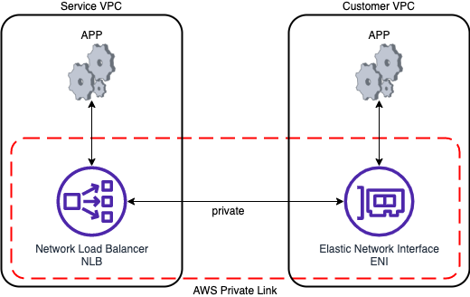
    - 要分享服務的位置, 必須配置 NLB 或 GLB
    - 要使用服務的 AWS Service, 需配置 ENI
    - 要使用服務的 On-Premise, 需藉由 VGW
- 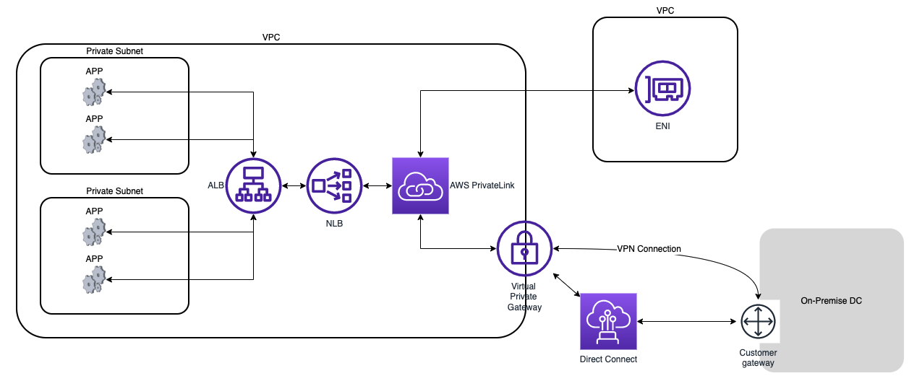

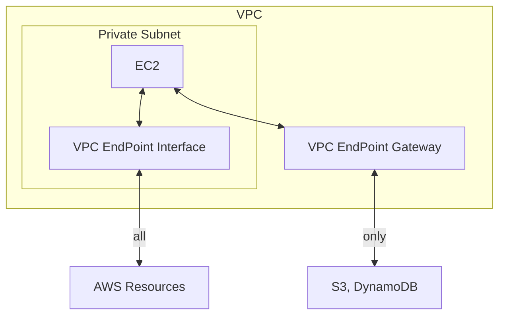


# EC2-Classic && AWS ClassicLink

- 2022/08/15 廢除服務


# VPC Flow Logs

- Capture info about IP traffic going into your interfaces, 有底下 3 kinds:
    - VPC Flow Logs
    - Subnet Flow Logs
    - Elastic Network Interface(ENI) Flow Logs
- 能有效的協助 mmonitor && troubleshoot Connectivity Issue
- 會從各個 AWS 管理的 interfaces 蒐集 network information:
    - ELB
    - RDS
    - ElastiCache
    - Redshift
    - WorkSpaces
    - NAT Gateway
    - Transit Gateway
    - etc
- *Flow logs* 可被保存到 S3 / CloudWatch Logs
- VPC Flow Logs 裡頭大概有這些欄位(有大概印象就好):
    - version
    - account-id
    - interface-id
    - srcaddr
    - dstaddr
    - srcport
    - dstport
    - protocol
    - packets
    - bytes
    - start
    - end
    - action : Security Group 或 NACL 訪問的 http method
    - log-status
- 想要分析這些 Flow Logs 的話, 可藉由 Athena(on s3) 或 *CloudWatch Logs Insights*(on stream)


# AWS Site-to-Site VPN

- [What is AWS Site-to-Site VPN?](https://docs.aws.amazon.com/vpn/latest/s2svpn/VPC_VPN.html)
    - 此處的 VPN 指的是 On-Premise network 與 VPC 之間的 network connection
- *Site-to-Site VPN* 支援了 *Internet Protocol security (IPsec) VPN connections*
    - 需要留意的是, 即使連線過程皆為 encrypted, 但仍會有 Security Issue!!
- Virtual Private Gateway, VPG 或 VGW
    - AWS 對於 VPN connection 需要有個 VPN concentrator
    - 在想建立 Site-to-Site VPN 的 VPC 上頭 create && attach VPG
    - UNKNOWN 弄個 ASN(Autonomous System Number)
- Customer Gateway, CGW
    - Data Center 上頭, 弄個 (軟體 or 硬體) customer gateway (用來做 VPN connection)
- 實作上需注意, AWS 那邊需要 enable *Route Propagation* for VPG
    - 如此一來, Virtual Private Gateway 與 subnet 之間才會有 route table
- 目前不支援 IPv6 && 不支援 *Path MTU Discovery*
- Charge: 依照 VPN connection per hour 以及 EC2 network traffic out 來收費
- AWS VPN CloudHub
    - 概念上是指, 如果咱們企業有很多個 customer network, 則彼此之間連線到 VGW 以後
    - 則企業端點之間可藉助 Site-to-Site VPN, 來當作 *VPN CloudHub* 使用
        - 白話文就是, 企業端點之間也能使用 VPN connection 了
    - 設定 CGW 與 VGW 時, 需要 enable *Dynamic Routing* && 配置 *Route Table* 就可以了~
- 實際配置
    - Create/Config 企業端的 *Customer Gateways*
    - Create/Config AWS 上頭的 *Virtual Private Gateways*
    - 使用 *Site-to-Site VPN Connections*, 並將上面兩者 connect
        - 可選擇 *Virtual Private Gateway* 或 *Transit Gateway*
        - 配置 Routing && IPv4(CIDR)
        - 最後再 Create VPN connection

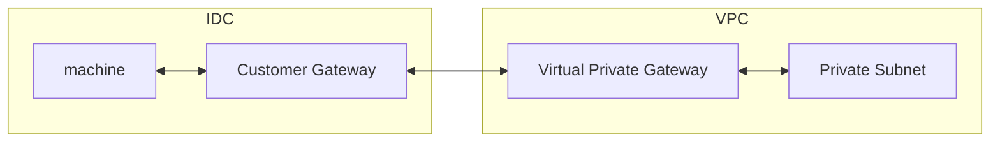


# Direct Connect, DX

- [What is AWS Direct Connect?](https://docs.aws.amazon.com/directconnect/latest/UserGuide/Welcome.html)
    - dd
    - 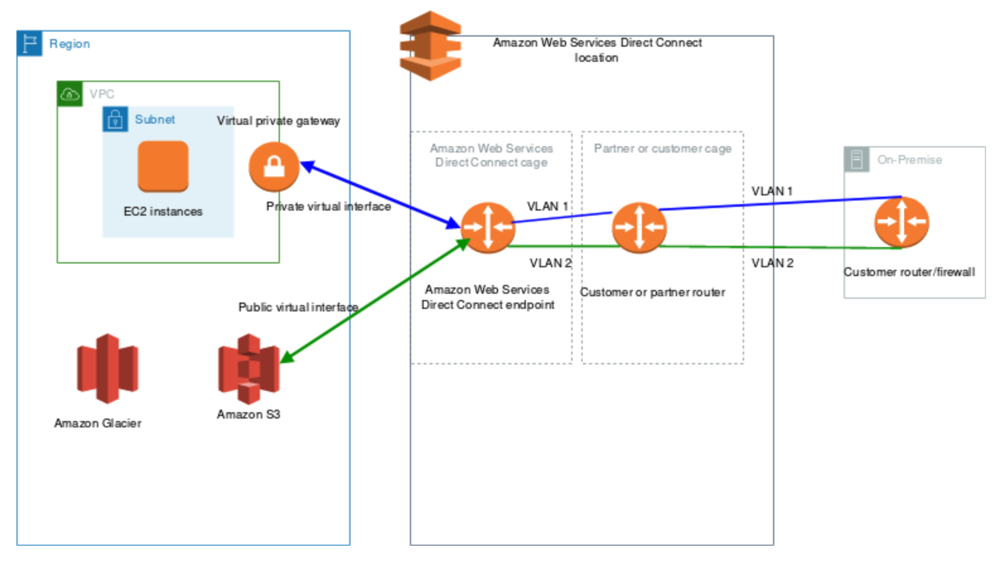
- (上下圖相同) 
    ```mermaid
    flowchart TB
  
    subgraph dcl["Direct Connect Location, DCL"]
        cr["customer/partner router"]
        dce["Direct Connect Endpoint, DCE"]
  
        dce <--> cr;
    end
  
    dc["On-Premise DC"] <-- connection --> cr;
  
    subgraph Region
      subgraph VPC
          subgraph Subnet
              ec2["EC2"]
          end
          vpg["Virtual Private Gateway, VPG"]
      end  
      S3;
    end
  
    dce <-- Private Virtual Interface --> vpg;
    dce <-- Public Virtual Interface --> S3;
    ```

    - 服務的核心有 2 個元件:
        - ISP 端用戶過來的 **Connections**
        - AWS 一端的 **Virtual Interface**
    - 建立後
        - 可藉由 `Private virtual interface` 連入 VPC (接入 `Virtual private gateway`)
        - 可藉由 `Public virtual interface` 連入 S3, Glacier, ...
- Networking:
    - 接入 DX 的流量, 都是在 AWS global network backbone (無論 cross AWS Services 或 cross Regions)
        - 流量費, 僅針對 data 從 Region 流出的一端計費 (Region A -> Region B, 則向 A 收費)
- AWS Direct Connect 的 Connection Types 可選擇下列:
    - Dedicated Connections:
        - 可選擇 1 Gbps 或 10 Gbps
        - 可有實體的專用裝置
    - Hosted Connections:
        - 可選擇 50 Mbps, 500 Mbps, 最高可達 10 Gpbs
        - 可按需求來增減
- Charge: Direct Connect 租約最低為 1 個月
    - 若有需求, send request to *AWS Direct Connect Partners*
    - 若需要使用的預估期限遠小於 1 個月... 可考慮其他方式了, 因為這個很貴~
- DX 因為是 private, 傳輸過程預設 「沒有 encrypt」, 但可自行搭配 VPN 來實踐 IPSec
    - 不過這過程會比較複雜...
- 底下的流程圖, 全部都是走 Private Virtual Interface, PVI

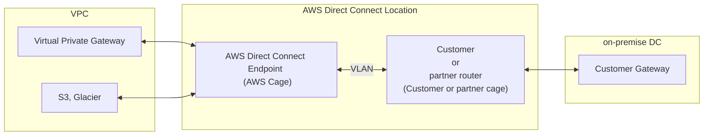

- 除了上圖, 也可直接在 *AWS Direct Connect Endpoint* 上頭, 直接連到 VPC 裡頭的 S3/Glacier
    - 此為 Public Virtual Interface
- *Direct Connect gateway* 可與下列的 gateway 做連線 
    - A transit gateway when you have multiple VPCs in the same Region(tgw)
    - A virtual private gateway(vpg)
        - 可用來 extend *local zone*
- 如果想一口氣設定可連入到 multiple VPC(same account), 則需使用 *Direct Connect Gateway*
    - 一樣本地端連入到 *AWS Direct Connect*, 之後藉由 *Direct Connect Gateway* 的 *Private Virtual Interface* 來連線到 VPG

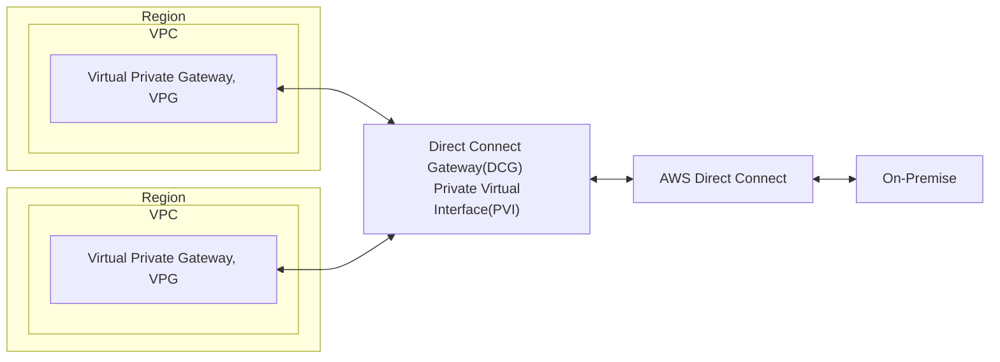


# Transit Gateway

- [What is a transit gateway?](https://docs.aws.amazon.com/vpc/latest/tgw/what-is-transit-gateway.html)
- 可將複雜的 cross VPC 的網路問題, 簡化成一個 *hub-and-spoke(star)* connection
    - 將 Transit Gateway 置於中心, 連結各種的 networking
    - 可再藉由 [Resource Access Manager, RAM](./iam.md#aws-resource-access-manager-ram) 來做 cross account sharing
    - 藉由 *Route Table* 來做訪問的存取控制
    - 可同時連上成百上千個 VPC (只需要一個 Transit Gateway)
    - 流量會跑在 *AWS Global Infrastructure*, 傳輸過程為 encrypted, 且不會跑到 public internet (較安全)
- Transit Gateway 有幾個 key concepts:
    - Attachments. 可以 attach 一堆元件到 Transit Gateway
        - VPCs
        - VPN connections
        - AWS Direct Connect Gateway, DCG
        - Transit Gateway Connect attachments
        - Transit Gateway peering connections
        - A Connect SD-WAN/third-party network appliance
        - A peering connection with another transit gateway
    - Transit gateway MTU
    - Transit gateway route table
    - Associations
    - Route propagation
- Transit gateway 行為如同 Regional router, 用來轉發 VPCs && on-premise 的流量
- Charge:
    - 基本上, 每個 attach 到 transit gateway 的元件, 依小時計費. 此外還會依照總流量來收費

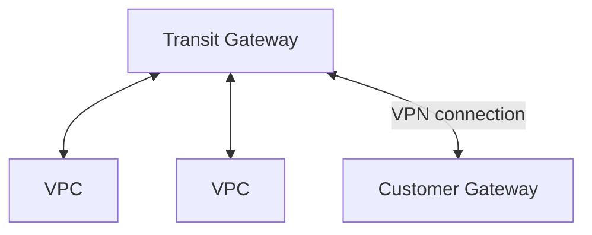

- 使用 transit gateway 的另一種情境是, by using ECMP to increase the bandwidth of your site-to-site VPN connection
    - ECMP, equal-cost multi-path. 此為 允許 forward packet over multiple best path 的一種 Routing Strategy
- 比較:
    - VPN to virtual private gateway, VPG(VGW)
        - 與 VPC 連線後, 建立一條 connection, 1.25 Gbps
            - 而此 connection 使用了 2 tunnels (upload / download)
    - VPN to transit gateway
        - 與 transit gateway 連線後, 會與後面的 VPC, 各自建立自己的 *site-to-site VPN*
            - 而每個 *site-to-site VPN* connection 2.5 Gbps (by ECMP)
        - 如果想要更高流量, 可增加更多的 *site-to-site VPN connections*
            - 每個 *site-to-site VPN connection* 一樣有 2 tunnels


# VPC - Traffic Mirroring

- used to capture && inspect network traffic in VPC (non-intrusive manner)
- Use Case: 想蒐集某個 ENI 的流量, 但又不想直接干擾到機器的運作
    - 使用此方式, 會將此流量做一個 copy/mirroring 到一個 「NLB 或 GLB (with UDP listener)」 為入口的 networking
- 可將 packet 做 filter/truncate, 用以專注在想分析的流量上頭


# VPC - IPv6

- 如果 EC2 要想使用 IPv6, 則需做底下配置(尚未測試過):
    - VPC - edit CIDR
    - subnet - edit CIDR
    - NACL - 要留意是否被阻擋
    - route table - 加一筆路由, Destination v6 網段, Target 為 IGW
    - SG - allow IPv6 (ssh, http, ...)
    - EC2 - assign new IPv6 address
- 如果想建立一個只能允許 outbound (無 inbound) 的環境, 可參考 [Enable outbound IPv6 traffic using an egress-only internet gateway](https://docs.aws.amazon.com/vpc/latest/userguide/egress-only-internet-gateway.html)
- Egress-only Internet Gateway, 只能使用 IPv6. 如果是 IPv4 也想打造一樣的環境, 需使用 *NAT Gateway*
    - 地位等同於 IPv4 的 [NAT Gateway](#nat-gateway-network-address-translation-gateway)
    - 為了達成此需求, 記得要手動修改 Route Table

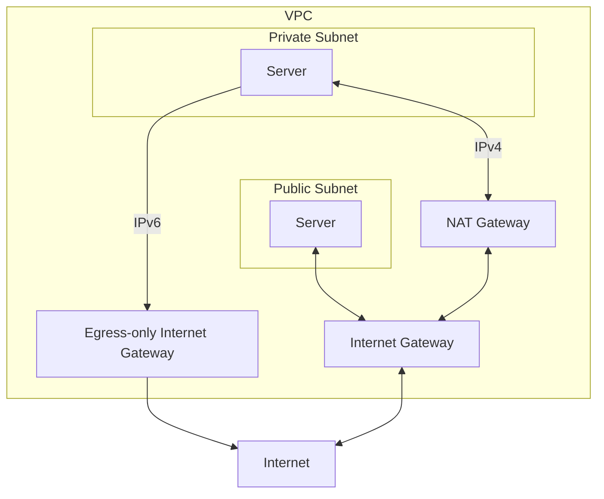


# NAT Gateway, Network Address Translation Gateway

- *NAT Instance* (Outdated, NAT Gateway 的前身)
    - NAT Instance 初始設定繁雜, 且無 HA
    - 必須 launch 在 *Public Subnet*
    - 必須 DISABLE EC2 的 source/destination IP check, 才能正常使用 (它是老東西了)
    - 必須為 private subnet 配置適當的 *Route table* 以使用 NAT Gateway
- NAT Gateway 建立以後, 就會被配置一個 EIP(Elastic IP) 在上頭
    - Only for IPv4 (IPv6, 需使用 *Egress*)
    - 流量為 5 Gbps, auto-scaling -> 45 Gbps
    - 無須管理 NAT Gateway 的 SG
- 無法在相同的 subnet 裏頭使用
    - EC2 與 NAT Gateway 必須在不同 subnet
- 同一個 AZ 裏頭具備 HA (無法 cross AZ)
    - 若要 cross AZ, 來做 HA, 需自行逐筆 create

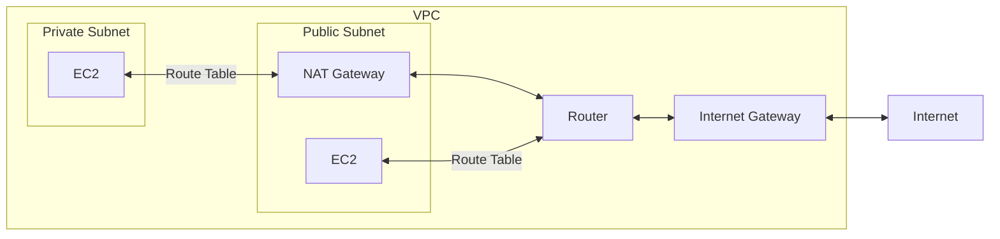