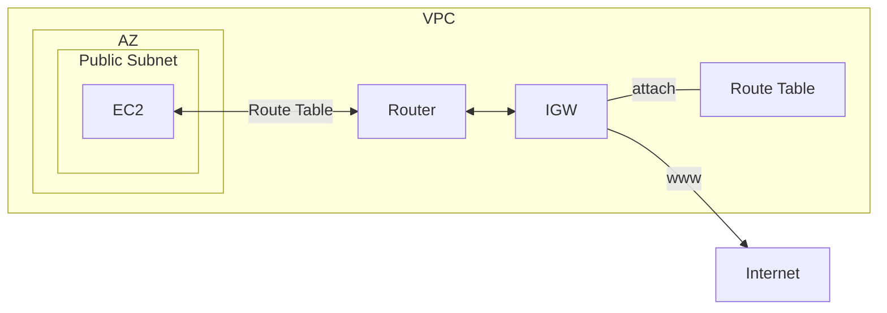
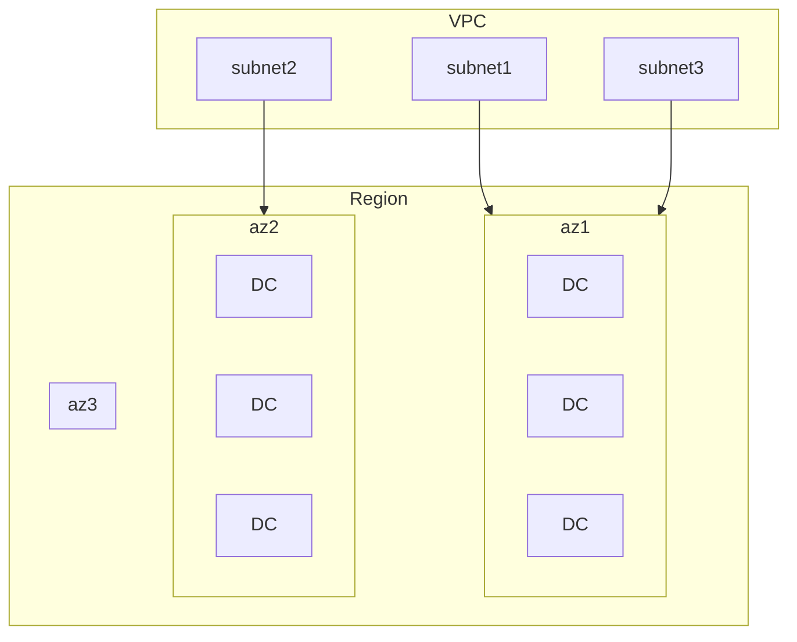
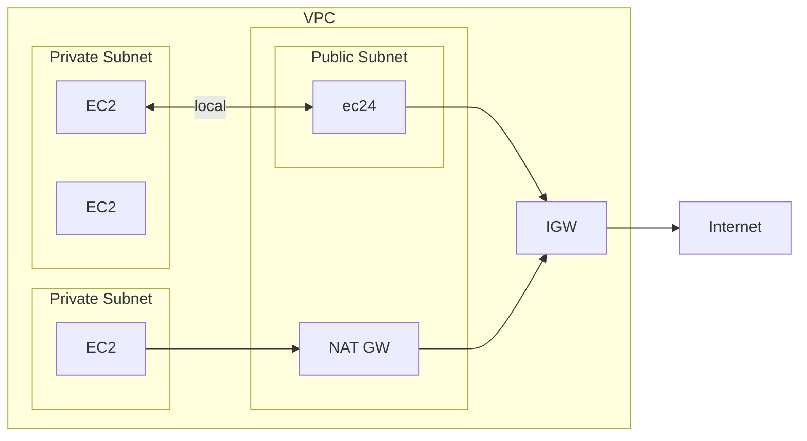
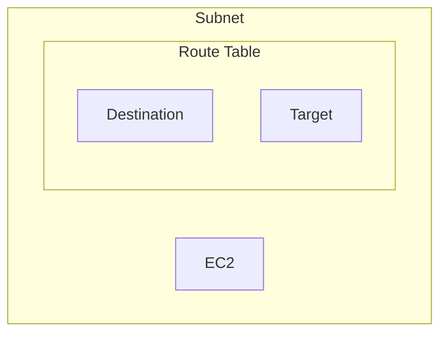
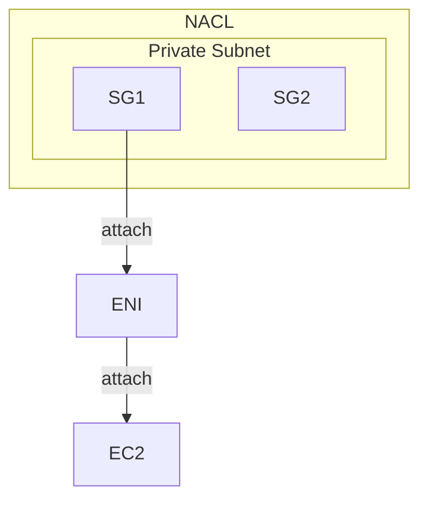
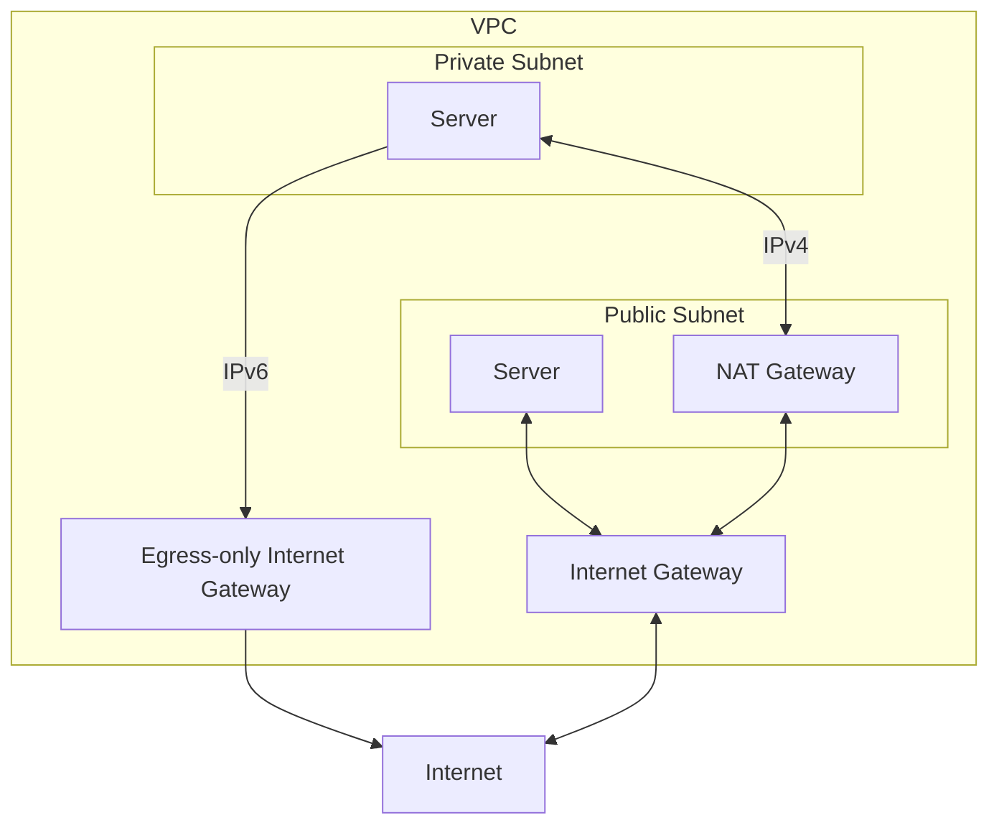
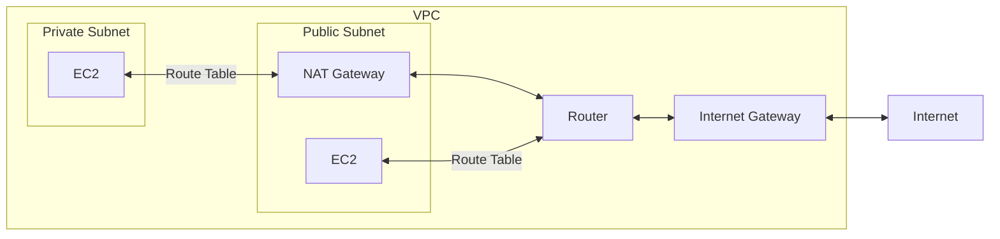

# VPC

- 一個 VPC link to 一個 Region
    - VPC 內有 Subnets
    - AZ 內有 Subnets
- Private IPv4
    - 10.0.0.0 - 10.255.255.255 (10.0.0.0/8)
    - 172.16.0.0 - 172.31.255.255 (172.16.0.0/12)
    - 192.168.0.0 - 192.168.255.255 (192.168.0.0/16)
- VPC 的 DNS support 以及 hostname
    - **DNS Resolution** : `enableDnsSupport` 
        - default True
        - 讓 VPC 內的 EC2, 可使用下列 2 者之一的 DNS
            - `169.254.169.253` (Amazon provided DNS Server)
            - Subnet IP address 的 `.2` 位置 (VPC 保留給 DNS 的 IP)
        - 如果不啟用, 那麼就得自行定義 DNS 位置 OR 在 VPC 裡面自幹 DNS Server
    - **DNS Hostnames** ; `enableDnsHostnames`
        - default True (for Default VPC)
        - EC2 會有個 Hostname 可做訪問
        - custom VPC, 建議也 enableDnsHostnames 
        - 很有趣的是, 可在 *Route53*, create private zone (也要花摳摳)
            - 綁定 hosted zone && VPC, 將來 VPC 裏頭就有自己私有的 DNS 了~
    - 如果想要 VPC 內的 EC2 藉由 private hostname 來溝通的話
        - Route53 建立 private hosted zone (需要課金)
        - 此 hosted zone 綁定特定 VPC
        - 需要 enable 上面 2 個設定
        - 如此一來就可以讓 VPC 內的 EC2 們藉由 private hostname 來溝通了
- CIDR, Classless Inter-Domain Routing
    - [IPv4 CIDR 切分子網路](https://www.ipaddressguide.com/cidr)
    - IPv4 的 VPC && Subnet, CIDR range : `/16 ~ /28` (AWS CIDR 範圍)
        - [How Amazon VPC works](https://docs.aws.amazon.com/vpc/latest/userguide/how-it-works.html#VPC_Sizing)
        - Default VPC default CIDR : `172.31.0.0/16`
            - Default Subnet A: `172.31.0.0/20`
            - Default Subnet B: `172.31.0.16/20`
            - Default Subnet C: `172.31.0.32/20`
- VPC 擴展議題
    - 如果事業做大(global), 想要做個全球版圖的網路空間, 可參考 [Extend a VPC to a Local Zone, Wavelength Zone, or Outpost](https://docs.aws.amazon.com/vpc/latest/userguide/Extend_VPCs.html). 如此一來, 會有底下的一堆服務可以納入考量:
        - Availability zones
        - local zones
        - aws outposts
        - wavelength zones
- VPC 冷知識
    - 每個 Region 最多 5 個 VPCs(軟性限制)
    - 每個 VPC 最多 5 組 CIDRs
    - CIDR 的 range:
        - min 為 `/28`(4 bits IP Addresses), 只能擁有 16 IPs
        - max 為 `/16`(16 bits IP Addresses), 也就是能有 65536 IPs
- 常見 Issue:
    - 如果 access 機器, 發生 timeout,            必定是 Security Group Issue!!
    - 如果 access 機器, 發生 connection refused, 可能是 APP Error 或 機器沒開

# Subnet

- AWS 為每個 Subnet 裏頭, 保留了 5 個 IPv4 addresses, ex: 10.0.0.0/24
    - 10.0.0.0   : Network Address
    - 10.0.0.1   : for VPC router
    - 10.0.0.2   : for mapping to Amazon-provided DNS
    - 10.0.0.3   : for future use
    - 10.0.0.255 : Network Broadcast Address (AWS 無支援 broadcast in VPC, 因此此為保留)
- 流量出入 Subnet, 需要由 `Route Table` 來做配置管理

# IGW, Internet Gateway

- 可讓 VPC 內的 AWS Resources/Lambda 具備 network connectivity
- HA
- 一個 VPC, 只能對應一個 IGW (反之亦然)
- IGW 必須要安排 *Route Table*, 才能夠上網
    - 並非 IGW attach 上去之後就能上網

# Retion/AZ vs VPC/Subnet

- 建立 VPC, 聲明 IP Range. ex: *10.1.0.0/16*
- Data Center, DC - 實體資料中心
- Virtual Private Network, VPC - 虛擬網路區域
    - 內有 2~N 個s Subnet
        - 一個 Subnet 對應一個 AZ
- Availability zone, AZ - 可用區域 (邏輯資料中心)
    - 一個 AZ 可能會對應多個 實體資料中心(Data Center)
    - 使用者操作 AWS Resources 時, 會將 Resource 放到特定 AZ
        - ex: 把 EC2 放到 ap-northeast1
    - HA, 其中一種對應做法, 就是把 Service 部署到不同 AZ
- Region 對應實際上的地理位置
    - Region 內部有多個 AZ

- 如上圖
    - Region, ex: Tokyo
    - Tokyo 有多個 邏輯資料中心, az1, az2, az3
    - 每個 AZ 裡頭有多個對應到的 實體資料中心 (裡頭的 DC)
    - Subnet, 可暫時把它想像成 VPC 裡頭的 子網段

# Routes & Security

- Internet Gateway, IGW
    - IGW attach 的標的為 VPC
        - 如果 VPC 有 IGW, 則裡頭的 Subnet 可設定他的 Route Table 到此 IGW
            - 新增 Route, `Destination: 0.0.0.0/0` `Target: IGW`
                - 此時, 此 Subnet 即是 Public Subnet
- Public Subnet 裡頭有個 NAT Gateway, NAT GW
    - 給 Private Subnet 代理出門上網
    - NAT Gateway 也會有個 Elastic IP
        - NAT Gateway 要花摳摳
- Private Subnet
    - 裡頭的 EC2, 藉由 local 的中繼站來互通
    - 裡頭的 EC2, 藉由 Public Subnet 的 NAT GW 出去
        - Private Subnet > Route Table > Routes > Edit routes > Add route > `Destination: 0.0.0.0/0` & `Target: nat`
        - 如此一來, 此 Private Subnet, 前往 LAN, 會藉由 local, 前往未知位置, 會走 0.0.0.0 前往 NAT GW

# SG && ENI && EC2 && NACL

- [clf-NACL](./cert-CLF_C01.md#vpcvirtual-private-network--networking)
    - NOTE: *VPC Peering* 的位置大概與 *IGW* 相同
- 
- 每個 Subnet 都會有個 *Default NACL*, 不過他預設 `Rule 100, ALLOW 0.0.0.0/0 all IPv4 in & out`
- Elastic Network Interface, ENI
- SG 並非直接對 EC2 作用, 它其實是 attach 到 ENI
    - ENI 再 attach 到 EC2
    - 一個 ENI, 可有多個 SG
    - 一個 EC2, 可有多個 ENI
    - 因此, 也就是說, 一個 EC2, 可有多個 SG
- Ephemeral Ports
    - NACL 往返流量時, 會與 client 建立 connection
    - port range:
        - IANA && Win10, client port: `49152 - 65535`
        - Linux: `32768 - 60999`
- VPC Reachability Analyzer Tools
    - 診斷 *VPC 內的 endpoints* 之間的網路狀況
    - 不做侵入式的檢測, 僅從配置來做診斷, 最綜合評估底下的配置
        - NACL
        - SG
        - ENI
        - Route Table
    - Charge: 每跑一次要價 `$0.1` USD

Security Group     | NACL
------------------ | --------------------------
instance level     | subnet level
apply to an EC2    | allpy to all EC2
ALLOW only         | ALLOW/DENY
Stateful           | Stateless

## ELastic Network Interface, ENI

- 一台 EC2 可有多個 ENI
- 一個 ENI 有一個 *Primary private IPv4*
- 一個 ENI 可有 0~N 個 *Secondary private IPv4*
- 每個 *Private IP* 可有多個對應 EIP
- 一個 ENI 可有一個 *Public IP*
- 一個 ENI 可有 0~N 個 SG
- 一個 ENI 有個 *MAC Address*
- ENI 受限於 AZ 之下, 無法 cross AZ
- 手動增加 ENI 不收費~

# Bastion Host

- 放在 Public Subnet 的 堡壘機/跳板機

# EC2-Classic && AWS ClassicLink

- 2022/08/15 廢除服務

# VPC Flow Logs

- Capture info about IP traffic going into your interfaces, 有底下 3 kinds:
    - VPC Flow Logs
    - Subnet Flow Logs
    - Elastic Network Interface(ENI) Flow Logs
- 能有效的協助 monitor && troubleshoot Connectivity Issue
- 會從各個 AWS 管理的 interfaces 蒐集 network information:
    - ELB
    - RDS
    - ElastiCache
    - Redshift
    - WorkSpaces
    - NAT Gateway
    - Transit Gateway
    - etc
- *Flow logs* 可被保存到 S3 / CloudWatch Logs
- VPC Flow Logs 裡頭大概有這些欄位(有大概印象就好):
    - version
    - account-id
    - interface-id
    - srcaddr
    - dstaddr
    - srcport
    - dstport
    - protocol
    - packets
    - bytes
    - start
    - end
    - action : Security Group 或 NACL 訪問的 http method
    - log-status
- 想要分析這些 Flow Logs 的話, 可藉由 Athena(on s3) 或 *CloudWatch Logs Insights*(on stream)

# VPC - Traffic Mirroring

- used to capture && inspect network traffic in VPC (non-intrusive manner)
- Use Case: 想蒐集某個 ENI 的流量, 但又不想直接干擾到機器的運作
    - 使用此方式, 會將此流量做一個 copy/mirroring 到一個 「NLB 或 GLB (with UDP listener)」 為入口的 networking
- 可將 packet 做 filter/truncate, 用以專注在想分析的流量上頭

# VPC - IPv6

- 如果 EC2 要想使用 IPv6, 則需做底下配置(尚未測試過):
    - VPC - edit CIDR
    - subnet - edit CIDR
    - NACL - 要留意是否被阻擋
    - route table - 加一筆路由, Destination v6 網段, Target 為 IGW
    - SG - allow IPv6 (ssh, http, ...)
    - EC2 - assign new IPv6 address
- 如果想建立一個只能允許 outbound (無 inbound) 的環境, 可參考 [Enable outbound IPv6 traffic using an egress-only internet gateway](https://docs.aws.amazon.com/vpc/latest/userguide/egress-only-internet-gateway.html)
- Egress-only Internet Gateway, 只能使用 IPv6. 如果是 IPv4 也想打造一樣的環境, 需使用 *NAT Gateway*
    - 地位等同於 IPv4 的 **NAT Gateway** + **IGW**
    - 為了達成此需求, 記得要手動修改 Route Table

# NAT Gateway, Network Address Translation Gateway

- *NAT Instance* (Outdated, NAT Gateway 的前身)
    - NAT Instance 初始設定繁雜, 且無 HA
    - 必須 launch 在 *Public Subnet*
    - 必須 DISABLE EC2 的 source/destination IP check, 才能正常使用 (它是老東西了)
    - 必須為 private subnet 配置適當的 *Route table* 以使用 NAT Gateway
- NAT Gateway 建立以後, 就會被配置一個 EIP(Elastic IP) 在上頭
    - Only for IPv4 (IPv6, 需使用 *Egress*)
    - 流量為 5 Gbps, auto-scaling -> 45 Gbps
    - 無須管理 NAT Gateway 的 SG
- 無法在相同的 subnet 裏頭使用
    - EC2 與 NAT Gateway 必須在不同 subnet
- 同一個 AZ 裏頭具備 HA (無法 cross AZ)
    - 若要 cross AZ, 來做 HA, 需自行逐筆 create

