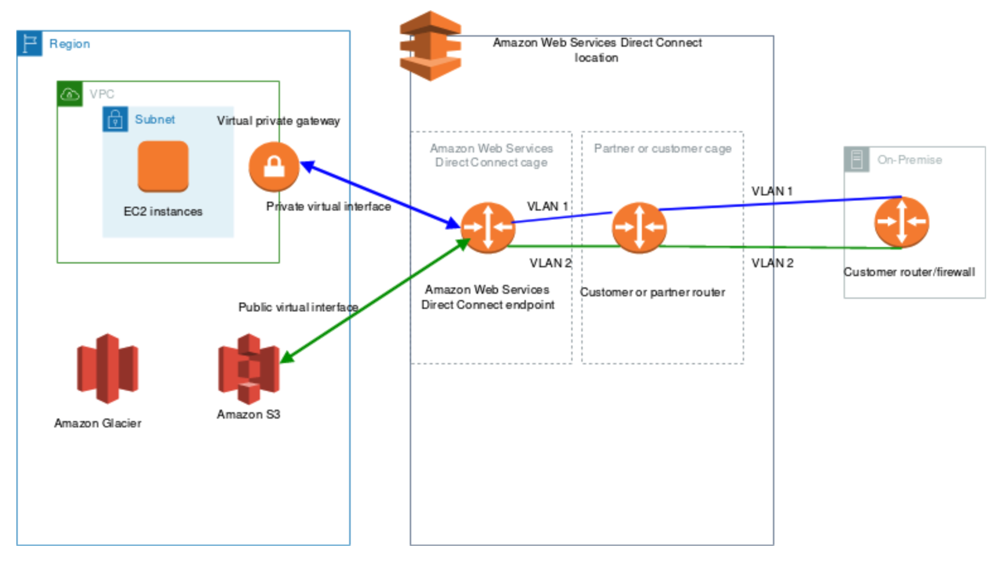

# [VPC - Direct Connect](https://docs.aws.amazon.com/directconnect/latest/UserGuide/Welcome.html)

- 需要耗時起碼一個月來架設 與 AWS VPC 的 **dedicated private connection** 專用線路
    - 並不適用於像是建立 2 endpoints 之間的連線
- [Direct Connect v.s. Site-to-site VPN](https://www.stormit.cloud/blog/comparison-aws-direct-connect-vs-vpn/)
  - 這兩者超級容易混淆...
- (上下圖相同) 
  - 服務的核心有 2 個元件:
    - ISP 端用戶過來的 **Connections**
    - AWS 一端的 **Virtual Interface**
        - Virtual Interface, VIF
  - 建立後
    - 可藉由 `Private virtual interface` 連入 VPC (接入 `Virtual private gateway`)
    - 可藉由 `Public virtual interface` 連入 S3, Glacier, ...

- Networking:
    - 接入 DX 的流量, 都是在 AWS global network backbone (無論 cross AWS Services 或 cross Regions)
        - 流量費, 僅針對 data 從 Region 流出的一端計費 (Region A -> Region B, 則向 A 收費)
- AWS Direct Connect 的 Connection Types 可選擇下列:
    - Dedicated Connections:
        - 可選擇 1 Gbps 或 10 Gbps
        - 可有實體的專用裝置
    - Hosted Connections:
        - 可選擇 50 Mbps, 500 Mbps, 最高可達 10 Gpbs
        - 可按需求來增減
- Charge: Direct Connect 租約最低為 1 個月
    - 若有需求, send request to *AWS Direct Connect Partners*
    - 若需要使用的預估期限遠小於 1 個月... 可考慮其他方式了, 因為這個很貴~
- DX 因為是 private, 傳輸過程預設 「沒有 encrypt」, 但可自行搭配 VPN 來實踐 IPSec
    - 不過這過程會比較複雜...
- 底下的流程圖, 全部都是走 Private Virtual Interface, PVI

- 除了上圖, 也可直接在 *AWS Direct Connect Endpoint* 上頭, 直接連到 VPC 裡頭的 S3/Glacier
    - 此為 Public Virtual Interface
- *Direct Connect gateway* 可與下列的 gateway 做連線 
    - A transit gateway when you have multiple VPCs in the same Region(tgw)
    - A virtual private gateway(vpg)
        - 可用來 extend *local zone*
- 如果想一口氣設定可連入到 multiple VPC(same account), 則需使用 *Direct Connect Gateway*
    - 一樣本地端連入到 *AWS Direct Connect*, 之後藉由 *Direct Connect Gateway* 的 *Private Virtual Interface* 來連線到 VPG

