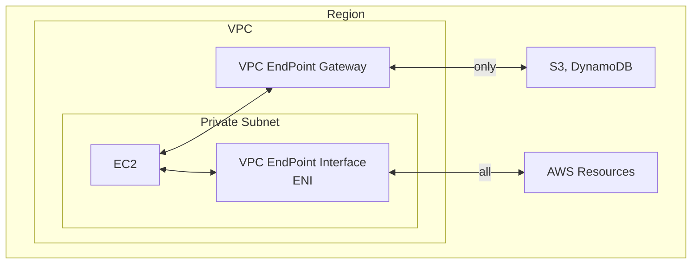

# VPC Endpoint Services / PrivateLink(Private Link)

- 可以用來讓 VPC/On-Premise 的 AWS Services 藉由 private 的方式, 訪問其他的 AWS Services
  - 避免走 public 增加延遲 & 克金
- PrivateLink 定義: _A technology that provides private connectivity between VPCs and services._
- VPC Endpoint 定義: _The entry point in your VPC that enables you to connect privately to a service._
- VPC Endpoints 分成 2 種類型:
  - Interface VPC Endpoints
    - 藉由: PrivateLink (實現 VPC 內部訪問)
    - 須配置: `ENI` 及 `Security Group`
    - 支援範圍: https://docs.aws.amazon.com/vpc/latest/privatelink/aws-services-privatelink-support.html
    - 收費: 使用時數 & 傳輸量
  - Gateway VPC Endpoints / Gateway Endpoints
    - 用途: 讓你們家的 AWS Instance 可不透過 Internet 的方式, 藉由 private 連到 DynamoDB / S3
    - 藉由: (_Gateway endpoints_ 並不借助 _AWS PrivateLink_)
    - 須配置: `gateway` 及 `Route Table`
    - 支援範圍: `DynamoDB` 及 `S3`
    - 收費: 免費~~
- 配置方式
  - Console > VPC > Endpoints > Create endpoint
- 可用來 expose service 給成百上千個 VPC (Secure && Scalable)
  - **PrivateLink** 可完全取代 **VPC Peering**
  - 無需依賴於 **VPC Peering**, IGW, NATGW, Route Table
- 可讓 private subnet 內的 Resources, 藉由 _VPC Endpoint Gateway_ 來連接外部 Resources
  - ex: S3, DynamoDB
- PrivateLink 的兩端必須是 NLB/GLB 及 ENI

---

- 要分享服務的位置, 必須配置 NLB 或 GLB
- 要使用服務的 AWS Service, 需配置 ENI
- 要使用服務的 On-Premise, 需藉由 VGW

---

