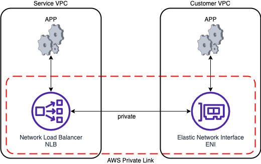

# VPC Endpoint Services / PrivateLink

- 可以用來讓 VPC/On-Premise 的 AWS Services 藉由 private 的方式, 訪問其他的 AWS Services
    - 避免走 public 增加延遲 & 克金
- VPC Endpoints 分成 2 種類型:
    - Interface Endpoints (powered by AWS PrivateLink)
        - 須配置: `ENI` 及 `Security Group`
        - 收費: 使用時數 & 傳輸量
    - Gateway Endpoints
        - 須配置: `gateway` 及 `Route Table`
        - 免費
        - 僅限 `DynamoDB` 及 `S3`
- 配置方式
    - Console > VPC > Endpoints > Create endpoint
- 可用來 expose service 給成百上千個 VPC (Secure && Scalable)
    - **PrivateLink** 可完全取代 **VPC Peering**
    - 無需依賴於 **VPC Peering**, IGW, NATGW, Route Table
- 可讓 private subnet 內的 Resources, 藉由 *VPC Endpoint Gateway* 來連接外部 Resources
    - ex: S3, DynamoDB
- PrivateLink 的兩端必須是 NLB/GLB 及 ENI

---

- 要分享服務的位置, 必須配置 NLB 或 GLB
- 要使用服務的 AWS Service, 需配置 ENI
- 要使用服務的 On-Premise, 需藉由 VGW

---

