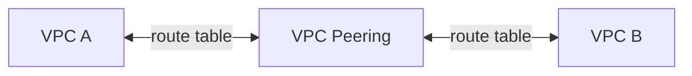

# VPC Peering

- 可以 Cross Account 及 Cross Region, 將 2 個 VPC 做成 LAN
    - VPC 之間, 不能夠 overlapp CIDRs
- 
- 重要範例:
    - 若 A 及 B 做好了 peering && B 及 C 做好了 peering
        - A 與 C 依然無法 connect (朋友的朋友, 未必是我朋友)
        - VPC Peering connection is NOT transitive

實作上會建立 `VPC Peering`(路由器), 然後再設定兩邊的 Route Table

> Concole > VPC > VPC Peering connections > Create (建立完後, 需要 Approval)
> 
> 此外, 需要為 VPC 的 **雙方** 配置 RouteTable
> 
> Destination: `x.x.x.x/16`, Target: `PeeringConnectionId`
