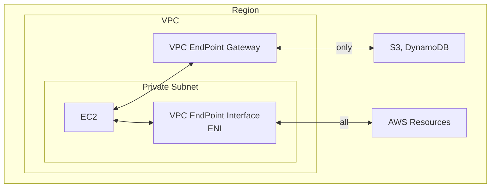

# VPC Endpoint Services (AWS PrivateLink)

- 可用來 expose service 給成百上千個 VPC (Secure && Scalable)
    - 此做法可完全取代 [VPC Peering](#vpc-peering)
    - 無需依賴於 *VPC Peering*, IGW, NATGW, Route Table
- 可讓 private subnet 內的 Resources, 藉由 *VPC Endpoint Gateway* 來連接外部 Resources
    - ex: S3, DynamoDB
- VPC EndPoint Gateway (或 Gateway Endpoint) 有 2 種 Endpoint type:
    - Gateway Endpoint : 只能連 DynamoDB && S3
    - Interface Endpoint : 能連 any AWS Resources
        - provision an ENI(private IP) as an entry point (也須 attach SG)

---

- 

- 要分享服務的位置, 必須配置 NLB 或 GLB
- 要使用服務的 AWS Service, 需配置 ENI
- 要使用服務的 On-Premise, 需藉由 VGW

- 

