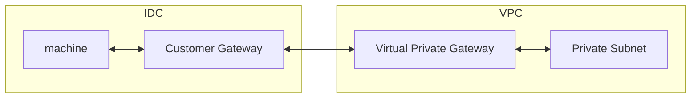

# VPC Site-to-Site VPN

- [What is AWS Site-to-Site VPN?](https://docs.aws.amazon.com/vpn/latest/s2svpn/VPC_VPN.html)
    - 此處的 VPN 指的是 On-Premise network 與 VPC 之間的 network connection
- *Site-to-Site VPN* 支援了 *Internet Protocol security (IPsec) VPN connections*
    - 需要留意的是, 即使連線過程皆為 encrypted, 但仍會有 Security Issue!!
- Virtual Private Gateway, VPG 或 VGW
    - AWS 對於 VPN connection 需要有個 VPN concentrator
    - 在想建立 Site-to-Site VPN 的 VPC 上頭 create && attach VPG
    - UNKNOWN 弄個 ASN(Autonomous System Number)
- Customer Gateway, CGW
    - Data Center 上頭, 弄個 (軟體 or 硬體) customer gateway (用來做 VPN connection)
- 實作上需注意, AWS 那邊需要 enable *Route Propagation* for VPG
    - 如此一來, Virtual Private Gateway 與 subnet 之間才會有 route table
- 目前不支援 IPv6 && 不支援 *Path MTU Discovery*
- Charge: 依照 VPN connection per hour 以及 EC2 network traffic out 來收費
- AWS VPN CloudHub
    - 概念上是指, 如果咱們企業有很多個 customer network, 則彼此之間連線到 VGW 以後
    - 則企業端點之間可藉助 Site-to-Site VPN, 來當作 **VPN CloudHub** 使用
        - 白話文就是, 企業端點之間也能使用 VPN connection 了
    - 設定 CGW 與 VGW 時, 需要 enable *Dynamic Routing* && 配置 *Route Table* 就可以了~
- 實際配置
    - Create/Config 企業端的 *Customer Gateways*
    - Create/Config AWS 上頭的 *Virtual Private Gateways*
    - 使用 *Site-to-Site VPN Connections*, 並將上面兩者 connect
        - 可選擇 *Virtual Private Gateway* 或 *Transit Gateway*
        - 配置 Routing && IPv4(CIDR)
        - 最後再 Create VPN connection

