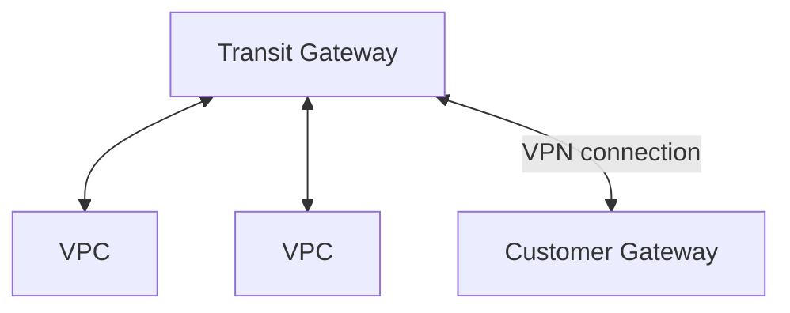

# [Transit Gateway](https://docs.aws.amazon.com/vpc/latest/tgw/what-is-transit-gateway.html)

- 此為 Regional Service
    - 可以 cross region
    - 可藉由 **Resource Access Manager, RAM** 來做 cross account sharing
- 藉由 **Route Table** 來做訪問的存取控制
- 可將複雜的 cross VPC 的網路問題, 簡化成一個 *hub-and-spoke(star)* connection
    - 將 Transit Gateway 置於中心, 連結各種的 networking
    - 可同時連上成百上千個 VPC (只需要一個 Transit Gateway)
    - 流量 inside **AWS Global Infrastructure** &&  **encrypted**
        - 不會跑到 public
- Transit Gateway 有幾個 key concepts:
    - Attachments. 可以 attach 一堆元件到 Transit Gateway
        - VPCs
        - VPN connections
        - AWS Direct Connect Gateway, DCG
        - Transit Gateway Connect attachments
        - Transit Gateway peering connections
        - A Connect SD-WAN/third-party network appliance
        - A peering connection with another transit gateway
    - Transit gateway MTU
    - Transit gateway route table
    - Associations
    - Route propagation
- Transit gateway 行為如同 Regional router, 用來轉發 VPCs && on-premise 的流量
- AWS 唯一支援 `IP Multicast` 的 network service
- Charge:
    - 基本上, 每個 attach 到 transit gateway 的元件, 依小時計費. 此外還會依照總流量來收費

- 使用 transit gateway 的另一種情境是, by using ECMP to increase the bandwidth of your site-to-site VPN connection
    - ECMP, equal-cost multi-path. 此為 允許 forward packet over multiple best path 的一種 Routing Strategy
- 比較:
    - VPN to virtual private gateway, VPG(VGW)
        - 與 VPC 連線後, 建立一條 connection, 1.25 Gbps
            - 而此 connection 使用了 2 tunnels (upload / download)
    - VPN to transit gateway
        - 與 transit gateway 連線後, 會與後面的 VPC, 各自建立自己的 *site-to-site VPN*
            - 而每個 *site-to-site VPN* connection 2.5 Gbps (by ECMP)
        - 如果想要更高流量, 可增加更多的 *site-to-site VPN connections*
            - 每個 *site-to-site VPN connection* 一樣有 2 tunnels
